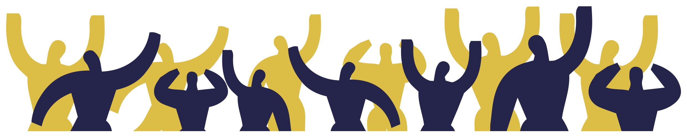

# PREFAZIONE
A cura delle Brigate di Solidarietà Attiva
Nasciamo come Brigate della solidarietà attiva durante il terremoto
aquilano come prima risposta di intervento dal basso a favore delle
popolazioni colpite.
Ci ispiriamo alle prime forme di mutualismo e di solidarietà popolare e
fin da subito mettiamo al centro del nostro intervento il metodo dell'autorganizzazione.

Come Bsa in questi anni abbiamo attraversato sia il terreno delle emergenze ambientali che quello della crisi economica tentando di usare lo
stesso metodo, sia per quanto riguarda la crisi del terremoto che il terremoto della crisi.
Siamo stati presenti in tutti i terremoti, in moltissime alluvioni come
quelli recenti di Livorno e di Brescello, abbiamo contribuito a realizzare
lo sciopero dei braccianti di Nardò, spalato neve e siamo intervenuti
durante gli incendi.
Con lo stesso metodo siamo intervenuti a supporto dei presidi operai
per difendere il lavoro, e in molte altre lotte locali.

Cresciamo esponenzialmente durante le emergenze e diffondiamo il nostro metodo sulla base del meccanismo prassi – teoria – prassi.
Abbiamo brigate territoriali che sono in connessione in un coordinamento che ha al suo interno gruppi che si occupano di settori specifici
come la comunicazione, la logistica, l'amministrazione.
Il principio di base che regola il nostro funzionamento è che la sovranità
spetta comunque alle assemblee territoriali.

L'orizzontalità del processo degli interventi ha permesso alle Bsa di eliminare completamente il livello burocratico che appartiene ad esempio alle strutture statali come la protezione civile e di permettere alla
solidarietà popolare di entrare in connessione diretta con i bisogni del
territorio.

"Dal popolo per il popolo" non è quindi un semplice slogan, ma l'affermazione di un processo che, anche dal punto dell'efficacia, ha dimostrato due elementi fondamentali.

Il coinvolgimento della popolazione locale nei processi di solidarietà
attiva per poi supportarne la presa di voce.
Più che un contenitore siamo dei "connettori sociali" che sviluppano e
diffondono confederalità sociale a partire dalle pratiche.
Una forma di mutualità del XXI secolo nella quale, in maniera autonome ed indipendente i vari soggetti cooperano tra loro, sia nella quotidianità della crisi che vivono le classi popolari che nella straordinarietà
delle emergenze ambientali.

Questo vademecum, curato dagli avvocati di Alterego Fabbrica dei Diritti, si inserisce a pieno nel quadro sopra descritto: intendiamo infatti il
mutualismo non solo come metodo di aiuto ai bisogni materiali (come
cibo, prodotti igienici, coperte, vestiti) ma soprattutto come supporto
alle vertenze e ai conflitti che sorgono dentro e fuori le emergenze.
Le popolazioni terremotate sono state lasciate in balia di una vera e
propria giungla normativa, tra centinaia di norme a carattere nazionale
e locale spesso contraddittorie.

Oissa 2 è lo strumento che traduce queste norme e che permette alle
decine di comitati sorti nel cratere di discutere e avanzare proposte forti
di una maggiore consapevolezza.

Per questo intendiamo la diffusione di questo vademecum importante
tanto quanto la distribuzione di aiuti materiali.

