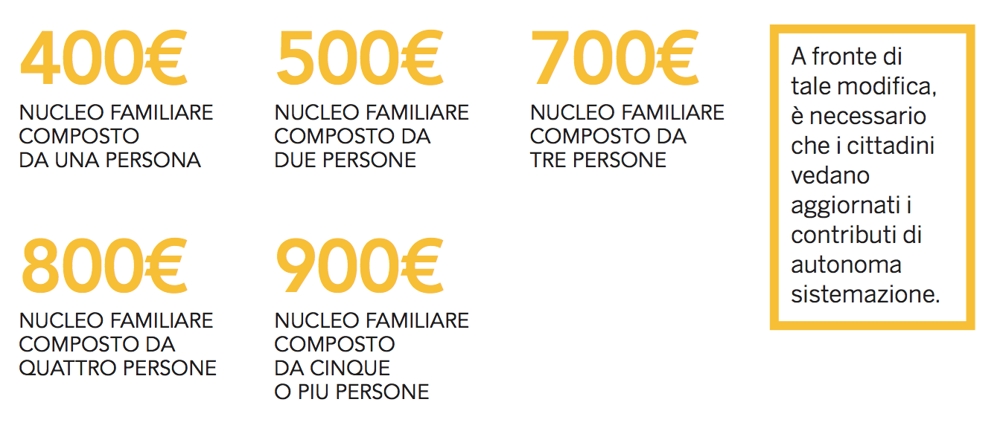
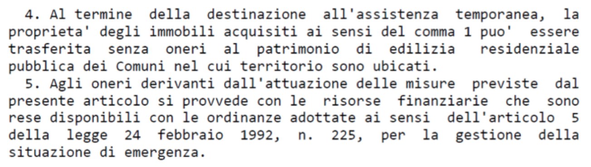
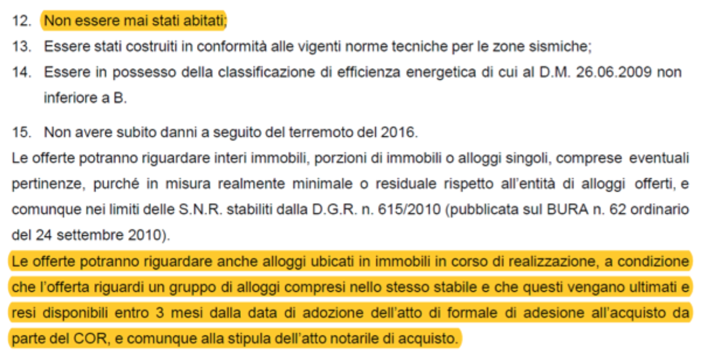

<!-- TOC --> 
- [1. Emergenza abitativa](#1-emergenza-abitativa)
    - [MISURE DI PRIMA EMERGENZA](#misure-di-prima-emergenza)
        - [CONTRIBUTO DI AUTONOMA SISTEMAZIONE](#contributo-di-autonoma-sistemazione)
        - [CONTAINER](#container)
        - [LE CONVENZIONI ALBERGHIERE](#le-convenzioni-alberghiere)
        - [L'AUTONOMA INSTALLAZIONE DI MANUFATTI ABITATIVI IN VIA EMERGENZIALE](#lautonoma-installazione-di-manufatti-abitativi-in-via-emergenziale)
    - [MISURE POST-EMERGENZA](#misure-post-emergenza)
        - [STRUTTURE ABITATIVE DI EMERGENZA](#strutture-abitative-di-emergenza)
        - [ACQUISIZIONE D'IMMOBILI PER ASSISTENZA ALLA POPOLAZIONE (c.d. Art. 14)](#acquisizione-dimmobili-per-assistenza-alla-popolazione-cd-art-14)
<!-- /TOC -->

# 1. Emergenza abitativa
## MISURE DI PRIMA EMERGENZA

Per prima emergenza deve intendersi il periodo immediatamente successivo all'evento sismico. Tali misure sono state previste dalla normativa per poter immediatamente dare la possibilità alla popolazione di trovare una pronta sistemazione abitativa, prima di procedere alle soluzioni "comunque temporanee ma di più lungo periodo" definite soluzioni di post-emergenza (Sae e art. 14).

### CONTRIBUTO DI AUTONOMA SISTEMAZIONE

**Il CAS** (contributo di autonoma sistemazione) è un contributo economico finalizzato al rimborso delle spese che il cittadino deve affrontare autonomamente per beneficiare di un'adeguata sistemazione abitativa.
Lo possono richiedere coloro i quali sono stati raggiunti dall'ordinanza di sgombero da parte della protezione civile (escluse quindi le seconde case) o dal provvedimento che ne dichiara l'inagibilità.

Con il CAS il cittadino colpito dall'evento sismico può provvedere autonomamente alla sistemazione abitativa diversa dalle soluzioni proposte e promosse dallo Stato e dagli organi ad esse preposte: infatti, è bene sottolineare che tale sistemazione abitativa deve essere temporanea e deve realizzarsi in un alloggio che non sia una una soluzione abitativa messa a disposizione dallo Stato (SAE, CONTAINER, ALBERGO, ABITAZIONI POPOLARI, ecc).

**Il CAS è un diritto soggettivo** direttamente discendente dalla legge e dai provvedimenti commissariali, così come confermato da ampia e consolidata giurisprudenza, sia ordinaria che amministrativa. (ord. Prot. Civ. 388-2016, art. 3) legato a condizioni che la pubblica amministrazione potrà solo verificare.

Per tale motivo è anche definibile quale diritto condizionato, ossia legato a condizioni che la pubblica amministrazione potrà solo verificare.
Il Comune, pertanto, non potrà in alcun modo decidere discrezionalmente se riconoscere o meno tale contributo, avendo il solo compito di verificare se le condizioni previste per averlo siano presenti.

**Le condizioni per l'assegnazione** del contributo sono stabilite per legge.
È necessario che il soggetto richiedente appartenga ad un nucleo (mono) familiare che abbia subito lo sgombero in esecuzione di provvedimenti delle competenti autorità, adottati a seguito degli eventi sismici, dalla sua abitazione.
È necessario, inoltre, che **l'abitazione principale, continuativa e abituale sia stata dichiarata totalmente o parzialmente distrutta**.

Al fine di ottenere il contributo, **non è obbligatoria la residenza, ma sarà possibile provare la continuità e l'abitualità della vita nell'abitazione danneggiata o distrutta** mediante documentazione certa (contratto di lavoro, contratto di affitto, utenze luce e gas, ecc.)

**Può richiedere il contributo anche lo studente iscritto agli anni accademici 2015/2016 e 2016/2017 presso università che rilascino titolo di studio nei comuni colpiti dagli eventi sismici.**

L'entità del contributo, prima del 15 novembre 2016, ammontava ad 300€ per **il nucleo familiare composto da una persona; mentre per il nucleo familiare composto da più persone erano stati previsti 200€ a persona, fino ad un massimo** di 600€ mensili.

Inoltre, è previsto un contributo ulteriore di

Tale contributo aggiuntivo è concesso anche oltre il limite massimo di contributo mensile a nucleo familiare ed ora (dopo il 15-11-2016) è cumulabile se sussistono due o più condizioni:

La richiesta del contributo di autonoma sistemazione può essere presentata al Comune di residenza con una specifica istanza, in rappresentanza dei rispettivi nuclei familiari.

**Il modulo di autocertificazione** (MODULO DC/AS- Eventi sismici 26 e 30 Ottobre 2016) deve essere inviato al Comune e deve essere indicato:

**1.** la composizione del nucleo familiare;
**2.** l'indirizzo dell'abitazione nella quale il nucleo familiare dimorava stabilmente ed in maniera continuativa nelle date del terremoto del 24 agosto, del 26 ottobre o del 30 ottobre;

* Se l'immobile è stato oggetto di sgombero, ovvero, è distrutto in tutto o in parte;
* Se il nucleo familiare è composto da persone con più di 65 anni, portatori di handicap, diversamente abili con invalidità non inferiore al 67%;
* Qualunque titolo legittimante all'uso del bene immobile, vigente alle date del sisma;
* La titolarità di utenze relative alla fornitura di energia elettrica, alla fornitura di gas, e le eventuali utenze di telefonia fissa;
* La titolarità di un contratto di locazione registrato, nel caso in cui si sia conduttori di immobili.

**Il diritto a ricevere il CAS sorge a decorrere dalla data indicata nel provvedimento di sgombero dell'immobile**, o comunque, dal momento in cui è stato dichiarato lo stato di emergenza.
Tale diritto a ricevere il CAS spetta a chiunque dimorava abitualmente e stabilmente a vario titolo nell'immobile dichiarato inagibile dalla scheda AEDES o FAST.

**I Sindaci dei Comuni colpiti dal sisma, sono tenuti a controllare la veridicità delle autocertificazioni rese dai cittadini e finalizzate all'erogazione del CAS**. Tali accertamenti sono ripetuti con cadenza periodica finalizzati alla verifica del permanere dei requisiti necessari per la concessione del CAS.

Pertanto, **nel caso in cui venga accertata la carenza dei requisiti, provvedono a revocare l'erogazione del contributo e ad agire per la restituzione di quanto percepito indebitamente**.

E' possibile che il Comune di residenza interrompa l'erogazione del contributo dal momento in cui si siano realizzate le condizioni per il rientro nell'abitazione, ovvero il cittadino abbia provveduto ad altra sistemazione avente carattere di stabilità, e comunque non oltre la data di scadenza dello stato di emergenza.
L'ultima estensione dello stato di emergenza è avvenuta con il Decreto Legge 91/2017, art. 16 sexies, che lo ha prorogato al **28 Febbraio 2018** (prorogabile per altri 180 giorni).
La variazione delle informazioni rilasciate con la richiesta del CAS dovrà essere comunicata al Comune, onde evitare l'obbligo di restituzione dei contributi di cui si ha beneficiato.

Devono considerarsi facenti parte del **nucleo familiare**, oltre gli appartenenti alla famiglia in senso stretto, anche le persone che vi sono stabilmente inserite con funzioni di assistenza domiciliare ai minori, agli infermi, ai disabili, ed in generale, a soggetti non autosufficienti (come ad es. le badanti). Inoltre, anche i conviventi hanno diritto a ricevere il CAS.

In caso di **revoca del CAS** la competenza per una eventuale impugnazione del provvedimento di revoca appartiene al giudice ordinario, poiché esso rientra in materia di contributi e sovvenzioni pubbliche.

Nel caso in cui il CAS una volta concesso venga revocato dall'amministrazione, il cittadino può far valere il proprio diritto innanzi al tribunale ordinario e non al tribunale amministrativo regionale: per questo il ruolo della pubblica amministrazione in sede di revoca è solo quello di verificare se sussistono le condizioni richieste, senza valutazione discrezionale in ordine alla sussistenza di un interesse pubblico, così come confermato dalla giurisprudenza amministrativa e ordinaria.

E' necessario allegare ulteriori dati per la richiesta del CAS:

* Ente che ha rilasciato la dichiarazione di invalidità o di handicap;
* Titolo legittimante l'uso del bene immobile (es. contratto di affitto);
* Nome del proprietario dell'immobile, nome dell'affittuario, e intestatario utenze (luce e gas);
* Numero e data del provvedimento di sgombero;
* Numero e data del provvedimento che ha limitato l'accesso alla area dove si trova l'abitazione e data della sua revoca (in alternativa data di scadenza dello stato di emergenza);
* Data della richiesta al Comune di sopralluogo per la verifica dell'agibilità;
* Scheda AeDES (di agibilità o inagibilità);
* Periodo in cui si è provveduto autonomamente ad una sistemazione o con oneri a carico della pubblica amministrazione;
* Eventuale data di dichiarazione di agibilità o data di scadenza dello stato di emergenza;
* Data di ricostruzione o data di scadenza dello stato di emergenza;
* Indirizzo a cui inviare eventuali comunicazioni;
* Fotocopia documento di identità se il modulo viene spedito o consegnato da terzi;
* Codice IBAN per l'accredito delle somme.

È sempre possibile che siano previste forme di contribuzione ulteriori a quelle del Contributo di Autonoma Sistemazione: infatti le Regioni, i singoli Comuni, le Comunità Montane, possono prevedere forme di contribuzione e assistenza alle popolazioni colpite dagli eventi sismici cumulative e ulteriori a quelle previste dalla Legge Nazionale.

**NOTA**
> Qualora il cittadino faccia richiesta per il SAE dovrà, una volta ricevuta la casetta, rinunciare al CAS.
Tale rinuncia avverrà al momento della richiesta del SAE.
Infatti qualora il cittadino abbia richiesto il SAE e deciso, successivamente, di non andarci a vivere, dovrà comunque rinunciare alla liquidazione del CAS.

**NOTA**
> Il CAS è un contributo che, come detto, viene riconosciuto solo ed esclusivamente per la finalità abitativa.
Esso NON E' un contributo con finalità di sostegno al reddito. E' dubbio se in questa somma sia possibile ricondurre anche le spese per il c.d. "vitto".
Infatti, se a chi ha risieduto o risiede tuttora negli Alberghi, lo Stato ha garantito anche i pasti (compresi nelle convenzioni con gli Alberghi stessi) e il CAS è uno strumento di assistenza alternativo all'Albergo, parrebbe logico che le spese alimentari possano essere affrontate anche con il CAS.
Tale considerazione non è stata prevista espressamente per legge.

**CRITICITA' E DENUNCE**
> Dal nostro lavoro sul territorio una cosa ci è apparsa chiara.
La maggior parte dei Comuni continuano a ritardare il pagamento del CAS ai cittadini.
Tale ritardo viene giustificato dal fatto che i controlli sono lunghi e complessi, non considerandosi la natura alimentare ed emergenziale di questo contributo.
Appare evidente come la tempestività nella liquidazione del CAS sia fondamentale per permettere alle persone colpite dal sisma di vivere un'esistenza "dignitosa" seppur temporaneamente.
Il controllo, l'accertamento delle violazioni e il conseguente procedimento a carico di chi ha ingiustamente beneficiato di tale contributo, dovrebbero svolgersi in fasi successive o quantomeno parallele a una fondamentale continuità di liquidazione delle somme.
Per tale motivo esistono rimedi giudiziari di rapida attivazione che consentono la liquidazione delle somme o di mettere in mora l'amministrazione pubblica per il pagamento del CAS.
Il Decreto Ingiuntivo ne è un esempio.
Tale strumento, come ogni azione legale avente ad oggetto diritti soggettivi, garantisce rapidità nella tutela di un diritto che, come già affermato, NON PUO' ESSERE IN ALCUN MODO MESSO IN DISCUSSIONE DA NESSUNA ISTITUZIONE SE IL BENEFICIARIO RIENTRA TRA I CRITERI OBBLI- GATORI PER LEGGE.

### CONTAINER

I container sono dei moduli abitativi prefabbricati, che vengono utilizzati per assistere le popolazioni colpite dal sisma.
Hanno delle dimensioni di circa 12 mq e sono dotati di biancheria e arredamento. La loro caratteristica principale è la temporaneità, posto che vengono messi a disposizione fin tanto che siano cercate le aree idonee alla installazione delle soluzioni abitative di emergenza.

Da un lato è compito dei sindaci individuare il numero di persone per cui sono necessari i container e le aree su cui installarli; dall'altro la protezione civile si occupa di verificare, insieme ai tecnici della regione e dei centri di competenza, l'idoneità idrogeologica e di accessibilità dei siti individuati al fine di acquisire il parere della Regione.

Preliminarmente devono essere individuate le aree dove installare i moduli (possibilmente preferendo le aree pubbliche) cui segue la fase di organizzazione dei container sulla base delle richieste, oltre alla fase di
urbanizzazione delle aree da parte degli operatori incaricati (L'Esercito Italiano o altra ditta individuata dal comune richiedente). Una volta completati tali lavori, inizia l'installazione dei moduli abitativi, moduli di servizio, uso ufficio e sale comuni.
La fornitura dei container spetta ai sindaci dei comuni interessati che devono indicare al Dipartimento della protezione civile le aree in cui installare questi complessi che prevedono la presenza, oltre ai moduli container ad uso abitativo, anche 10 diversi moduli di servizio:

Il Dipartimento della protezione civile nel 2015 ha stipulato una convenzione con la Consip, società del Ministero dell'economia e delle finanze, la quale ha promosso una gara per il noleggio, trasporto e installazione dei container in caso di emergenza (prevedendo anche la realizzazione di campi base, il trasporto fino alle aree per l'insediamento, l'installazione e la manutenzione straordinari). Sono stati conclusi, quindi, vari Accordi quadro con diverse società aggiudicatarie (tra cui Frimat Spa e Ri spa), in deroga alle procedure normali: per la fornitura, le aziende firmatarie hanno l'obbligo di montare e consegnare il 25% dei campi base offerti entro 15giorni dalla richiesta, il restante 75% entro 30 giorni.
Di seguito indichiamo le aree in cui sono stati installati i container:

* **Regione Umbria**:
sei aree nella zona di Norcia (comprese le aree di Ancarano, Frascaro, Popoli, San Pellegrino e Savelli) e due aree nella zona di Cascia (Avendita e Campo di Mare) per un totale di 311 moduli container.

* **Regione Marche**:
sette i comuni in cui sono state realizzate le aree container: Amandola, (area a Pian di Contro); Caldarola (area vicina a via Aldo Moro);
Camerino (con tre aree a Vallicelle A1, Vallicelle A2 e Vallicelle B);
Petriolo (area in via Giovanni XXIII);
Pieve Torina (area denominata PIP2); Tolentino (area "Zona industriale La Rancia"); Visso (area "Il Piano").

**CRITICITA' E DENUNCE**
> La normativa emanata in via di emergenza ha previsto, tra gli strumenti idonei a sopperire alle esigenze abitative emergenziali, la permanenza nei container collettivi di coloro i quali avessero perso la casa a causa del sisma.
Più precisamente, la finalità per la quale questo tipo di strutture sono state previste è quella di offrire ai cittadini una soluzione abitativa per il tempo strettamente necessario alla predisposizione da parte delle istituzioni delle soluzioni post-emergenziali (SAE o di appartamenti da fare in comodato d'uso gratuito ai cittadini che hanno perso la casa).
Purtroppo, in molti Comuni questa soluzione si è trasformata da temporanea a semi-permanente, potendosi constatare oggi la presenza di numerosi campi container ancora pienamente operativi.
Tra le varie realtà che si trovano in questa situazione, ad esempio abbiamo avuto l'occasione di occuparci ampiamente del campo container del Comune di Tolentino, una struttura nata tra il gennaio e febbraio del 2017 che ad oggi ospita più o meno 240 persone.
Parlando con i cittadini che vivono in quei container abbiamo avuto modo di comprendere il disagio di vivere per tutti quei mesi in situazioni di promiscuità, subendo un disagio ai limiti della dignità umana e, sopratutto, vivendo nel completo abbandono di qualsiasi informazione da parte delle istituzioni locali e nazionali.
Considerando che i container collettivi dovrebbero ospitare i cittadini solo per il tempo necessario alla predisposizione delle strutture post-emergenziali ( SAE o di appartamenti da fare in comodato d'uso gratuito ai cittadini che hanno perso la casa), i ritardi nella predisposizione di queste ultime si ripercuotono direttamente sui cittadini.
A nostro parere, in situazioni come quella del comune di Tolentino, i container collettivi diventano il "dimenticatoio" dell'emergenza abitativa e l'alibi alla procrastinazione delle soluzioni.
A conferma di questo, sempre riguardo al campo container del Comune di Tolentino, si deve considerare che non tutti gli abitanti sono stati mandati nei container subito dopo il sisma.
Infatti tra i 240 attuali abitanti, circa 30 persone sono state inserite nel campo container del Comune di Tolentino a seguito dello sfratto dell'Hotel 77, sostituendo ad una soluzione abitativa che doveva cessare mesi fa, ovvero la permanenza in strutture alberghiere, una soluzione abitativa che doveva cessare altrettanto tempo fa, ovvero la permanenza del container.

### LE CONVENZIONI ALBERGHIERE
Sono più di 4000 sfollati che sono stati ospitati in imprese recettive sulla costa marchigiana: questa possibilità è consentita dalla convenzione tra Regioni Abruzzo, Lazio, Marche e Umbria, ANCI e Associazioni Maggiormente Rappresentative delle strutture alberghiere firmata il giorno 8 settembre 2016 e vigente fino alla conclusione dello stato di emergenza.
L'opportunità di essere ospitati presso strutture alberghiere è prevista per le persone la cui abitazione principale, abituale e continuativa sia stata distrutta in tutto o in parte ovvero sia stata sgomberata in esecuzione dei provvedimenti delle autorità competenti.
I Sindaci dei comuni colpiti dal sisma prevedono ad attestare in elenchi delle persone che si trovano nella condizione di essere ospitate nelle strutture ricettive che hanno manifestato la disponibilità ad ospitarle.
È necessario che la struttura ricettiva ospitante abbia i requisiti per contrarre con la pubblica amministrazione.
Il comune si impegna al pagamento delle somme dovute per ogni singolo ospite e tale rimborso è effettuato con le risorse statali destinate alla gestione dell'emergenza, mentre il gestore della struttura si impegna a fornire il trattamento concordato in base alle esigenze dell'utente che non potrà essere superiore alle seguenti tariffe:

### L'AUTONOMA INSTALLAZIONE DI MANUFATTI ABITATIVI IN VIA EMERGENZIALE

**A fronte dei notevoli ritardi nella fornitura dei container** per far fronte alle esigenze abitative che interessano i territori colpiti dal sisma, **molti cittadini hanno provveduto alla installazione di moduli prefabbricati temporanei** in maniera autonoma.

In tempi recentissimi è intervenuta la Corte di Cassazione, la quale, nel definire i presupposti per l'installazione di moduli abitativi senza permesso di costruire, ha ritenuto che la **precarietà dell'opera** edilizia non derivi dalla tipologia dei materiali impiegati per la realizzazione, né dalla sua facile amovibilità: **ciò che conta è la oggettiva temporaneità e contingenza delle esigenze che l'opera è destinata a soddisfare**.

Quindi, gli interventi di **"nuova costruzione"** per i quali è necessario il permesso di costruire o altro titolo simile, sono ad esempio, i manufatti leggeri, roulottes, campers, case mobili utilizzati come depositi, magazzini e simili, quando non siano diretti a soddisfare esigenze meramente temporanee.

**Non rientrerebbero in tale previsione normativa**, i container o le casette mobili che sono state **autonomamente installate dai cittadini**, posto che sono opere precarie **destinate a soddisfare l'esigenza abitativa emergenziale** e non sono strutture suscettibili ad incidere in maniera permanente e tendenzialmente definitiva sull'assetto e sull'uso del territorio, a nulla rilevando la presenza di vincoli paesaggistici o simili.

Sarà necessario, perciò, un intervento amministrativo (permesso di costruire) solamente quando l'insediamento avrà carattere di sostanziale stabilità, cui consegua una trasformazione permanente del suolo inedificato.

In tema di reati edilizi-urbanistici, è configurabile il reato di costruzione edilizia abusiva nell'ipotesi di installazione su un terreno, senza permesso di costruire, di strutture mobili quali camper, roulotte e case mobili, sia pure montate su ruote e non incorporate al suolo, aventi una destinazione duratura al soddisfacimento di esigenze abitative.

Ciò avviene, ad esempio, nella fattispecie di case prefabbricate munite di ruote gommate.

Com'è noto, in molti casi la popolazione colpita dal terremoto ha provveduto autonomamente alla predisposizione di moduli abitativi, attraverso il noleggio, l'acquisto o la semplice donazione da parte di Onlus nate con lo scopo di fornire un sussidio concreto.
L'installazione di tali container ha comportato, in alcuni casi, il pericolo di rimozione degli stessi per la normativa inerente l'abuso edilizio.

Tale situazione è stata oggi modificata, solo per i cittadini che hanno subito la distruzione o l'inagibilità a causa degli eventi sismici della loro abitazione, dal nuovo art. 8-bis inserito nel Decreto Terremoto dal nuovo D.L. 148-2017.

Infatti **per tutti gli immobili costruiti senza permesso dal 24 Agosto 2016 al 24 Agosto 2017** per esigenze abitative da chi ha perduto l'immobile di cui era proprietario o locatore o abitante ad altro titolo, è prevista la possibilità di fare una **comunicazione al Comune** di installazione di tali immobili qualora vengano soddisfatte le seguenti **condizioni**:

* Il richiedente sia proprietario o suo parente entro il terzo grado, usufruttuario o titolare di diritto reale di godimento su un **immobile dichiarato inagibile a seguito degli eventi sismici**.
* Il richiedente sia altresì proprietario o suo parente entro il terzo grado, usufruttuario o titolare di diritto reale di godimento sull'area su cui è stato realizzato l'immmobile in assenza di titolo abilitativo.
* **L'area su cui è stato realizzato** l'immobile privo di titolo ricada in uno dei Comuni interni al c.d. “Cratere” e risulti edificabile secondo le previsioni dello strumento urbanistico comunale, del piano paesaggistico e del piano di assetto del parco, se ricompresa all'interno del perimetro di un parco nazionale o regionale, vigenti alla data dell'evento sismico.
* **Il richiedente abbia presentato**, ovvero presenti contestualmente alla comunicazione di costruzione c.d. “libera” al Comune, **domanda di accesso a contributo per la ricostruzione dell'immobile dichiarato inagibile**.
* **La volumetria dell'immobile realizzato** in assenza di titolo abilitativo **non sia superiore a quella dell'immobile dichiarato inagibile**.
* Il nuovo edificio risulti adibito ad abitazione del richiedente e del suo nucleo familiare convivente sulla base delle risultanze anagrafiche o di un parente entro il terzo grado.
* Il richiedente non disponga a qualsiasi titolo di altra unità a uso abitativo libera e agibile nel medesimo Comune.

**Alla c.d. comunicazione di nuova costruzione libera** deve allegarsi una perizia asseverata e copia della scheda AEDES dell'edificio distrutto o gravemente danneggiato.
**Tale comunicazione deve essere recapitata al Comune competente entro il 31 Gennaio 2018**.

**La presentazione della comunicazione comporta rinuncia al contributo per l'autonoma sistemazione** eventualmente percepito dal richiedente a far data dalla presentazione medesima, salvo che il richiedente attesti che l'immobile non è ancora utilizzabile a fini abitativi.

**CRITICITA' E DENUNCE**
> Appare evidente come la valutazione di collegare la costruzione o installazione di una nuova abitazione alla automatica rinuncia al CAS comporta non pochi problemi.
Il CAS, come sopra già ampliamente trattato, ha una finalità che è proprio quella di permettere l'autonoma sistemazione del cittadino in una situazione di dignità abitativa.
Tale strumento di sostegno ben permetterebbe, infatti, di accedere a un finanziamento o alla locazione di strutture d'emergenza da installare autonomamente.
Con la privazione del CAS a chi ha installato autonomamente tali manufatti il rischio è di trovarsi difronte a una norma discriminante.
Solo chi avrà una autonomia economica importante potrà, realisticamente, procedere con la comunicazione al Comune, poiché in grado di sostenere i costi della costruzione o della locazione della stessa.
Al contrario, chi fondava tale soluzione proprio sul CAS dovrà procedere alla demolizione della struttura e "sperare" nell'arrivo del SAE.

## MISURE POST-EMERGENZA

### STRUTTURE ABITATIVE DI EMERGENZA

Le strutture abitative di emergenza (**S.A.E.**) sono dei moduli abitativi destinati alle popolazioni colpite dal terremoto in attesa della ricostruzione dei centri abitati.
I SAE sono destinati alla popolazione che abbia un'abitazione danneggiata in cui aveva **dimora abituale e continuativa** in proprietà, in affitto o abitata ad altro titolo e che risulti:

* **Inagibile con esito "E"** a seguito della rilevazione effettuata con scheda AEDES;
* **Inagibile con esito "F" di non rapida soluzione**, a seguito della rilevazione effettuata con scheda AEDES;
* **In Zona Rossa**.

Le Regioni Abruzzo, Lazio, Marche ed Umbria sono i soggetti attuatori/fornitori delle S.A.E., provvedendo alle opere di urbanizzazione;

**I Comuni** si occupano della ricognizione e quantificazione dei fabbisogni dei propri territori, considerando gli edifici situati nelle zone rosse o dichiarati inagibili (con esito di rilevazione dei danni di tipo "E" o "F").
Su tali basi i Comuni provvedono a effettuare una proposta circa le aree da destinare alle S.A.E.;

**La Regione** d'intesa con il Comune individua le aree destinate ad ospitare le S.A.E., assicurando la preferenza delle aree pubbliche rispetto a quelle private oltre che il contenimento del numero delle aree, pur nel rispetto delle esigenze abitative dei nuclei familiari.

Il prototipo delle S.A.E. è realizzato dal Consorzio Nazionale Servizi (CNS) che nel 2015 è risultato il primo aggiudicatario della gara d'appalto indetta da Consip S.p.A. per conto del Dipartimento della Protezione Civile.
All'aggiudicazione del bando è seguita la stipula di un accordo quadro tra CNS e Dipartimento per la fornitura, il trasporto e il montaggio di Soluzioni Abitative in Emergenza per un massimo di 6.000 di cui 850 per ogni evento calamitoso.
L'offerta del Consorzio Nazionale Servizi è stata valutata dalla Commissione di gara come quella economicamente più vantaggiosa.
Il CNS ha vinto la gara per due lotti (Nord e centro Italia).
Le Regioni possono quindi decidere di avvalersi dell'accordo quadro sottoscritto dal Dipartimento con il Consorzio stipulando con quest'ultimo intese specifiche.

Le S.A.E. individuate dal Consorzio, sulla base dei requisiti indicati dal bando di gara, prevedono moduli in acciaio e legno da 40, 60 e 80 metri quadri (si tratta sempre di superfici interne nette).

Le S.A.E. sono adatte a qualsiasi condizione climatica e studiate per essere fruibili anche da persone disabili.
Sono progettate nel rispetto della normativa antisismica e delle leggi in materia di sicurezza, igiene e ambiente.

Le S.A.E. sono predisposte inoltre per essere rimosse e recuperate quando non più necessarie.
Secondo quanto previsto dalle imprese che hanno progettato i lavori.

**CRITICITA' E DENUNCE**
> Molte segnalazioni sono arrivate in riferimento a difetti di costruzione o progettazione delle SAE. Tali situazioni hanno generato enormi criticità tanto da comportare ulteriori interventi di "correzione" o riparazione successivi alla consegna delle SAE (pertanto a collaudo già effettuato).
Anche in questo caso potrebbero configurarsi danni in capo ai beneficiari suscettibili di risarcimento da azionarsi nelle sedi giurisdizionali (TAR o Tribunale Ordinario).
Durante la nostra esperienza abbiamo riscontrato in molteplici occasioni come l'amministrazione statale nonché quella comunale siano in estremo ritardo rispetto alla individuazione, predisposizione e consegna delle soluzioni abitative di emergenza.
In base all'accordo quadro del 25 maggio 2016 n. 1239 (con capitolato tecnico, allegato 5 della gara europea) è prevista, infatti, una sequenza molto articolata di atti per la procedura di fornitura e installazione dei S.A.E.
In linea generale le amministrazioni, a norma della legge fondamentale sul procedimento amministrativo, hanno l'obbligo di concludere il procedimento con un provvedimento motivato entro 30 giorni dalla richiesta del cittadino o quando lo stesso debba iniziare d'ufficio.
Appare evidente come la domanda del cittadino rappresenti l'atto con cui iniziano a decorrere i termini del procedimento entro cui gli enti amministrativi preposti devono svolgere le loro attività obbligatorie.
Quindi, dalla domanda del cittadino avente diritto (protocollata e rilasciata in copia a chi la presenta al Comune) è previsto un termine entro il quale i Comuni devono provvedere alla ricognizione e quantificazione dei fabbisogni in 30 giorni.
Da questo momento, individuate le necessità da parte del Comune e le aree da parte della Regione ove andare a realizzare la o le SAE, iniziano a decorrere i termini obbligatori per le aziende incaricate della produzione e installazione delle strutture e per le aziende incaricate della Urbanizzazione dell'area individuata.
L'intera procedura di realizzazione, dall'approvazione del progetto esecutivo (approvato dalla Regione) al verbale di consegna, non puo' durare più di 6 mesi (tale disciplina è specificata proprio all'interno dell'accordo quadro del 25 maggio 2016).
Una volta consegnato il villaggio o la SAE al Comune, decorre un ulteriore termine di 30 giorni entro il quale il Comune deve assegnare e consegnare la SAE al beneficiario richiedente.
Pertanto il termine massimo previsto dalla richiesta del beneficiario alla consegna della SAE è di circa 9 mesi.

> IN TUTTI I CASI IN CUI TALE TERMINE NON E' STATO RISPETTATO, POTREBBE CONFIGURARSI L'IPOTESI DI UNA RICHIESTA DI RISARCIMENTO DEL DANNO NEI CONFRONTI DEL BENEFICIARIO RICHIEDENTE IL SAE A CAUSA DELL'INGIUSTIFICATO RITARDO DELLA PUBBLICA AMMINISTRAZIONE.

**NOTA**
> Nel caso in cui i terreni temporaneamente occupati dalla Pubblica Amministrazione per la costruzione delle SAE siano privati, le Istituzioni competenti sono obbligate a corrispondere al privato una indennità mensile da concordarsi anche in virtù della natura del terreno (edificabile, a destinazione agricola, ecc.).
Con la nuova legge di bilancio (legge di bilancio 2018) è stato previsto che la proprietà di tali terreni venga trasferita direttamente in capo al Comune, destinandoli definitivamente a essere utilizzati per "necessità di Protezione Civile o per lo sviluppo socio-economico del territorio".
In tal caso la legittimità di qualsiasi provvedimento successivo di espropriazione potrebbe non essere così certa. Infatti, l'ordinanza del sindaco con cui inizialmente i terreni sono stati occupati temporaneamente spesso fissa tra gli obblighi della Pubblica Amministrazione quello di riconsegnare, a fine occupazione, i terreni nello stato in cui sono stati inizialmente consegnati dal privato. Potrebbe essere dura per la Pubblica Amministrazione provare che il motivo di occupazione da temporaneo si trasformi in definitivo, in tal senso autorizzandosi l'esproprio definitivo del terreno.
In ogni caso, da ogni provvedimento notificato dalla Pubblica Amministrazione (in tal caso è obbligatoria la notifica del provvedimento al privato cittadino) ci saranno 60 giorni per impugnare tale provvedimento.

### ACQUISIZIONE D'IMMOBILI PER ASSISTENZA ALLA POPOLAZIONE (c.d. Art. 14)
*A cura di [Emidio di Treviri](http://www.emidioditreviri.org/) - Gruppo di Ricerca sul post-sisma del Centro Italia.*

L'articolo 14, titolato "**Acquisizione d'immobili ad uso abitativo per l'assistenza della popolazione**" ed inserito per la prima volta nel **Decreto n.8 del 9.11.2016** (convertito in legge il successivo 7 Aprile), autorizza le regioni coinvolte nell'emergenza sisma 2016/2017 (Marche, Lazio, Abruzzo ed Umbria) a comprare unità immobiliari da destinare in maniera provvisoria ai terremotati, che verranno in un secondo momento trasformate in "case popolari".

Una notevole operazione di acquisizione al patrimonio pubblico residenziale, dunque, come non succedeva da decenni, compiuta attraverso il Fondo nazionale per le Emergenze (ai sensi dell'articolo 5 della legge 24 febbraio 1992, n. 225).
Costituirebbe un importante passaggio di riflessione ragionare sul fatto che:

* la "domanda di casa" rappresenti un tema all'ordine del giorno solo in una situazione straordinaria come il post-terremoto,
* che lo Stato cerchi di tamponare parte della questione del disagio abitativo solo grazie all'emergenza, nonché
* che le istituzioni individuino, tra le molte categorie sociali in affanno,
quella dei terremotati quale target-group meritevole di un intervento - al contrario di tutti gli altri -.

Ma tralasciando questi interrogativi e stando a una prima lettura del fenomeno, l'operazione dell'art.14 sembrerebbe quasi rappresentare un'inversione di tendenza rispetto alla grande ritirata dello Stato dal welfare sociale delle ultime decadi.

L'articolo 14 della legge avrebbe potuto rappresentare, oltre a una simbolica inversione di tendenza rispetto all'interesse pubblico per chi ha necessità reali, anche un argine alla bolla speculativa dei mercati immobiliari di sponda delle zone terremotate.
Una situazione che colpisce soprattutto le aree periferiche del cratere e i territori ad esso immediatamente adiacenti, gonfiata nel corso dei mesi dal meccanismo del Contributo di Autonoma Sistemazione (CAS).
Il CAS, inizialmente pensato come una misura per sostenere chi aveva perso tutto, in alternativa alle altre forme assistenziali, si è trasformato infatti in un'iniqua forma di sostegno al reddito che nelle sue distorsioni - ha anche contribuito a deformare il mercato degli affitti.
Ma se *rubrica legis non est lex* ed il disastro rappresenta sempre più spesso un'occasione privilegiata per una diversa redistribuzione delle risorse, facilmente è possibile notare quanto l'aleatorietà e la poca specificità con cui la norma è stata redatta abbia lasciato ampi margini interpretativi alle Regioni coinvolte, chiamate ad applicarla attraverso
l'emissione di bandi pubblici.
I bandi regionali, indipendenti l'uno dall'altro, hanno operato in maniera diversa, come se i confini amministrativi rappresentassero una reale spartizione dei luoghi.
Come se i terremotati di Accumoli (Rieti, Lazio) avessero caratteristiche così diverse rispetto a quelli di Arquata (Ascoli P., Marche) o di Ceppo (Teramo, Abruzzo) o di Norcia (Perugia, Umbria), tutti compresi nello stesso raggio di 20 chilometri.

Analizzando le specifiche degli avvisi di manifestazione di interesse pubblicati, salta subito all'occhio quanto l'implementazione della legge abbia assunto di regione in regione forme dissimili e, in alcuni casi, pericolose.

La prima evidenza, conferma la straordinaria efficacia riscossa dai Tavoli tecnici permanenti di confronto coordinati dal Direttore dell'Ufficio speciale per la Ricostruzione, ed avviati, ad esempio nel caso della Regione Marche, con l'Associazione Nazionale dei Costruttori Edili (ANCE - Confindustria).

Scorrendo le specifiche del bando, emanato dalle regioni adriatiche, è facile ravvisare quanto le modalità di applicazione di una misura potenzialmente virtuosa in linea di principio, corrano il rischio di scadere nella possibilità di implementare i meccanismi di speculazione e di rendita del mercato immobiliare.
In base alle regolamentazioni stilate da Marche e Abruzzo, le abitazioni devono essere preferibilmente nuove, prioritariamente mai utilizzate e possono trovarsi anche fuori dai comuni del cratere (al contrario di Marche e Abruzzo, l'Umbria , ad esempio, non prevede quest'ultimo punto).

Il pensiero corre immediatamente alle cementificazioni della costa:

A ribadire il concetto, le regioni adriatiche chiariscono che non sono interessate alle abitazioni di tipo rurale.

Inoltre, l'offerta di acquisto è valida anche per quelle case e quegli **edifici non ancora ultimati**, previa consegna entro i tre o sei mesi dalla stipula dell'acquisto.
Vengono quindi compresi gli scheletri che gli speculatori hanno abbandonato sul territorio, a patto che siano ultimati nei termini sopra indicati.
Una simile applicazione dell'art. 14 rappresenta un assist senza precedenti agli impresari edili che, favoriti nelle graduatorie rispetto ai singoli proprietari e alla logica delle ristrutturazioni, possono piazzare l'invenduto storico agli enti regionali per l'edilizia pubblica.

Da quanto sinora emerge dalle graduatorie in aggiornamento relative ai due bandi pubblicati, l'Erap, (l'ente marchigiano per l'abitazione pubblica), ha valutato la congruità di 740 offerte di vendita, di cui 412 esterni al cratere contro 328 nei comuni che ne fanno parte, per un totale di oltre 100 milioni di euro.
Anche la regione Abruzzo non è stata da meno.
Con 113 offerte di vendita valutate congrue dall'Ater (l'agenzia territoriale per l'edilizia residenziale), saranno acquistati 427 appartamenti invenduti e mai occupati.
Anche in questo caso, vengono stanziati oltre 68 milioni di euro del Fondo nazionale per le emergenze per acquistare alloggi per gli sfollati situati in 17 comuni abruzzesi, di cui 11 fuori dal cratere sismico.

All'indomani della chiusura del bando Erap , commentava così il presidente della Regione Marche Luca Ceriscioli: "è un ulteriore tassello che, insieme con altri provvedimenti, ci consente di agevolare il processo di rientro delle persone le cui abitazioni hanno subito danni gravi dal sisma, in attesa della ricostruzione pesante".

Ma la prassi sembra essere direzionata proprio nel verso opposto, incentivando le urbanizzazioni incompiute, favorendo così lo spopolamento dei territori interni colpiti dal sisma.
Infatti, come si nota dalla mappatura, la maggior parte degli immobili individuati dal bando è collocata nelle zone dove negli ultimi anni si sono verificati i maggiori incrementi di densità urbanistica, ben lontano dalle aree interne.

L'articolo 14 non è che l'ennesimo tassello di una politica imposta dall'alto, senza il coinvolgimento delle popolazioni interessate.
Pensare di trasferire i terremotati e le terremotate lontano da casa, ospiti di soluzioni che potenzialmente sono destinate a durare anni, non collima con una ricostruzione immaginata insieme alle persone per ridare un futuro alle aree interne.