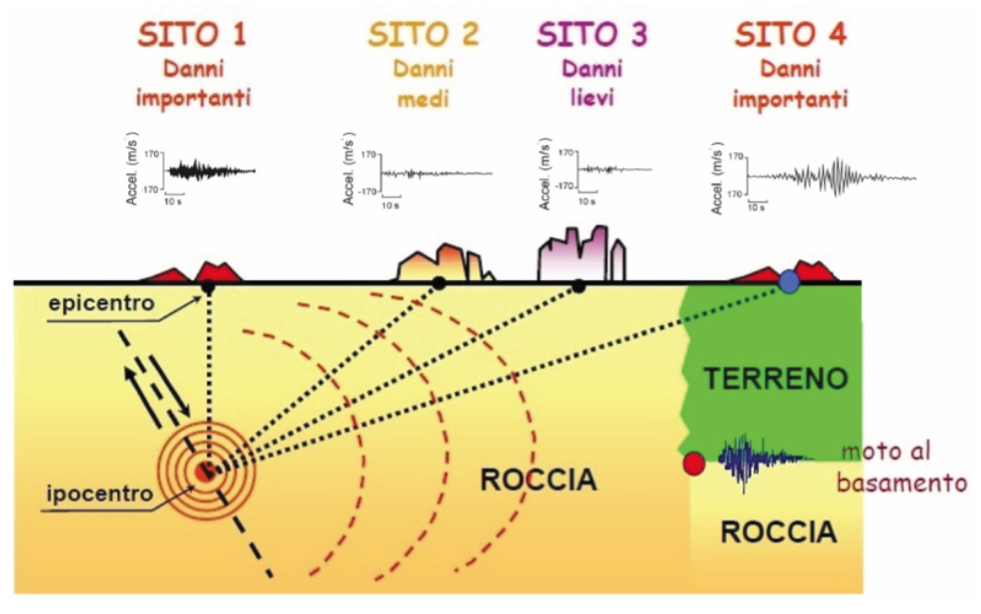
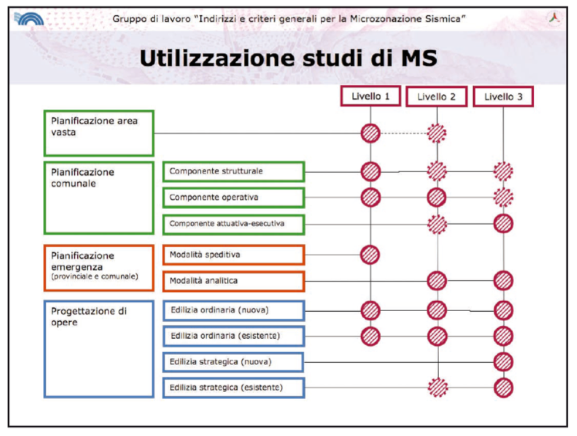

<!-- TOC --> 
- [2. Appunti per la prevenzione sismica da pretendere](#2-appunti-per-la-prevenzione-sismica-da-pretendere)
<!-- /TOC -->

# 2. Appunti per la prevenzione sismica da pretendere
*A cura dell'associazione [Geologia Senza Frontiere](http://www.gsf.it/).*

**Il terremoto** si genera in profondità, sotto la superficie terrestre; entro i primi chilometri di crosta fragile le tensioni accumulate si liberano improvvisamente in corrispondenza di una frattura: la crosta si rompe, interi settori di roccia compatta in pochi secondi scorrono uno sull'altra, le fratture si propagano per chilometri.
E' un fenomeno violento e improvviso: dall'ipocentro si liberano enormi quantità di energia che si diffondono in tutte le direzioni sotto forma di onde sferiche che raggiungono la superficie terrestre in corrispondenza dell'epicentro posto sulla esatta verticale del punto di rottura profondo.

Pochi secondi, le onde sismiche attraversano tutta la crosta verso l'epicentro – influenzando la circolazione idrica sotterranea, modificando il regime delle sorgenti, la composizione delle acque, le emissioni gassose interagiscono con l'atmosfera, generano altre onde, percorrono centinaia di chilometri in tutte le direzioni.

Tutto viene investito dal complesso treno di onde che si propaga: versanti vallivi, frane, massi instabili, costruzioni, strade, tutto è sottoposto ad accelerazioni, scuotimenti, oscillazioni, deformazioni, alcune delle quali tanto forti da vincere la resistenza strutturale degli edifici e determinarne il danneggiamento o il collasso definitivo.

Idealmente verrebbe da pensare che più stai lontano, più sei in sicurezza.
Le onde sismiche interessano volumi di crosta via via maggiori e progressivamente l'energia viene dissipata; a maggiore distanza dall'epicentro gli scuotimenti si riducono, i diversi tipi di onde generate dal terremoto viaggiano a diversa velocità e si distanziano, si disperdono, diventano nel complesso meno distruttive.
Il terremoto senza dubbio si percepisce, magari ci sveglia, ci inquieta, ma è solo uno spavento, niente di più; nei giorni successivi resta un ricordo dell'instabilità. Ma siamo lontani non c'è pericolo.
In effetti, verrebbe da dire, il maggior scuotimento dovrebbe registrarsi all'epicentro e allontanandosi da tale punto in tutte le direzioni, le accelerazioni dovrebbero progressivamente diminuire e i danni agli edifici diventare radi, lievi e poi nulli.

Però non è proprio così.
Dopo un evento sismico di una certa entità a tutti può apparire immediatamente evidente come gli effetti del terremoto siano distribuiti in modo eterogeneo nella zona del sisma, talvolta con fortissimi danneggiamenti posti anche a grande distanza dall'epicentro oppure localizzati solo in alcune aree circoscritte, all'interno delle quali si verificano i maggiori crolli, circondate da zone prive o quasi di danni agli edifici che appaiono misteriosamente indenni nonostante siano pressoché identici a quelli crollati poco lontano.
**C'è qualche motivo o è solo un caso? Magari dipende dalle modalità costruttive, o c'è qualcos'altro?**

L'ipotesi di progressiva riduzione degli effetti superficiali di un sisma al crescere della distanza epicentrale sarebbe corretta solo se tutto il sottosuolo fosse omogeneamente costituito da rocce compatte e prive di discontinuità; nella realtà esistono rocce più tenere o fratturate, cavità sotterranee, e soprattutto "terreni soffici" appena sotto la superficie (ad esempio i depositi alluvionali più recenti) che ricoprono anche per centinaia o migliaia di metri le rocce compatte del cosiddetto **bedrock o basamento sismico** entro cui si propagano più o meno inalterate le onde generate dal sisma.

**Le fondazioni delle nostre case** spesso poggiano proprio su tali depositi meno coerenti, costituiti da terre o rocce tenere, o si trovano alla base di versanti vallivi interessati da frane, spesso molto antiche, o ancora su sistemi di cavità sotterranee o terreni granulari sciolti e saturi d'acqua.

**Le onde generate da un terremoto**, attraversando più o meno omogeneamente le rocce rigide e compatte del basamento sismico, raggiungono la base dei depositi superficiali; il passaggio da un mezzo più rigido (la roccia) ad uno più soffice (i depositi di copertura) modifica la forma dell'onda, le sue caratteristiche di ampiezza e frequenza: l'onda rallenta, ma aumenta l'ampiezza.
Si assiste a una **"amplificazione"** del moto sismico legata alla presenza di terreni più soffici e incoerenti.
L'effetto di tale fenomeno è potenzialmente devastante anche a grande distanza dall'epicentro e fenomeni simili si sono osservati in occasione di ogni grande terremoto. Inoltre, l'amplificazione del moto sismico in corrispondenza di versanti o creste rocciose, legata a fattori morfologici oltre che litologici, può indurre l'innesco di fenomeni franosi o la riattivazione di antiche frane, di cui non di rado si perde memoria e sulle quali spesso sono stati costruiti interi paesi.

> Ricapitolando è quindi chiaro che gli effetti che un terremoto provoca in termini di crolli e devastazioni, sono legati sia alla potenza dell'energia sprigionata ( la forza del terremoto, espressa dalla Magnitudo), sia alla presenza di caratteristiche locali in grado di modificare l'inda sismica tanto da amplificarne l'effetto.

**Fare prevenzione sismica**, intendendo con tale termine l'insieme di attività volte ad evitare o a ridurre al minimo la possibilità che si verifichino danni conseguenti ad eventi sismici, significa avere a che fare con i seguenti due aspetti:

**1.** Da una parte la **conoscenza delle zone a maggiore sismicità**, quelle
porzioni del territorio localizzate più vicino alle sorgenti sismogenetiche note (le faglie attive conosciute), in corrispondenza delle quali possono generarsi gli eventi sismici di maggiore entità;

**2.** Dall'altra **la conoscenza puntuale del territorio** con l'individuazione di tutte le condizioni locali che possano indurre amplificazione sismica o effetti di sito, in grado di produrre danneggiamenti di entità maggiore di quelli attesi in zone di affioramento in superficie del basamento sismico.

**La conoscenza della struttura profonda del territorio** nazionale, con la delimitazione dei settori a maggiore sismicità, l'individuazione delle sorgenti sismogenetiche con l'ulteriore valutazione del loro potenziale in termini di energia sprigionata e frequenze di ricorrenza, la definizione delle leggi di propagazione del moto sismico in profondità e, quindi, la definizione della **"pericolosità sismica di base"** di ogni punto del territorio italiano è un lavoro che devono e possono svolgere solo gli istituti di ricerca nazionali competenti in materia (INGV in primis) e che in passato ha condotto alla redazione della **Carta di pericolosità sismica del territorio nazionale**, recepita dalle Norme Tecniche per le costruzioni (approvate però solo dopo il terremoto de L'Aquila).
**La definizione della pericolosità sismica locale**, ovvero la componente di pericolosità legata ai caratteri geologici e geomorfologici locali, si fonda su un lavoro puntuale e approfondito che dovrebbe essere svolto, su incarico delle amministrazioni regionali o comunali, da soggetti realizzatori competenti nelle materie geologiche e geofisiche.

**La Microzonazione Sismica** è definita come la **"valutazione della pericolosità sismica locale attraverso l'individuazione di zone del territorio caratterizzate da comportamento sismico uniforme"**; la microzonazione sismica è stata introdotta in Italia nell'ambito della normativa relativa alle costruzioni e alla pianificazione territoriale solo da circa un decennio, sebbene fosse noto da tempo che le caratteristiche locali del territorio sono in grado di alterare sensibilmente l'azione sismica e che la definizione delle azioni sismiche attese non può prescindere dall'analisi di sito.

Gli studi di microzonazione sismica, articolati nei vari livelli di approfondimento di seguito descritti, costituiscono uno strumento indispensabile ai fini della prevenzione sismica e della valutazione del rischio sismico a supporto della pianificazione territoriale, della progettazione edilizia (sia per nuovi fabbricati che per interventi sul patrimonio esistente) e della pianificazione dell'emergenza.
**"La microzonazione sismica ha lo scopo di riconoscere ad una scala sufficientemente grande (scala comunale o subcomunale) le condizioni locali che possono modificare le caratteristiche del moto sismico atteso o possono produrre deformazioni permanenti rilevanti per le costruzioni e le infrastrutture"** (ICMS 2008).

Le Regioni hanno il compito di predisporre le specifiche per la realizzazione degli studi e le modalità di utilizzo (anche in relazione agli altri strumenti di pianificazione urbanistica o di emergenza).

In funzione dei diversi contesti e obiettivi, gli studi di microzonazione sismica possono essere effettuati a diversi livelli di approfondimento successivo, con complessità e impegno crescenti:

**LIVELLO 1**
Raccolta ed elaborazione di dati preesistenti allo scopo di suddividere il territorio in microzone con comportamento sismico qualitativamente omogeneo; è propedeutico ai veri e propri studi di microzonazione sismica di dettaglio, che generalmente vengono svolti su aree specifiche.
Il principale prodotto del livello 1 di microzonazione sismica – generalmente esteso all'intero territorio comunale – è la **Carta delle microzone omogenee in prospettiva sismica** (Carta MOPS) che dovrebbe costituire un documento fondamentale sia nell'ambito della pianificazione urbanistica che nella pianificazione dell'emergenza.
**La carta MOPS** che deve essere validata (generalmente dagli uffici regionali competenti in materia sismica) riclassifica il territorio comunale in diverse microzone (le MOPS) individuate e caratterizzate secondo tre categorie principali.

* **Zone stabili**:
zone dove non si ipotizzano effetti locali di rilievo e dove quindi il moto sismico non viene modificato rispetto a quello atteso in condizioni di substrato sismico rigido affiorante e topografia orizzontale; in questi settori gli scuotimenti attesi coincidono con quelli forniti dagli studi per la definizione della pericolosità sismica di base.
* **Zone stabili suscettibili di amplificazioni locali**:
zone dove sono attese amplificazioni del moto sismico dovute alla litostratigrafia e alla morfologia locale.
* **Zone suscettibili di instabilità**:
in cui i terreni sono suscettibili di attivazione di fenomeni di deformazione permanente del territorio a seguito di un evento sismico (instabilità di versante, cedimenti, liquefazioni, faglie attive e/o capaci).

**LIVELLO 2**
Vengono condotti degli approfondimenti conoscitivi per le incertezze
individuate nel Livello 1 e viene associato alle microzone omogenee l'elemento quantitativo, espresso come **fattore di amplificazione Fa**.
Il livello 2 costituisce un approfondimento che viene richiesto in aree specifiche a scala sub-comunale; il prodotto principale è la **Carta di microzonazione sismica**.

**LIVELLO 3**
Livello di ulteriore approfondimento che viene realizzato nelle zone
stabili suscettibili di amplificazioni locali, nei casi di situazioni geologiche e geotecniche complesse oppure nelle zone suscettibili di instabilità particolarmente gravose per complessità del fenomeno e/o diffusione areale; il livello 3 di MS , si basa su analisi numeriche ot tenute da dati di indagini geologico-tecniche e geofisiche eseguite in situ e di prove di laboratorio e consente di raggiungere un livello di conoscenza dell'azione sismica attesa paragonabile a quello richiesto per la progettazione strutturale.

La seguente immagine, tratta dagli indirizzi e criteri generali per la Microzonazione Sismica (ICMS 2008), evidenzia la relazione tra i diversi livelli di approfondimento degli studi di microzonazione sismica e le esigenze della pianificazione e della progettazione di opere.

Da quanto finora brevemente esposto, risulta evidente che una corretta azione di prevenzione sismica, di mitigazione del rischio sismico e di pianificazione delle emergenze non può che passare attraverso la realizzazione di studi di microzonazione sismica di un livello adeguato; nei territori a maggiore pericolosità sismica di base, è indispensabile eseguire studi approfonditi sia nelle aree in cui si prevedono nuove espansioni urbanistiche, sia nelle zone già edificate, nei centri storici e in corrispondenza delle principali infrastrutture.
Questo passaggio è fondamentale per cercare di intervenire su un patrimonio edilizio storico spesso localizzato in settori suscettibili di amplificazione sismica (come nel caso del centro di Amatrice) o in zone instabili (come ad esempio nella zona di Pescara del Tronto); 
**la definizione quantitativa della azione sismica attesa è infatti l'unico strumento rigoroso per la progettazione di interventi di miglioramento o adeguamento delle strutture esistenti**.

La Carta MOPS del Comune di Amatrice, scaricabile dal sito della Regione Lazio, è stata validata il 15 marzo 2017; il 24 agosto del 2016 il Comune, classificato da sempre ad elevata sismicità, era evidentemente privo di tale strumento indispensabile.

> E' chiaro che l'esecuzione di studi di microzonazione sismica, ancorché molto approfonditi, è totalmente superflua e autoreferenziale se tali studi non costituiscono poi la base per un'azione di governo del territorio efficace.
Tuttavia è indispensabile che sull'intero territorio nazionale e ancor di più nelle aree a maggiore pericolosità sismica di base, la popolazione solleciti con forza la realizzazione degli studi di microzonazione sismica insieme all'attivazione di tutti gli strumenti di pianificazione e conoscenza (ad esempio i Piani di Emergenza Comunale, con l'analisi della condizione limite dell'emergenza, ecc.) indispensabili per un'azione di governo finalizzata alla prevenzione dal rischio sismico e dagli altri rischi naturali.

**Bibliografia**:
* **Lanzo 2012** - Risposta sismica locale: fondamenti teorici e modellazione numerica.
* **Dipartimento di protezione civile 2008**: Indirizzi e criteri generali per la Microzonazione Sismica.