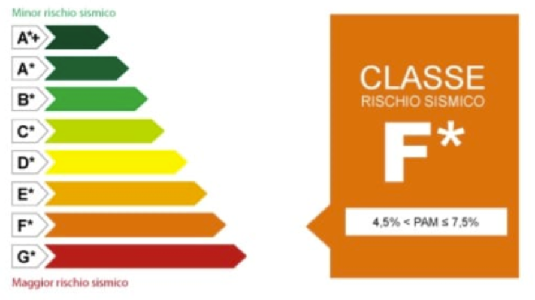
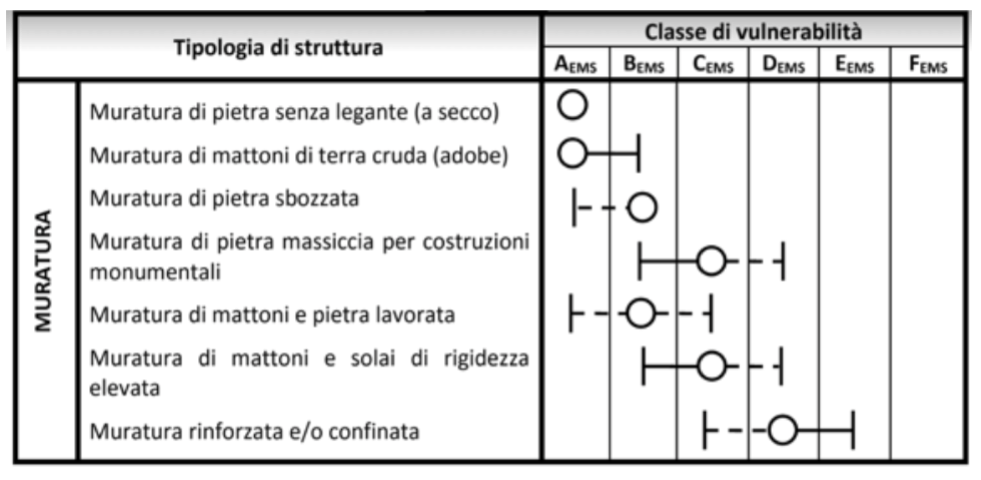
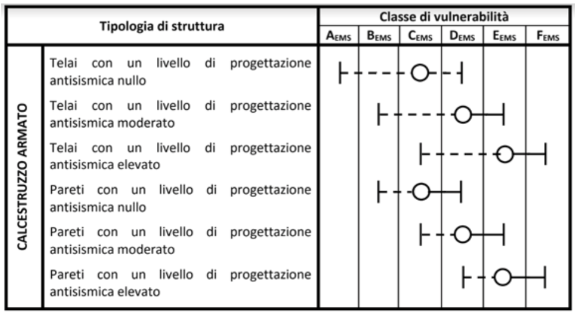
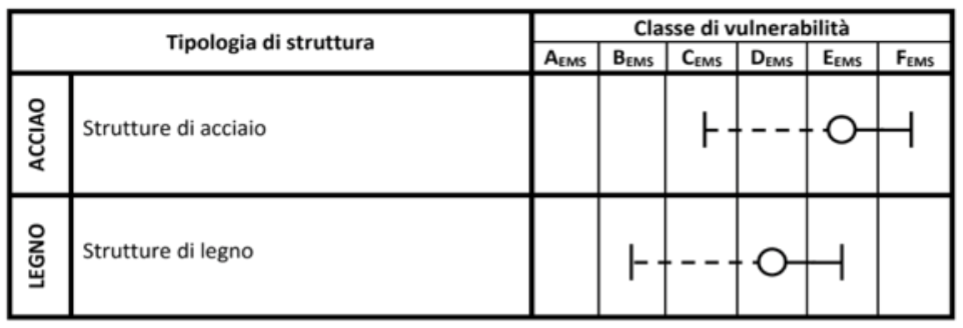
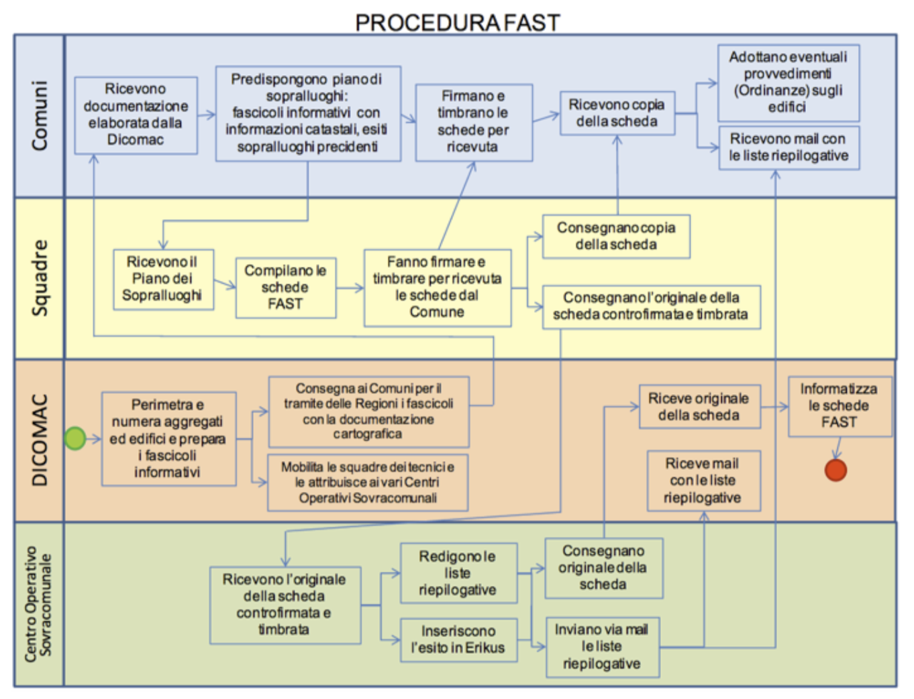
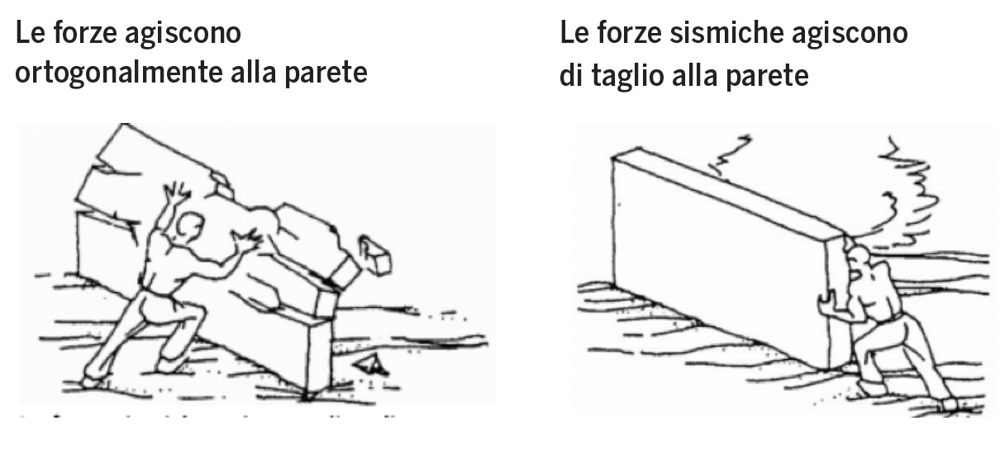
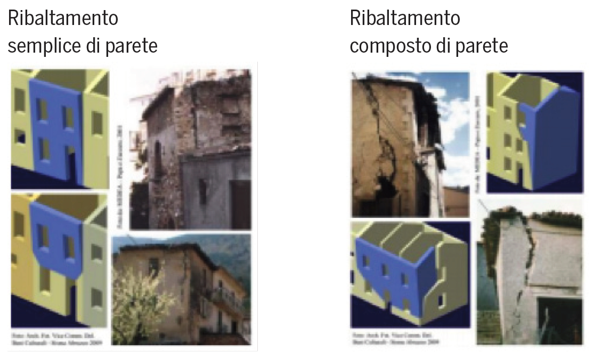
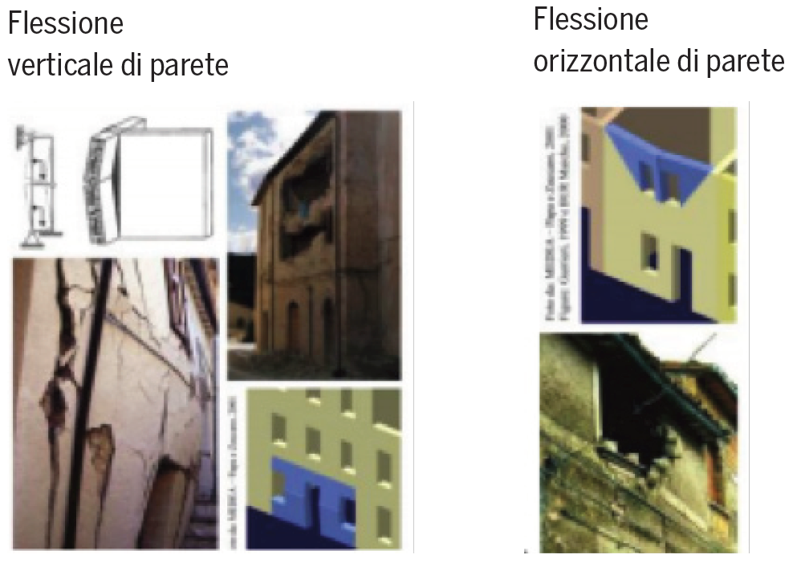
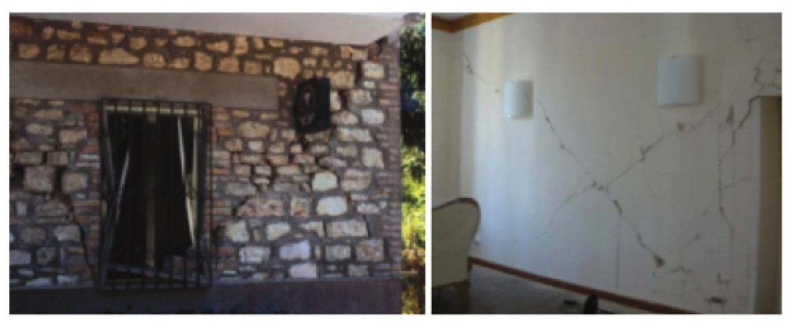

# 4. Ingegneria antisismica

## RISCHIO SISMICO COS'È?

A cura dell'associazione Ingegneria Senza Frontiere.

Come viene stabilito se una struttura ha un elevato rischio sismico.
Due gruppi di edifici appartenenti ad una stessa città possono avere un
rischio sismico diverso?

**Il rischio sismico** è definito come la misura probabilistica del grado di severità degli effetti (perdite) che possono essere prodotte dai terremoti, in un sito prefissato, durante un intervallo di tempo di attesa del terremoto prefissato.

Per poter valutare il rischio sismico si valutano principalmente tre fattori principali: **la pericolosità sismica, la vulnerabilità e l'esposizione**.

**PERICOLOSITÀ SISMICA** è definita come la misura probabilistica del grado di severità dei terremoti che possono presentarsi in un sito prefissato, durante un intervallo di tempo prefissato.

**VULNERABILITÀ SISMICA** è definita come misura probabilistica dell'entità del danno che un manufatto di prefissata tipologia subisce per effetto di un terremoto di prefissata severità.

**ESPOSIZIONE** è definita come la misura probabilistica della quantità di beni e attività che si accompagnano ad una prefissata tipologia strutturale.

**Il rischio sismico viene infine valutato da una combinazione delle tre caratteristiche**:

**Rischio = Pericolosità x Vulnerabilità x Esposizione**

Il rischio sismico viene classificato secondo una scala da A+ (basso rischio) a G, elevato rischio sismico.

L'Italia ha una **pericolosità sismica medio-alta** (per frequenza e intensità dei fenomeni sismici), una **vulnerabilità molto elevata** (per la fragilità del patrimonio edilizio) e un'**esposizione altissima** (per densità abitativa e presenza di un patrimonio storico, artistico e monumentale unico al mondo).
**La nostra Penisola è dunque ad elevato rischio sismico, in termini di vittime , danni alle costruzioni e costi diretti e indiretti attesi a seguito di un terremoto**.

### PERICOLOSITÁ

**La pericolosità sismica** di un territorio è rappresentata dalla frequenza e dalla forza dei terremoti che lo interessano, ovvero dalla sua sismicità.
**Viene definita come la probabilità che in una data area ed in un certo intervallo di tempo si verifichi un terremoto che superi valore di magnitudo o accelerazione al suolo**.

In questa immagine cartina dell'Italia viene riportata una classificazione della pericolosità sismica a livello macroscopico.

Gli studi di pericolosità sismica sono stati impiegati, soprattutto negli ultimi anni, nelle analisi territoriali e regionali finalizzate a **zonazioni** (pericolosità di base per la classificazione sismica) o **microzonazioni** (pericolosità locale).
In quest'ultimo caso, valutare la pericolosità significa individuare le aree a livello di territorio comunale che, in occasione di una scossa sismica, possono essere soggette a fenomeni di amplificazione e fornire indicazioni utili per la pianificazione urbanistica.

Gli studi di pericolosità possono essere utilizzati anche nelle analisi locali per localizzare opere critiche dal punto di vista della sicurezza, del rischio o dell'importanza strategica (centrali elettriche, installazioni militari, ospedali).
**Valutare la pericolosità** significa, in questo caso, stabilire la probabilità di occorrenza di un terremoto di magnitudo (o Pga) superiore al valore di soglia stabilito dagli organi politico/decisionali, portando all'eventuale scelta di aree diverse.

Il **metodo** più utilizzato per definire la pericolosità è quello **di Cornell**,
che prevede vengano individuate nel territorio le zone responsabili degli eventi sismici (**zone sismo genetiche**), sia quantificato il loro grado di attività sismica e si calcolino gli effetti provocati da tali zone sul territorio in relazione alla distanza dall'epicentro.

### VULNERABILITÁ

**La vulnerabilità sismica è definita come la propensione di una struttura a subire un danno di un determinato livello, a fronte di un evento sismico di una data intensità**.

Oggi, le norme per le costruzioni in zone sismiche prevedono che gli edifici:

* non si danneggino per terremoti di bassa intensità;
* non abbiano danni strutturali per terremoti di media intensità;
* non crollino in occasione di terremoti forti, pur potendo subire gravi danni.

Dopo un terremoto, per valutare la vulnerabilità degli edifici è sufficiente rilevare i danni provocati, associandoli all'intensità della scossa.

Più complessa è invece la **valutazione della vulnerabilità degli edifici prima che si verifichi un evento sismico**.
Per questa sono stati messi a punto vari metodi.

I **metodi di tipo statistico** classificano gli edifici in funzione dei materiali di cui sono costituiti e delle tecniche con cui sono costruiti. Il metodo si basa sui dati di danneggiamento dei passati terremoti, che non sempre sono disponibili.

I **metodi di tipo meccanicistico** utilizzano, invece, modelli teorici che riproducono le principali caratteristiche degli edifici da valutare, su cui vengono studiati i danni causati da terremoti simulati.

L'impatto di un terremoto e quindi il rischio dipendono fortemente dalle caratteristiche dell'edificio.
E' stata definita una classificazione degli edifici in classi di vulnerabilità da A a F, (A più vulnerabile, F meno vulnerabile),in base alla capacità di un edificio di resistere o venire lesionato da un determinato terremoto.
Maggiore è la vulnerabilità di un edificio (materiali scadenti, assenza di misure antisismiche), maggiore sarà il rischio sismico.

Nella tabella per ogni tipologia e ogni classe di vulnerabilità, viene indicato il valore più credibile (cerchio) e la dispersione intorno a tale valore, espressa con i valori più probabili (linee continue) e meno probabili
o addirittura eccezionali (linee tratteggiate).

### ESPOSIZIONE

L'ultimo parametro importante per conoscere il rischio sismico è **l'esposizione** ovvero la **misura probabilistica della quantità di beni e attività che si accompagnano ad una prefissata tipologia strutturale**.
Tramite tale valutazione è possibile pervenire ad una quantificazione del danno in termini economici.
L' esposizione è intesa come valutazione probabilistica delle conseguenze sociali ed economiche prodotte dal raggiungimento di determinati livelli di danno negli elementi esposti, anche in relazione alla presenza
di persone e beni.
Vengono stimate le **perdite dirette**, ossia i costi strettamente legati alla riparazione del danno, e le **perdite indirette**, che possono essere **sia economiche** (costi indiretti, per lo più legati ai contenuti e all'interruzione dell'operatività della costruzione) **sia sociali** (perdite umane, perdite di valore del bene culturale, etc.), conseguenti al raggiungimento di determinati livelli di danno.

Questo parametro è il più difficile da valutare perché dipende da varie considerazioni. L'esposizione dipende principalmente dalla destinazione
d'uso dell'edificio ad esempio assume valori elevati per zone residenziali, scuole, e ospedali e valori sempre più bassi per zone rurali e di montagna.

Altri fattori che influenzano la valutazione dell'esposizione sono:
la variabilità del numero di occupanti degli edifici nell'arco del giorno, mese, anno, quindi l'orario del terremoto, le possibilità di fuggire e/o di
proteggersi, il tipo di coinvolgimento delle persone (morte o ferite subìte),la possibilità di morire anche successivamente alle attività di soccorso.

Il danno che produce il terremoto è anche un danno indiretto, legato ad esempio ad attività commerciali, sono da includere nella valutazione
dell'esposizione i legami commerciali che si sono persi tra commerciante e cliente che a seguito della chiusura dell'attività si rivolge ad altri.

Il primo obiettivo di un **programma generale di protezione dai terremoti è la salvaguardia della vita umana**.
Per questa ragione è molto importante valutare il numero delle persone coinvolte, decedute e/o ferite che può accompagnare un certo livello di danno.

I motivi che causano la perdita di vite umane possono essere di diverso tipo:
crollo di edifici, di ponti e altre costruzioni, ma anche incidenti stradali. A questi si aggiungono quelli legati a fenomeni innescati dal terremoto,
come frane, liquefazione dei terreni, maremoti, incendi. Da non sottovalutare anche il numero di morti causati da danni non
strutturali degli edifici, danni che non determinano il collasso dell'edificio, (caduta di tramezzi, vetrate, cornicioni, tegole, ecc.) indotti dal terremoto.

E' molto difficile stimare con precisione le conseguenze di un terremoto in termini di vite umane nei diversi momenti del giorno e dell'anno.
Il numero di persone che risiedono in un'abitazione, infatti, varia da regione a regione, dalla città alla campagna e dipende dalle dimensioni
del nucleo familiare. Inoltre, durante il giorno, il numero delle persone presenti in un edificio dipende dal suo utilizzo.
Ad esempio, negli uffici, la presenza è massima nelle ore centrali del giorno ed è pressoché nulla durante la notte.
In un'abitazione di città, invece, la presenza delle persone di sera e di notte è mediamente inferiore rispetto ad un'abitazione di campagna, perché esistono più attività, ludiche e lavorative, che si svolgono in quegli orari e spesso fuori casa.
Il riferimento alla tipologia di edifici e ai relativi abitanti, comunque, può fornire una stima globale accettabile per terremoti violenti che interessino vaste aree.

Altro aspetto rilevante dell'esposizione è la presenza in Italia di un patrimonio culturale inestimabile, costituito dall'edificato corrente dei nostri
centri storici, che ancora sfugge ad una quantificazione sistematica di
consistenza e qualità.
Il primo passo per la prevenzione e mitigazione del rischio sismico del patrimonio storico architettonico è, ovviamente, la conoscenza dei beni
esposti. È stato, perciò, avviato in collaborazione con il **Ministero per i Beni e le Attività Culturali - MiBAC** un censimento a scala nazionale dei
centri storici esposti al rischio e lo sviluppo di un metodo di indagine conoscitiva sulla vulnerabilità dell'edificato storico, attraverso messa a punto di un apposito strumento web **"Centri Storici e Rischio Sismico - Csrs"** di rilievo, da condividere con tutte le istituzioni competenti sul territorio.

### RISPOSTA SISMICA DELLE STRUTTURE

L'azione sismica su una struttura dipende principalmente da tre fattori: l'intensità del terremoto, il terreno e le caratteristiche della struttura stessa.

Le onde sismiche che partono dall'epicentro, propagandosi verso la superficie, subiscono variazioni dovute all' eterogeneità della crosta terrestre.
**Le caratteristiche del terreno, composizione e stratigrafia, possono quindi amplificare o ridurre gli effetti del sisma sugli edifici**.
Quindi due identici edifici allocati alla stessa distanza dall'epicentro terremoto ma su terreni di diversa struttura e composizione subiscono un'azione sismica differente.

Per questo motivo, per studiare questi effetti, viene utilizzato un parametro che meglio rappresenta l'intensità locale (in un determinato punto) del sisma: l'**accelerazione al suolo**.
Questo valore da una misura dell'entità dello scuotimento del terreno che attraverso le fondazioni imprime sugli edifici degli spostamenti con conseguenti deformazioni.

Lo **scuotimento** del terreno è rappresentato da spostamenti in direzione orizzontale e verticale, ma per quanto riguarda la risposta delle strutture quello che interessa maggiormente è quello **orizzontale**.

L'edificio subendo lo spostamento orizzontale è sottoposto, di conseguenza, ad una forza di inerzia, cioè una forza che tende a far mantenere all'edificio la sua posizione iniziale contrastando il movimento delle fondazioni e provocando la deformazione dell'edificio.

La deformazione ed i movimenti oscillatori della struttura dipenderanno principalmente da due parametri: **la massa dell'edificio** e **la sua rigidezza**.

Analogamente a quanto evidenziato prima, due edifici, con caratteristiche
diverse, massa e rigidezza(concetto legato principalmente all'altezza dell'edificio), anche se posti a stessa distanza dall'epicentro e su terreni dalle identiche caratteristiche non risponderanno nella stessa maniera al terremoto.

Quando una struttura è soggetta ad un'azione sismica, comincia ad
oscillare, e si possono presentare due scenari:

* o la struttura non risente del terremoto poichè la forza sismica è
così veloce che la struttura non se ne accorge, o comunque l'edificio
si muove in direzione opposta al movimento del terreno;
* oppure si può verificare che la struttura amplifica l'effetto del terremoto, ossia entra in risonanza.

Quello che accade in questo caso è che il movimento oscillatorio del terreno (che alterna spostamenti a destra e sinistra) è in sincrono con il movimento oscillatorio di deformazione della struttura, in questo moto l'energia di deformazione impressa sull'edificio aumenta, incrementando il rischio di danneggiamento e collasso.

Definita l'entità della deformazione, i danni che subirà l'edificio, saranno conseguenza del materiale (in particolare la sua capacità di assorbire le deformazioni), degli elementi strutturali (travi e pilastri) e della loro disposizione, e da come le forze di deformazione incidono.

In generale possiamo dire che **fabbricati alti e snelli** subiranno oscillazioni ampie (si pensi al movimento di tali fabbricati come fosse in ritardo rispetto al movimento del terreno, in quanto si avranno oscillazioni dell'edificio ampie mentre l'accelerazione del terreno è bassa).
Per **fabbricati bassi e rigidi**, le oscillazioni saranno contenute e si muoveranno quasi allo stesso modo del terreno.
In tal caso l'effetto di accelerazione sarà minore, con minor rischio di
crolli o danni.

## AGIBILITÀ E VULNERABILITÀ

### PERIZIA DI AGIBILITÀ

**Scheda FAST**

La procedura **FAST (rilevamento sui Fabbricati per l'Agibilità Sintetica post-Terremoto)** è finalizzata ad individuare rapidamente le situazioni nelle quali sussistono le condizioni per la concessione delle soluzioni abitative di breve termine (moduli-container).
Tale procedura prevede una rapida ricognizione da effettuarsi o su singoli edifici o a tappeto su tutti i fabbricati ubicati in aree perimetrate indicate dai Sindaci stessi.

L'esito della valutazione deve essere riportato dalla squadra di tecnici
preposti su una scheda sintetica (**scheda FAST**) finalizzata a selezionare
gli edifici agibili rispetto a quelli non utilizzabili immediatamente per il
venir meno delle condizioni di sicurezza a causa di un danneggiamento
del fabbricato o per condizioni di rischio esterno.
Qualora non sia possibile emettere una valutazione, per difficoltà di
accesso, assenza del proprietario o altre motivazioni, nella scheda sarà
riportato che il sopralluogo non è stato eseguito.
**La procedura con scheda FAST non è sostitutiva**, ai fini della ricostruzione, della procedura **con scheda Aedes** per quanto riguarda l'approfondimento degli edifici valutati non utilizzabili.

**Scheda AEDES**

La scheda di **primo livello di rilevamento danno**, pronto intervento e agibilità per edifici ordinari nell'emergenza post- sismica **AeDES (Agibilità e
Danno nell'Emergenza Sismica)** è finalizzata al rilevamento delle caratteristiche tipologiche, del danno e dell'agibilità degli edifici ordinari nella
fase di emergenza che segue il terremoto.
Gli edifici sono intesi come unità strutturali di tipologia costruttiva (tipicamente quella in muratura, in cemento armato o acciaio intelaiato o
a setti) dell'edilizia per abitazioni e/o servizi.
È **esclusa pertanto l'applicazione della scheda** agli edifici a tipologia
specialistica (**capannoni industriali, edilizia sportiva, teatri, chiese etc.**)
o monumentale.
La scheda consente di effettuare un rilievo speditivo ed una prima catalogazione del patrimonio edilizio, disponendo di dati tipologici e metrici
degli edifici. Accoppiati ai dati di danno, tali dati sono utili anche ad una prima valutazione dei costi di riparazione e/o miglioramento, consentendo di predisporre scenari di costo per diversi contributi unitari associati a diverse soglie di danno.
**La valutazione di agibilità in emergenza post-sismica è una valutazione
temporanea** e speditiva - vale a dire formulata sulla base di un giudizio
esperto e condotta in tempi limitati, in base alla **semplice analisi visiva** ed
alla raccolta di informazioni facilmente accessibili - volta a stabilire se, in
presenza di una crisi sismica in atto, gli edifici colpiti dal terremoto possano essere utilizzati restando ragionevolmente protetta la vita umana.
Tale definizione presuppone la **conoscenza della massima intensità che
può verificarsi al sito** nel corso della crisi sismica, e cioè dell'evento di
riferimento rispetto al quale formulare il giudizio di agibilità.
In particolare se l'evento di riferimento al sito è quello di intensità massima risentito nello stesso sito durante la crisi sismica in atto, più certo
sarà il giudizio di agibilità.
Questa ipotesi è generalmente abbastanza cautelativa nelle zone epicentrali, dove con minore probabilità si verificano risentimenti di intensità
più elevata della scossa principale.

**Riguardo al giudizio di agibilità sono contemplati sei differenti esiti:**

**A** Edificio agibile

**B** Edificio temporaneamente inagibile (tutto o parte) ma agibile con
provvedimenti di pronto intervento

**C** Edificio parzialmente inagibile

**D** Edificio temporaneamente inagibile da rivedere con approfondimento

**E** Edificio inagibile

**F** Edificio inagibile con rischio esterno

[Quadro sintetico aggiornato delle perizie di agibilità](http://www.protezionecivile.gov.it/jcms/it/verifiche_di_agibilit.wp) - ultimo aggiornamento: 11 agosto 2017

### PERIZIA DI VULNERABILITÀ

**Come valutare la vulnerabilità di una struttura?**

In termini tecnici la vulnerabilità sismica di una struttura è rappresentata da un **indicatore** che mette in relazione la capacità di resistenza
della struttura e la richiesta in termini di **resistenza** e/o **spostamento**
del sisma.
Le procedure per la valutazione della vulnerabilità sismica degli edifici
possono essere condotte con diversi gradi di approfondimento e complessità di calcolo: da **stime più qualitative**, basate sul rilievo mediante schede
delle principali caratteristiche degli elementi costitutivi dell'edificio, a **complesse analisi numeriche** mediante metodi di calcolo lineari e non lineari.

Naturalmente tutte le procedure di valutazione della vulnerabilità degli
edifici esistenti basate sulla compilazione di schede cartacee conducono a considerazioni preliminari ed i risultati con esse ottenuti possono
essere utilizzati al più per stabilire un ordine di priorità sui possibili
interventi di adeguamento o miglioramento.
Di contro, la stima della vulnerabilità sismica globale di una struttura ai
fini della redazione di un progetto strutturale di miglioramento/adeguamento sismico deve essere conseguita mediante l'esecuzione di calcoli
strutturali coerenti con i metodi di analisi previsti dalle Norme Tecniche
per le Costruzioni.

La stima della vulnerabilità mediante schede viene eseguita in sede di
sopralluogo associando una certa classe ad un set di parametri rappresentativi della tipologia strutturale e del grado di conservazione dei
principali elementi portanti.
Ad ogni parametro è associata una **scala di punteggi** variabile in base
alla classe che può essere associata.
La combinazione dei punteggi ottenuti porta ad una **valutazione dell'indice di vulnerabilità della struttura**.
L'indicatore riassume pertanto le vulnerabilità numeriche in un unico
valore "di facile lettura", che non è però da considerare esaustivo in
quanto nelle verifiche numeriche non vengono incluse vulnerabilità quali ad esempio la caduta di comignoli o di altri elementi non strutturali.

E' obbligatoria l'esecuzione di vulnerabilità sismica per gli **edifici strategici e rilevanti** in relazione **alle conseguenze di un eventuale collasso**.
In via generale, i manufatti soggetti ad affollamento sono considerati rilevanti in relazione ad un eventuale collasso, facendo rientrare in questa
categoria **scuole, stadi, case di riposo, teatri, discoteche, ecc**.
Gli edifici strategici sono invece gli edifici che devono mantenere l'operatività durante e nel post dell'evento sismico, comprendendo in tal
modo ospedali, caserme di Polizia, Carabinieri, uffici tecnici comunali,
ufficio dell'anagrafe, ecc.
I soggetti proprietari possono essere sia pubblici che privati.
**Edifici ordinari** sono le comuni abitazioni ad esempio (classe d'uso II), **i
rilevanti** hanno classe d'uso III, **gli strategici** hanno classe d'uso IV. Al
crescere della classe d'uso cresce il periodo di ritorno (tempo medio
intercorrente tra il verificarsi di due eventi successivi di entità uguale
o superiore ad un valore di assegnata intensità) dell'evento sismico da
considerare a riferimento per il calcolo delle strutture da progettare.

### ITER PROGETTUALE PER LA VALUTAZIONE DELLA VULNERABILITÀ SISMICA

Per la stima dell'indice di vulnerabilità sismica di un edificio si segue
l'iter progettuale di **‘Valutazione della sicurezza'** espresso nelle attuali
Norme Tecniche per le Costruzioni, riassunto di seguito.

* **Acquisizione documentazone disponibile** - La fase preliminare della valutazione della vulnerabilità di un edificio esistente sarà costituita dall'acquisizione di tutta la documentazione disponibile. Più i dati di partenza saranno esaustivi il risultato finale sarà più attendibile.

* **Rilievo geometrico strutturale** - Questa fase è estremamente importante, tramite sopralluogo da parte del tecnico incaricato verrà eseguita un'acquisizione esaustiva delle caratteristiche della struttura.
Verranno individuate le strutture resistenti, i carichi agenti, la tipologia
strutturale, la disposizione in pianta degli elementi strutturali, rilievo delle fondazioni ed ogni altro aspetto che può influire sulla valutazione di
sicurezza, come ad esempio la presenza di quadri fessurativi sviluppati.

* **Caratterizzazione meccanica dei materiali** - Le Norme obbligano ad eseguire un numero di prove sui materiali che costituiscono la struttura, si acquisiranno tutte le informazioni anche in merito al sottosuolo.

* **Livelli di conoscenza e dei conseguenti fattori di confidenza** - Non tutte le informazioni caratterizzanti l'edificio dal punto di vista meccanico saranno individuate per vari motivi. 
Una struttura di cui si conosce poco, sarà penalizzata da fattori cautelativi che andranno a ridurre le caratteristiche meccaniche dei materiali.
Le Norme Tecniche per le Costruzioni prevedono tre livelli di conoscenza per l'edificio, e premiano le analisi svolte a partire da un elevato livello
di conoscenza permettendo di adottare coefficienti riduttivi delle proprietà meccaniche dei materiali via via minori.
 
* **Analisi strutturale** - Acquisite tutte le informazioni necessarie, è possibile procedere con l'analisi numerica, viene creato un modello di calcolo su cui fare analisi e simulazioni con l'ausilio di software.
L'obiettivo è quello di individuare la capacità globale della struttura,
ossia la forza sismica che porta al collasso la struttura e rapportarla
con quella prevista dalla normativa.

* **Determinazione della vulnerabilità** - Il rapporto tra capacità della struttura di far fronte al sisma e **richiesta** (in termini di resistenza e/o spostamento) da parte del sisma di riferimento previsto dalla normativa, permette la definizione dell'**indicatore di rischio sismico**.
Parametro che ci indicherà se l'edificio in questione dovrà subire interventi. La valutazione di vulnerabilità comprenderà inoltre tutti gli aspetti non desumibili dalla sola analisi numerica e che devono essere formulati dalla competenza del professionista: tali aspetti comprendono la stabilità di elementi non strutturali (controsoffitti, comignoli, ecc.) o particolari che devono essere rilevati in fase di acquisizione delle informazioni (presenza di travi non adeguatamente ammorsate, giunzioni tra travi lignee insufficienti, ecc.).

* **Proposta di eventuali interventi di adeguamento e valutazione del rapporto costi/benefici ottimale** - Le Norme obbligano ad eseguire un numero di prove sui materiali che costituiscono la struttura, si acquisiranno tutte le informazioni
anche in merito al sottosuolo.

**NOTA**
> La verifica di vulnerabilità sismica deve essere condotta dai soggetti proprietari.
Un proprietario pubblico o privato che non esegue la vulnerabilità sismica non
rispetta i termini di legge; ma non sono previste sanzioni per gli inadempienti.

### QUAL È IL RAPPORTO TRA AGIBILITÀ E VULNERABILITÀ?

Viene intesa l'agibilità come la capacità delle strutture di far fronte ad
ulteriori sismi di stessa intensità di quelli a cui sono già state soggette.
La vulnerabilità sismica deriva invece dall'inadeguatezza nei confronti
della Normativa Tecnica vigente, riferita alle azioni sismiche di progetto
(che possono essere maggiori di quelle verificatesi).

**Le azioni sismiche possono agire in due modi:**

**Nel primo caso si può incorrere nel meccanismo di collasso**

Questi tipi di danno dipendono principalmente dall'articolazione architettonica, dalle qualità costruttive e dai danni pregressi.

Per quanto riguarda il secondo meccanismo invece si formano danni del
tipo illustrato:

Dato il movimento oscillatorio impresso dal terremoto sull' edificio,
quest'ultimo si muoverà inizialmente ipotizziamo verso destra ma rimarrà ancorato al terreno tramite le fondazioni, in questo movimento si
genererà una lesione dal basso verso l'alto da sinistra verso destra inclinata a 45 gradi, quando invece la struttura si muoverà verso sinistra si
genererà la fessura nella direzione opposta sempre dal basso verso l'alto.
Queste sono le tipiche lesioni ad X.

**Questo meccanismo è amplificato in virtù della presenza di aperture
nella parete**.

### INTERVENTI DI RIDUZIONE DEL RISCHIO SISMICO

Essendo il rischio sismico il risultato dell'incrocio tra pericolosità, vulnerabilità sismica della costruzione ed esposizione, ed essendo la pericolosità una proprietà del sito su cui l'edificio sorge, dunque immutabile,
l'unico mezzo di cui si dispone per ridurre il rischio, non volendo o non
potendo variare l'esposizione, ovvero l'uso attuale della costruzione, è
la riduzione della vulnerabilità.
La vulnerabilità sismica di un edificio, peraltro, è quantizzata dal rapporto tra capacità e domanda e la domanda sismica cui l'edificio è soggetto non dipende solo dalla pericolosità sismica del sito, ma anche dalla risposta sismica dell'edificio stesso.

Per ridurre il rischio sismico di un edificio riducendone la vulnerabilità,
dunque, si può (i due approcci non sono alternativi e possono essere
adottati anche congiuntamente):

* **Aumentarne la capacità sismica**
* **Ridurne la risposta sismica**

**Gli interventi che aumentano la capacità**, possono essere suddivisi in tre
categorie:

* **Rinforzo di elementi strutturali esistenti** (ad esempio travi, pilastri, fondazioni, solai, pareti), con conseguente **incremento delle loro capacità resistenti e/o deformative**. Sia nel caso di edifici di muratura, sia nel caso di edifici con struttura di c.a., ciò può essere ottenuto, ad esempio, mediante l'appli    cazione di cerchiature o rinforzi di calcestruzzo, acciaio, fibre di carbonio, fibre di vetro e l'eventuale inserimento di armature o fibre longitudinali aggiuntive.

* **Miglioramento delle connessioni tra elementi strutturali e, più in generale, della collaborazione fra elementi strutturali finalizzata al funzionamento locale, con ripercussioni positive sul comportamento d'insieme**. Il miglioramento del funzionamento locale, infatti, mira a scongiurare il realizzarsi di meccanismi e rotture locali sfavorevoli, riconducendoil comportamento d'insieme a quello più favorevole per la tipologia di appartenenza. Nel caso di edifici in muratura ciò può essere ottenuto mediante catene o tiranti destinati a contrastare il ribaltamento delle pareti, a collegare i solai alle pareti con vincoli bilaterali, a raccogliere le spinte di archi e volte; nel caso di edifici in c.a. ciò può essere otte    nuto migliorando la rigidezza dei solai nel loro piano, collegando i solai alle travi perimetrali, le tamponature ai telai perimetrali, le fondazioni tra loro.

* **Inserimento di nuovi elementi strutturali**, all'esterno o all'interno dell'edificio, sia in muratura sia in c.a., quali ad esempio pareti in calcestruzzo o telai in acciaio, che contribuiscono in maniera significativa a resistere alle azioni sismiche.

**Gli interventi che riducono la risposta**, possono essere suddivisi in due
categorie:

* **Introduzione di dispositivi che riducono la risposta tagliando l'ener    gia in entrata**, ad esempio mediante isolamento sismico, alla base o a un certo piano dell'edificio.

* **Introduzione di dispositivi che riducono la risposta dissipando l'energia già entrata**, ad esempio con appositi dispositivi inseriti o facenti parte di controventi o creando un sistema di masse accordate.

**Interventi di rafforzamento locale, miglioramento, adeguamento**

Per decidere l'entità dell'intervento si dovrà tenere conto di almeno
tre esigenze:

* **Le prescrizioni normative**
* **Le finalità da perseguire**
* **La convenienza a intervenire (quantizzata eventualmente da un'analisi
costi benefici)**

Le Norme Tecniche per le Costruzioni prevedono tre diversi livelli di intervento sulle costruzioni esistenti, finalizzandoli al conseguimento di livelli di sicurezza antisismica progressivamente crescenti, e precisamente:

* **Riparazione o rafforzamento locale**, che interessa singoli elementi o porzioni della costruzione e comporta un sicuro incremento delle prestazioni a livello locale, e conseguentemente a livello globale, senza obbligo di valutazione dell'incremento della sicurezza della costruzione nel suo complesso;

* **Miglioramento**, che prevede il conseguimento di un livello di sicu    rezza antisismica (globale e/o locale) superiore a quello posseduto dalla costruzione prima dell'intervento e la valutazione dell'incre    mento di sicurezza della costruzione;

* **Adeguamento**, che prevede il conseguimento di un livello di sicurezza antisismica (globale e/o locale) pari o superiore a quello richiesto
alle nuove costruzioni e, naturalmente, la valutazione dell'incremento di sicurezza.

Si segnala che, per nessuno dei primi due, la norma fissa un livello di
sicurezza minimo da raggiungere obbligatoriamente (come invece avviene per l'adeguamento) e dunque la scelta tra rafforzamento e miglioramento è dettata dall'incrocio tra caratteristiche dell'edificio, finalità da
perseguire e convenienza.

Riportiamo qui di seguito alcuni interventi che posso essere eseguiti in
strutture in muratura.

**Principalmente gli interventi sono mirati a**:

* **Migliorare i collegamenti tra pareti** e si utilizzano ad esempio

**Tiranti** - Tengono insieme le pareti opposte degli edifici favorendo l'effetto "scatolare".

**Cerchiature** - Utilizzata sia per confinare singoli elementi strutturali che interi edifici
ha l'obiettivo di limitare o impedire le deformazioni laterali e l'innesco
della rottura.

**Cordoli** - In sommità alla muratura possono costituire una soluzione efficace per collegare le pareti, in una zona dove la muratura è meno coesa a causa del limitato livello di compressione, e per migliorare l'interazione con la copertura.
Questi possono essere realizzati: in calcestruzzo armato, in muratura
armata, in acciaio

* **Incrementare la resistenza delle murature e si utilizzano ad esempio

**Tecnica Scuci-cuci** - Si ripristinano zone limitate di muratura danneggiate con una nuova tessitura muraria tramite elementi con caratteristiche simili.

**Iniezioni di malta o Ristilatura dei giunti** - Si praticano nella muratura una serie di fori inclinati e si inietta un materiale legante (la malta cementizia) con un macchinario. Applicabile anche sui muri in pietra, consiste in una profonda scarnitura dei giunti e conseguente riempimento con malta di migliori caratteristiche.

**Iniezioni armate o Ristilatura armata** - Sono simili alle iniezioni di malta, ma contemporaneamente al getto di malta si inseriscono all'interno della muratura delle barre di armatura di rinforzo. Si ottiene il rafforzamento della parete attraverso l'introduzione di un primo strato di legante e posizionamento di una prima
barra e inserimento e compattazione di un secondo strato di legante
con successiva barra.

**Intonaci armati o Placcaggi con Fibra Rinforzata di Polimeri** - In aderenza alla superficie muraria vengono realizzate delle lastre a base cementizia armate con una rete metallica o in FRP (Fiber Reinforced Polymers).

**Costo degli interventi di rafforzamento locale e di miglioramento** - È possibile stimare, in via preliminare, il costo di ciascun tipo d'intervento su un edificio, sulla base di analisi parametriche relativamente semplici ottenendo, ovviamente, stime approssimate.
Un'idea del costo di ciascun tipo d'intervento possono darlo i valori desunti dai dati della ricostruzione degli edifici danneggiati dal terremoto di L'Aquila.
Ai fini di una corretta interpretazione dei valori sotto riportati, che comunque si riferiscono ad un campione statistico estremamente limitato per molte delle tecniche prese in esame, è bene tener conto che gli interventi di rafforzamento o miglioramento erano effettuati contestualmente a quelli di riparazione dei danni prodotti dal sisma, con una inevitabile interazione e sinergia tra le lavorazioni, e quindi dei relativi costi.
Tali costi sono, pertanto, sicuramente sottostimati.

L'analisi è stata condotta per gli edifici di agibilità B o C, sui quali sono stati eseguiti interventi dirafforzamento locale o di agibilità Esui quali sono stati effettuati interventi di **miglioramento sismico** per raggiungere una soglia di sicurezza compresa tra il **60%** e l'**80%** dell'adeguamento sismico.
Dall'analisi effettuata è emerso che il **costo medio per le diverse categorie d'intervento può essere stimato, in via approssimata, pari ai valori appresso evidenziati per i diversi livelli di intervento**.

* **Rinforzo ed incremento delle capacità deformative**

Costo medio di rafforzamento locale (edifici con esito B o C): 69 €/mq (140 edifici), in dettaglio:

| **Intervento** | **Costo** |
| :------------- |:------------- |
| CERCHIATURE CON FRP | 70 €/mq (130 edifici) |
| CERCHIATURE IN ACCIAIO | 53 €/mq (8 edifici) |
| CERCHIATURE CON ALTRI METODI | 46€/mq (2 edifici) |

* **Miglioramento**

Costo medio di miglioramento (edifici con esito E): 316 €/mq (67 edifici)), in dettaglio:

| **Intervento** | **Costo** |
| :------------- |:------------- |
| CERCHIATURE CON FRP | 308 €/mq (49 edifici) |
| CERCHIATURE IN ACCIAIO | 334 €/mq (6 edifici) |
| CERCHIATURE CON METODO CAM | 373€/mq (6 edifici) |
| CERCHIATURE IN CALCESTRUZZO | 306€/mq (6 edifici) |

Costo medio di miglioramento per inserimento di nuovi elementi strutturali:
370 €/mq (9 edifici)

Costo medio di miglioramento per inserimento di sistemi d'isolamento sismico:
392 €/mq (17 edifici)

Costi medio di miglioramento per inserimento di dispositivi di dissipazione:
400 €/mq (2 edifici)
