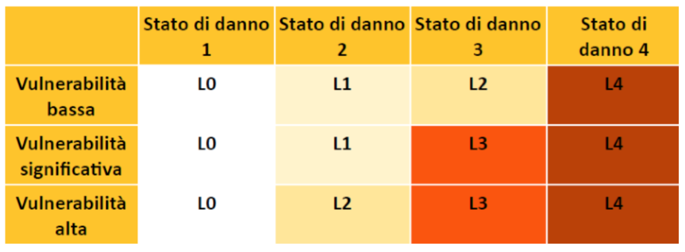

<!-- TOC -->

- [5. Ricostruzione privata](#5-ricostruzione-privata)
    - [INTERVENTI DI IMMEDIATA ESECUZIONE (Danni Lievi)](#interventi-di-immediata-esecuzione-danni-lievi)
    - [RICOSTRUZIONE PESANTE (Danni gravi)](#ricostruzione-pesante-danni-gravi)
    - [LA PERIMETRAZIONE](#la-perimetrazione)

<!-- /TOC -->

# 5. Ricostruzione privata

## INTERVENTI DI IMMEDIATA ESECUZIONE (Danni Lievi)

**CHE COSA SONO?**

È prevista una procedura specifica, anche in deroga alla normativa vigente, per l'avvio di interventi di immediata riparazione, a favore degli
edifici che hanno riportato danni lievi, al fine di favorire il rientro nelle
unità immobiliari e il ritorno alle normali condizioni di vita e di lavoro.

A tale scopo, i soggetti interessati possono avviare gli interventi di immediata esecuzione, a favore degli edifici con danni lievi classificati con
livello di **inagibilità B delle schede AeDES** (Agibilità e Danno nell'Emergenza Sismica), che necessitano soltanto di interventi di immediata riparazione, per effettuare l'immediato ripristino della agibilità degli edifici
e delle strutture, secondo le seguenti modalità:

* **la presentazione di un progetto e l'asseverazione da parte di un professionista abilitato, che documenti il nesso di causalità tra il sisma e lo stato della struttura**;
* **la comunicazione dell'avvio dei lavori di riparazione o ripristino agli uffici speciali per la ricostruzione**;
* **la presentazione della documentazione agli uffici speciali per la ricostruzione**
* **l'affidamento obbligatorio dei lavori a imprese indivi    duate in base a determinati requisiti**.

**NOTA**
> La richiesta deve essere inoltrata all'Ufficio Speciale per la Ricostruzione secondo il modello allegato alla ordinanza del Commissario Straordinario 12/2017 come modificata dalla ordinanza 29/2017, "ALLEGATO C".
Nello stesso modello sono specificatamente definiti tutti i documenti e i dati necessari.

**CHI PUÒ FARE RICHIESTA?**

La disciplina legale individua le categorie di immobili ai quali la procedura risulta applicabile, ossia "gli edifici con danni lievi (esito B e C) non classificati agibili secondo la procedura AeDES, oppure classificati non utilizzabili secondo procedure speditive disciplinate da ordinanza di protezione civile e che necessitano soltanto di interventi di immediata
riparazione".

Quindi possono usufruire della procedura di immediata esecuzione i soggetti legittimati in riferimento a:

* **Immobili adibiti ad uso abitativo o ad attività produttiva che risultano danneggiati a seguito degli eventi sismici verificatisi a far data dal 24 agosto 2016, con danni lievi così come definiti dall'Allegato 1 e dichiarati inagibili dalle schede AeDES**;

* **Immobili dichiarati non utilizzabili sulla base delle schede FAST, a cui ha fatto seguito la compilazione della scheda AeDES**;

**QUAL È LA PROCEDURA?**

La procedura per la realizzazione degli interventi di immediata esecuzione si sviluppa su **4 fondamentali passaggi**.

**1) COMUNICAZIONE DI AVVIO LAVORI**
La procedura per gli interventi di immediata esecuzione si apre con la comunicazione di avvio dei lavori da parte dei soggetti legittimati.
Tale comunicazione deve essere presentata **all'Ufficio Speciale per la Ricostruzione**. La comunicazione di inizio lavori costituisce Comunicazione di inizio lavori asseverata (**CILA**).

La comunicazione di avvio lavori deve contenere:

* **gli estremi e la categoria catastali**
* **la superficie complessiva**
* **la destinazione d'uso**
* **il numero e la data dell'ordinanza comunale di inagibilità**
* **il nominativo dei proprietari e la relativa quota di proprietà;**
* **l'eventuale nominativo dei locatari o comodatari, residenti e non, e gli estremi del contratto di locazione o comodato**.

**NOTA**
> La richiesta deve essere inoltrata all'Ufficio Speciale per la Ricostruzione secondo il modello allegato alla ordinanza del Commissario Straordinario 12/2017 come modificata dalla ordinanza 29/2017, "ALLEGATO C". Nello stesso modello sono specificatamente definiti tutti i documenti e i dati necessari.

Per il regolare rispetto della normativa, poi, è previsto che i soggetti legittimati provvedano ad allegare alla comunicazione la seguente documentazione:

* **la perizia asseverata dal tecnico incaricato della progettazione contenente gli elementi necessari previsti**
* **progetto degli interventi che si intendono eseguire**
* **dichiarazione autocertificativa della non abusività dell'immobile**
* **documentazione relativa alla procedura selettiva svolta**
* **dichiarazione autocertificativa con la quale l'impresa incaricata attesti di aver presentato domanda di iscrizione all'Anagrafe**
* **dichiarazione autocertificativa con la quale i professionisti, professionista incaricato e direttore dei lavori, attesti il possesso dei requisiti richiesti dalla normativa**
* **eventuale polizza assicurativa stipulata prima della data del sisma per il risarcimento dei danni conseguenti all'evento sismico, dalla quale risulti l'importo assicurativo riconosciuto"**.

**NOTA**
> Le comunicazioni attinenti alla procedura di immediata esecuzione devono essere inviate da parte del soggetto interessato "all'Ufficio Speciale per la Ricostruzione attraverso la piattaforma informatica sul sito istituzionale del
Commissario Straordinario" o per PEC o, se attivato, mediante lo specifico portale telematico.

**2) AVVIO DEI LAVORI E DEPOSITO DELLA DOCUMENTAZIONE INTEGRATIVA**
Contestualmente al deposito della comunicazione da parte del soggetto interessato, lo stesso, può legittimamente dare avvio ai lavori. Si tenga presente che, per il regolare rispetto della procedura, il soggetto richiedente dovrà:

* Tenere conto della necessità che i lavori rispettino, oltre alle disposizioni sancite dalle ordinanze commissariali, i contenuti generali della vigente pianificazione territoriale e urbanistica, ivi inclusa quella paesaggistica;
* Allegare o autocertificare quanto necessario ad assicurare il rispetto delle vigenti disposizioni di settore con particolare riferimento a quelle in materia di edilizia, di sicurezza e sismica. Poi, con riferimento alla documentazione integrativa è previsto **un termine di 30 GIORNI dall'inizio dei lavori per la presentazione, presso l'ufficio al quale sia stata fatta la comunicazione, della documentazione non presentata in sede di comunicazione**, ma necessaria per:

* **il rilascio del titolo abilitativo edilizio**;

* **l'autorizzazione paesaggistica**;

* **per il deposito del progetto strutturale o l'autorizzazione sismica**.

**3) DOMANDA DI CONTRIBUTO**
La domanda di contributo, deve essere presentata entro 60 giorni
dall'avvio dei lavori e comunque non oltre il 30/04/2018, rispettando, a pena di inammissibilità, la procedura stabilita dai provvedimenti emanati dal Commissario Straordinario.

Inoltre, si tenga presente che:

* **la risposta da parte dell'Ufficio per la Ricostruzione** sull'entità del contributo ammissibile sarà comunicata nei **60 giorni successivi alla richiesta**;
* qualora l'Ufficio Speciale riscontri la necessità di integrare la documentazione, assegnerà al soggetto interessato un termine per la presentazione dei documenti;
* **nel termine di 10 giorni dalla determinazione del contributo, il Vice Commissario adotta** il decreto di concessione del contributo, dandone comunicazione informatica al richiedente e all'istituto di credito prescelto dal beneficiario, che lo stesso avrà avuto premura di indicare all'Ufficio per la Ricostruzione.

**4) CONCLUSIONE DEI LAVORI**
Da ultimo, per quanto riguarda, poi, la conclusione dei lavori, la disciplina normativa stabilisce che la stessa debba avvenire, a pena di decadenza (eventuale restituzione di quanto percepito), **entro 6 mesi dalla data di concessione del contributo**.

La normativa prevede inoltre che il **soggetto interessato, adducendo giustificati motivi, possa richiedere al Comune una proroga del termine, che comunque non potrà essere superiore ai due mesi**.

**Nel caso in cui i lavori non vengano ultimati nel termine stabilito, il vice commissario procede a revocare il contributo in precedenza concesso**.

## RICOSTRUZIONE PESANTE (Danni gravi)
**CHE COSA È?**

Il processo di ricostruzione "pesante" ricomprende tutti quegli interventi finalizzati al **ripristino con miglioramento sismico** di interi edifici gravemente danneggiati o per la **ricostruzione** degli edifici completamente distrutti dal sisma.

Per ognuno di questi edifici è necessario che vi sia una **ordinanza comunale che ne dichiari l'inagibilità** oltre a una scheda AeDES che ne definisca il livello di danno.

Per le procedure di ricostruzione pesante sono stati definiti nuovi **livelli di danno che si identificano in danni per cui è previsto il ripristino con miglioramento sismico (L1-L2-L3) e danni per cui è prevista la ricostruzione di edifici interamente distrutti (L4)**.

Tali **livelli operativi di intervento** sono definiti dal rapporto tra due diversi elementi: **il livello di vulnerabilità** e lo **stato di danno**.

Per le procedure di ricostruzione è previsto un contributo ricostruzione da parte dello Stato.

**CHI SONO I BENEFICIARI?**

Possono richiedere il contributo per la ricostruzione **tutti i proprietari, usufruttuari o titolari di diritti reali (locazione, affitto, ecc.) delle abitazioni gravemente danneggiate o distrutte al momento del sisma**.

Possono richiedere tale contributo anche i **titolari di attività produttive svolte in edifici ad uso prevalentemente abitativo**.

**QUAL'È IL CONTRIBUTO?**

Per gli edifici collocati nei Comuni di cui all'art.1 comma 1 del Decreto Legge 189/2016 (**Comuni del Cratere**) il contributo concesso è pari al **100% del costo ammissibile** per ciascuna unità immobiliare destinata ad abitazione o ad attività produttiva.

Per gli **edifici non inclusi nei Comuni del Cratere**, qualora una perizia asseverata dimostri il nesso di causalità tra i danni e gli eventi sismici, il contributo concesso è pari al 50%.

Nel caso gli edifici danneggiati siano **l'abitazione principale o l'unità produttiva** sarà concesso un contributo pari al **100% anche se non compresi nei Comuni del Cratere**, sempre che sia provato il nesso di causalità.

**E' POSSIBILE LA REVISIONE DELLA SCHEDA AeDES?**

Per gli edifici interessati da ordinanze di inagibilità sulla base di **schede AEDES con esito B o C** che abbiano subito danni ulteriori da sismi successivi, i soggetti legittimati possono chiedere la revisione della scheda, allegando una **perizia asseverata** (il cui costo rientrerà nei contributi
finanziabili se richiesta entro il 29-10-2017).

Successivamente l'Ufficio Speciale per la Ricostruzione verificherà lo stato del danno prima dell'autorizzazione all'intervento di ripristino o ricostruzione.

**COME SI CHIEDE IL CONTRIBUTO IN CASO DI CONDOMINIO O CONSORZIO?**

Gli interventi di ripristino e ricostruzione per i **condomini** possono essere disposti dalla **maggioranza dei condomini che rappresentino la metà del valore dell'edificio**.

L'intervento è affidato, da apposita delibera assembleare, **all'amministratore di condominio**.

Nel caso di **condominio di fatto**, deve essere nominato un **rappresentante da tutti i proprietari**.

Per quanto riguarda la richiesta di tale contributo da parte dei **consorzi obbligatori** (previsti per il ripristino o la ricostruzione degli **aggregati urbani**) essa è demandata **all'amministratore del consorzio**.

Il ruolo di **amministratore** (di condominio e di consorzio) è **incompatibile con quella di progettista, direttore dei lavori, di responsabile della sicurezza in cantiere, di collaudatore o con lo svolgimento di ogni altra prestazione tecnica ammessa a contributo**.

**QUALI SONO I COSTI AMMISSIBILI A CONTRIBUTO?**
Vengono ammessi a contributo:

* opere di pronto intervento e messa in sicurezza;
* indagini e prove di laboratorio;
* opere di miglioramento sismico o ricostruzione;
* finiture interne o esterne connesse agli interventi sulle strutture e sulle parti comuni
* **impianti interni e comuni**
* **opere di efficientamento energetico**
* **spese tecniche, compensi per amministratori di condominio**

Sono ammesse a contributo anche le **pertinenze o le parti comuni dell'edificio**. Sono ammesse le pertinenze danneggiate (cantine, autorimesse, magazzini, ecc.).
Non sono ammesse le pertinenze danneggiate di edifici principali
dichiarati agibili.

Le pertinenze sono ammesse a contributo **nel limite massimo del 70% della superficie utile dell'immobile principale**.

Sono ammesse eventuali **varianti**, motivate dall'insorgere di situazioni imprevedibili alla progettazione o da prescrizioni amministrative intervenute successivamente.
**Devono comunque essere approvate dall'Ufficio Speciale**.

**DOVE NON POTRÀ AVVENIRE LA RICOSTRUZIONE?**

Gli edifici non dichiarati di interesse culturale, non vincolati (ambientali o paesaggistici), rientranti nei livelli operativi L1, L2 e L3, che, a giudizio del Comune consultato dall'Ufficio Speciale, non rivestono alcun valore funzionale, architettonico, storico o paesaggistico, **possono essere demoliti e ricostruiti anche in altro sedime edificabile nello stesso comune**.

Per gli edifici con livello operativo L4 la ricostruzione può avvenire anche in altro sedime edificabile nello stesso comune.
**E' comunque sempre richiesto il rispetto degli strumenti urbanistici, della pianificazione di settore, della legislazione vigente e la previa acquisizione del titolo abilitativo (edilizio)**.

E' previsto che per gli edifici che al momento del sisma e quindi del loro danneggiamento si trovavano in:

* **zone in frana**
* **zone di rispetto/suscettibilità per faglie attive e capaci (così come definite nelle "Linee guida per la gestione del territorio in aree interessate da faglie attive e capaci")**
* **zone con livello di rischio elevato o molto elevato (R3 o R4) come definite nel Piano di assetto idrogeologico**
* **zone di rispetto per liquefazione (così come definite nelle "Linee guida" di cui alla precedente lettera b)**
* **zone con cavità sotterranee instabili**

**Gli interventi di ricostruzione o di ripristino con miglioramento sismico sono possibili alle sole condizioni previste e nei limiti stabiliti dalla normativa vigente per le zone interessate**, salvo il caso in cui siano state effettuate opere di consolidamento già collaudate e di cui sia stata accertata l'efficacia dopo gli eventi sismici, oppure nel caso in cui sia possibile eseguire, contestualmente alla realizzazione degli interventi sugli edifici, opere di consolidamento volte alla mitigazione del rischio.
**Gli edifici ubicati nelle zone sopra elencate**, che comprendono edifici destinati ad abitazioni o ad attività produttive dichiarati **inagibili con danno grave, non possono essere ricostruiti nello stesso sito o migliorati simicamente qualora la zona non sia ricompresa tra quelle oggetto di interventi finanziati dal piano sui dissesti idrogeologici** previsti dalla normativa. 

In tale caso **il Vice Commissario può autorizzare la ricostruzione di edifici equivalenti in altri siti stabili**, individuati tra quelli già edificabili dallo strumento urbanistico, di proprietà pubblica o privata, o a seguito di
apposita variante dello strumento urbanistico.

**QUAL È LA PROCEDURA PER FARE LA DOMANDA DI CONTRIBUTO?**
Le domande devono essere presentate **agli Uffici speciali per la ricostruzione** mediante la procedura informatica a tal fine predisposta oppure, in assenza di tale procedura, a mezzo PEC (posta elettronica certificata) entro il **31 Ottobre 2018**.

Il modello di domanda è disponibile sul sito web [sisma2016](http://www.sisma2016.gov.it) ed è responsabilità del **professionista incaricato** quella di depositare la domanda completa di tutti i dati e di tutta la documentazione prevista.
Essa deve contenere:

* estremi e categoria catastale dell'edificio
* superficie complessiva utile e sue destinazioni (abitazione, produzione, pertinenze, ecc)
* destinazione d'uso
* numero e data della ordinanza di inagibilità (successiva a scheda Aedes o Fast)
* nominativo dei proprietari delle unità presenti nell'edificio
* nominativi degli eventuali locatari o comodatari

Devono anche essere indicati:

* **progettista, direttore dei lavori e del coordinamento della sicurezza** e eventuali compilatori delle schede AEDES.
* **l'impresa incaricata**: scelta tenendo conto del ribasso sui prezzi di elenco tra almeno tre ditte mediante procedura concorrenziale intesa all'affidamento dei lavori alla migliore offerta, alla quale possono partecipare le imprese che risultino iscritte all'Anagrafe antimafia degli esecutori, non abbiano commesso violazioni agli obblighi contributivi e previdenziali, come attestato dal DURC, siano in possesso della certificazione SOA per gli interventi superiori ai 150.000 €.
* **l'Istituto di Credito**: prescelto per l'erogazione del contributo, che abbia sottoscritto la convenzione tra Cassa Depositi e Prestiti e Associazione Bancaria Italiana del 18 Novembre 2016, per l'erogazione dei finanziamenti agevolati.

Devono anche essere indicati:

* **perizia asseverata** dal tecnico della progettazione, che di-mostri il nesso di causalità tra danni e sisma con espresso riferimento alla scheda AEDES o alla scheda Fast
* **progetto degli interventi che si intendono eseguire**, con l'indicazione effettiva delle relazioni, descrizioni, interventi, opere di efficientamento e computi metrico esplicative
* **dichiarazione autocertificativa che attesti che l'immobile non è totalmente abusivo** e che non risulta interessato da ordini di demolizione
* **documentazione su procedura selettiva dell'impresa esecutrice**
* dichiarazione autocertificativa dell'impresa esecutrice che attesti di essere **iscritta all'Anagrafe antimafia degli esecutori**
* dichiarazione autocertificativa del professionista progettista e direttore dei lavori che certifichi l'**iscrizione all'albo dei professionisti autorizzati**
* **eventuale polizza assicurativa sottoscritta prima del sisma** per il risarcimento dei danni all'immobile.

**NOTA**
> La domanda costituisce Segnalazione Certificata di Inizio Attività (SCIA) o domanda di permesso a costruire. Inoltre costituisce Deposito del progetto strutturale o Richiesta di autorizzazione preventiva.

A questo punto, **l'Ufficio Speciale riceve la domanda**, informa il Comune competente e verifica l'esistenza delle condizioni per il rilascio del titolo edilizio, in virtù dello strumento urbanistico e della legge;

Se l'edificio in questione è sottoposto a **vincoli ambientali, paesaggistici o di tutela dei beni culturali**, il progetto è sottoposto a parere vincolante della Conferenza Regionale, convocata dal Vice Commissario entro 5 giorni dalla verifica di conformità.
Il Comune, entro 10 giorni dal ricevimento della proposta dell'Ufficio Speciale, con parere favorevole della Conferenza Regionale se richiesto, rilascia il **titolo edilizio**;

Qualora si accerti che l'immobile è interessato da **abusi edilizi parziali o totali**, l'Ufficio Speciale ne informa il Comune.
Il Comune invita il richiedente a presentare istanza di sanatoria entro 30 giorni. In mancanza la domanda sarà improcedibile.

**COME AVVIENE LA CONCESSIONE DEL CONTRIBUTO?**

I passaggi per la concessione del contributo sono i seguenti:

1. **L'Ufficio Speciale entro 20 giorni dal ricevimento della domanda effettua i controlli sulla documentazione**. In caso di esito negativo concede 10 giorni per integrazioni o osservazioni al richiedente. In caso di ulteriore esito negativo trasmette al Vice Commissario proposta di rigetto.

2. **Se l'esito è positivo, l'Ufficio Speciale entro 60 giorni procede**:
* alla verifica urbanistica
* al controllo a campione sul progetto strutturale
* acquisisce il parere della Conferenza Regionale ove necessario
* propone il rilascio al Comune del titolo edilizio,
* verifica l'ammissibilità al finanziamento
* indica il contributo ammissibile,
* **provvede a richiedere il Codice Unico di progetto e il codice CIG e ne da comunicazione al Vice Commissario**.
 
3. **Il termine di 60 giorni può essere sospeso per una sola volta e per non più di 20 giorni se**:
* siano necessarie nuove acquisizioni documentali
* siano necessari ulteriori chiarimenti dal richiedente, che deve dare entro 30 giorni.

4. **Il Vice Commissario entro 10 giorni dalla comunicazione dell'Ufficio Speciale emette il provvedimento di concessione del contributo** informando il richiedente, la banca e il Comune.

**NOTA**
> Il provvedimento di concessione non puo' essere emesso se il Comune non rilascia il titolo edilizio.

**COME SI SVOLGE L'ESECUZIONE DEI LAVORI?**

E' previsto un **limite massimo di durata dei lavori**.
Essi devono essere **conclusi entro 24 mesi dalla concessione del contributo** (provvedimento del Vice-Commissario).
Tale termine può essere prorogato una sola volta massimo per 6 mesi, con richiesta motivata e su autorizzazione dell'Ufficio Speciale per la ricostruzione, sentito il Comune.

Nel caso in cui sia **disposta la sospensione dei lavori a causa di provvedimenti delle autorità competenti**, il periodo di sospensione interrompe il trascorrere dei 24 mesi.

**Alla fine dei lavori** il soggetto beneficiario comunica all'Ufficio Speciale l'avvenuta esecuzione delle opere finanziate, depositando apposita certificazione. L'Ufficio Speciale potrà verificare e accertare quanto dichiarato dal beneficiario direttamente sul luogo di intervento.

Qualora i lavori non siano terminati entro i termini, **l'Ufficio Speciale potrà revocare il contributo se entro ulteriori 90 giorni gli stessi lavori non vengano completati**.

**COME AVVIENE L'EROGAZIONE DEL CONTRIBUTO?**

Le norme di legge specificano che il contributo viene erogato alla fine di ogni Stato di Avanzamento Lavori (SAL).
Sono previsti in tutto 5 SAL.

| **SAL** | **Modalità di erogazione** |
| :-----: | :------ |
| **SAL 0** | Al richiedente può essere riconosciuto un **anticipo fino al 20% dell'intero ammontare solo se richiesto unitamente alla domanda del contributo**. Deve essere preventivamente presentata una **polizza fideiussoria**. Entro 5 giorni dalla ricezione del provvedimento di concessione del contributo, il richiedente deve inoltrare all'Ufficio Speciale la do-manda di anticipo (SAL-0) mediante la procedura informatica, allegando la fattura e la polizza fideiussoria (assicurativa o bancaria) esecutibile immediatamente nell'interesse dell'impresa incaricata a favore del Vice Commissario. La polizza deve essere di importo pari all'anticipo richiesto. |
| **SAL 1** | **Il 20 % del contributo entro trenta giorni dalla presentazione all'Ufficio Speciale dello stato di avanzamento lavori, che attesti l'esecuzione di almeno il 20% dei lavori ammessi** e la dichiarazione di impegno della ditta esecutrice al rispetto dei tempi di pagamento nei confronti dei fornitori o ditte subappaltatrici non superiori a 30 giorni. |
| **SAL 2** | **Il 20 % del contributo entro trenta giorni dalla presentazione all'Ufficio Speciale dello stato di avanzamento lavori, che attesti l'esecuzione di almeno il 40% dei lavori ammessi** e la dichiarazione di precedente pagamento e di impegno della ditta esecutrice al rispetto dei tempi di pagamento nei confronti dei fornitori o ditte subappaltatrici non superiori a 30 giorni. |
| **SAL 3** | **Il 30 % del contributo entro trenta giorni dalla presentazione all'Ufficio Speciale dello stato di avanzamento lavori, che attesti l'esecuzione di almeno il 70% dei lavori ammessi** e la dichiarazione di precedente pagamento e di impegno della ditta esecutrice al rispetto dei tempi di pagamento nei confronti dei fornitori o ditte subappaltatrici non superiori a 30 giorni.
| **SAL 4** | **Il restante 30 % del contributo entro trenta giorni dalla presentazione all'Ufficio Speciale del consuntivo economico dei lavori, che attesti l'esecuzione di tutti i lavori ammessi e necessari**, oltre la dichiarazione di precedente pagamento e di impegno della ditta esecutrice al rispetto dei tempi di pagamento nei confronti dei fornitori o ditte subappaltatrici non superiori a 30 giorni. **Qualora sia stato accordato l'anticipo (SAL 0) tale somma residua coprirà solo il 10%**. |

**CRITICITÀ E DENUNCE**
> Una denuncia che portiamo avanti dalla prima edizione del nostro Vademecum Legale riguarda il contratto di finanziamento agevolato tra Cassa Depositi e Prestiti, ABI (Associazione Bancaria Italiana) e cittadino.
Le coperture economiche inerenti la ricostruzione vengono previste dalla legge di bilancio 2016, al comma 362:
In relazione agli interventi per la riparazione, la ricostruzione, l'assistenza alla popolazione e la ripresa economica nei territori interessati dagli eventi sismici del 24 agosto 2016:

> * È autorizzata la spesa di 100 milioni di euro per l'anno 2017 e 200 milioni di euro annui dall'anno 2018 all'anno 2047, per la concessione del credito d'imposta maturato in relazione all'accesso ai finanziamenti agevolati, di durata venticinquennale, per la ricostruzione privata di cui all'articolo 5 del decreto-legge 17 ottobre 2016, n. 189.

> * È autorizzata la spesa di 200 milioni di euro per l'anno 2017, di 300 milioni di euro per l'anno 2018, di 350 milioni di euro per l'anno 2019 e di 150 milioni di euro per l'anno 2020 per la concessione dei contributi di cui all'articolo 14 del decreto legge 17 ottobre 2016, n. 189.2

> Dal dato testuale è possibile comprendere come quanto destinato dallo Stato alla Cassa Depositi e Prestiti (Somme che vengono successivamente utilizzate per "pagare" il Credito d'Imposta riconosciuto ai beneficiari e "venduto" alle Banche con cui i cittadini sottoscrivono il contratto di finanziamento, sono 100 Milioni per il 2017 e dal 2018 al 2047, 200 milioni l'anno.

> Ciò che ovviamente ci preoccupa è, come già ampiamente denunciato, la c.d. condizione sospensiva inserita nel Contratto di finanziamento agevolato che il beneficiario andrà a sottoscrivere con la Banca finanziatrice.

> All'art. 3.2.2 è inserita la seguente condizione sospensiva:
" Con riferimento alla condizione sospensiva di cui all'Articolo 3.2.1 lett. (c), il Beneficiario è a conoscenza del fatto che, e accetta che, le risorse per la concessione dei Finanziamenti CDP (tra cui il Finanziamento CDP/Banca) e dei Finanziamenti Beneficiario sono reperite a valere sulla provvista messa a disposizione da CDP, nel rispetto della capienza del Plafond
e dell'autorizzazione di spesa massima sul bilancio dello Stato previsto dal Limite Annuale.

> Il Beneficiario accetta quindi che, ove anche l'Istruttoria e l'Istruttoria Banca fossero state completate con esito positivo, nel caso in cui il Plafond fosse esaurito o il Limite Annuale fosse stato superato, la Erogazione richiesta non potrà
avere luogo, senza alcuna responsabilità a carico della Banca e/o di CDP.

> Nei casi di utilizzi complessivi che comportino l'approssimarsi all'esaurimento del Plafond ovvero del Limite Annuale, CDP informa tempestivamente le autorità competenti, per l'adozione di ogni utile provvedimento."

> La stessa convenzione definisce limite annuale:
"Limite Annuale" indica, ai sensi dell'articolo 5, comma 9, del D.L. 189/2016, l'autorizzazione di spesa massima annuale sul Bilancio dello Stato determinata dalla legge di bilancio.

> Definisce inoltre quale Plafond:
"Plafond" indica il Plafond Sisma Centro Italia, ossia, ai sensi dell'articolo 5, comma 9, del D.L. 189/2016, l'esposizione massima complessiva in linea capitale che CDP potrà assumere nel rispetto del Limite Annuale per effetto dei Finanziamenti CDP erogati.

> A fronte di una previsione di spesa massima (Limite annuale) di 100 milioni per il 2017 e di 200 milioni l'anno fino al 2047, in che modo sarà possibile coprire le spese che verranno immediatamente richieste per la ricostruzione,
quando ad oggi devono ancora essere completate le schede Aedes, con relative perizie e valutazione solo indicativa dei danni, e valutazione dei danni ai privati del solo terremoto del 24 agosto 2016 intorno ai 3,5 miliardi?
Il nuovo commissario continua ad affermare che sono pronti 6 miliardi per la ricostruzione privata, ma a fronte di quanto stabilito dalle norme ora citate, questi 6 miliardi potranno essere spesi in tranche da 200 milioni all'anno. Il
rischio rimane quello per il quale le aziende vedranno chiudersi i rubinetti anno per anno una volta spesi i 200 milioni.

> Per tale motivo è urgente una specifica del Ministero del Tesoro che possa rendere comprensibile in che modo questi "paventati" 6 miliardi potranno essere immediatamente disponibili per le aziende che inizieranno le opere di ricostruzione.

## LA PERIMETRAZIONE
**CHE COS'È?**

La perimetrazione costituisce una individuazione di spazi, edifici, aggregati e urbanizzazioni su cui si renda necessario intervenire e che risultino maggiormente colpiti dagli eventi sismici, nei quali gli interventi di ricostruzione devono essere attuati attraverso strumenti urbanistici attuativi (interventi
quindi che considerano la zona perimetrata come unico progetto).
Ciò non comporta mutamenti, modifiche ed integrazioni degli strumenti urbanistici vigenti.
All'individuazione dei centri e nuclei di particolare interesse si procede sulla base dei criteri e indirizzi elaborati dal Comitato tecnico-scientifico, il quale assiste il Commissario Straordinario.
Fino all'approvazione dei piani attuativi non è autorizzata la realizzazione di alcun intervento diretto su edifici, aggregati o infra-strutture ubicati all'interno del perimetro individuato.
Ove siano compresi beni paesaggistici, i piani attuativi assumono anche il valore di piani paesaggistici con riguardo al territorio in essi ricompreso.

**Criteri per perimetrare:**

* Presenza di patrimonio culturale "di particolare interesse" e **di pregio storico, architettonico, archeologico, naturale e paesaggistico**.
* I "centri e i nuclei o parti di essi" devono essere **maggiormente colpiti**.
* I Centri devono essere^ **soggetti a condizioni di pericolosità** anche di natura non sismica.

**CHI DEVE OCCUPARSENE?**

**Le Regioni**, attraverso gli Uffici speciali per la ricostruzione, **entro 30 giorni dalla entrata in vigore dell'ordinanza** (ossia entro il **22 giugno 2017** ), **individuano e perimetrano i centri e i nuclei di particolare interesse** nei comuni colpiti dal sisma.

**QUAL'È LA PROCEDURA?**

1. **MODALITA' E PROCEDIMENTO DI PERIMETRAZIONE**

Previa acquisizione delle necessarie indicazioni dal Comune interessato, vengono **disegnati i margini dell'area individuata**: i margini del perimetro devono ricadere in strade o altri spazi pubblici e possono includere, oltre al patrimonio edilizio da ricostruire o recuperare, le necessarie
opere di urbanizzazione primaria e secondaria ed aree ad uso pubblico.
**Per l'adozione del provvedimento di perimetrazione, l'Ufficio speciale** per la ricostruzione predispone i seguenti documenti:

* **relazione illustrativa** che attesti la coerenza delle scelte con i criteri e indirizzi individuati con ordinanza commissariale o elaborati dal comi-tato tecnico-scientifico;
* **elaborati cartografici** con l'indicazione del perimetro del territorio individuato, ricomprendente gli edifici distrutti o gravemente danneggiati ed il tracciato delle infrastrutture a rete;
* adeguata **documentazione fotografica** degli immobili e dei siti;
* **scheda riepilogativa degli elementi conoscitivi** e dei dati che hanno consentito di dichiarare il centro od il nucleo "di particolare interesse" e "maggiormente danneggiato".

2. **APPROVAZIONE DELLA PERIMETRAZIONE**

Terminata l'istruttoria, **l'Ufficio speciale per la ricostruzione provvede a trasmettere lo schema di atto di perimetrazione al Comune** interessato e **contestualmente a pubblicarlo sul sito web della Regione**, o comunque reso conoscibile con mezzi idonei dalla popolazione coinvolta. **Entro 10 giorni dalla scadenza del termine (12 giugno 2017), l'atto di perimetrazione è approvato con decreto del Presidente della Regione; Il decreto che approva l'atto di perimetrazione è inviato, entro 10 giorni dall'approvazione**, tramite procedura informatizzata, al Commissario straordinario per il coordinamento delle azioni successive.

3. **APPROVAZIONE PIANI URBANISTICI ATTUATIVI**

**Entro 150 giorni** (9 novembre 2017) dall'approvazione dell'atto di perimetrazione, **i Comuni, previo ampio coinvolgimento delle popolazioni interessate, anche con il supporto degli Uffici speciali per la ricostruzione,
predispongono i piani attuativi all'interno delle aree perimetrate**.

L'elaborazione e l'approvazione dei piani attuativi avvengono nel
**rispetto dei principi e dei criteri di indirizzo per la pianificazione** (tutela aspetto storico, architettonico, ambientale) assicurando la programmazione integrata degli interventi di ripristino con miglioramento sismico o ricostruzione degli edifici distrutti o gravemente
danneggiati e delle opere di urbanizzazione primaria e secondaria, compresa la rete di connessione dati, dedicando attenzione anche ai temi della prevenzione sismica alla scala urbana.

**Il Comune adotta con atto consiliare gli strumenti urbanistici attuativi**, i quali vengono pubblicati sull'albo pretorio per 15 giorni dalla loro adozione: i soggetti interessati possono presentare osservazioni ed opposizioni entro 30 giorni dalla loro pubblicazione. Terminati i 30 giorni dalla pubblicazione, il Comune trasmette gli atti, insieme alle osservazioni ed opposizioni, al Commissario straordinario per l'acquisizione del parere espresso attraverso la Conferenza Permanente.
**Il Comune adotta con atto consiliare gli strumenti urbanistici attuativi**, i quali vengono **pubblicati sull'albo pretorio per 15 giorni dalla loro adozione: i soggetti interessati possono presentare osservazioni ed opposizioni entro 30 giorni dalla loro pubblicazione**. **Terminati i 30 giorni dalla pubblicazione, il Comune trasmette gli atti**, insieme alle osservazioni ed opposizioni, al **Commissario straordinario** per l'acquisizione del parere espresso attraverso la **Conferenza Permanente**.
Acquisito il **parere obbligatorio e vincolante della Conferenza Permanente**, il Comune approva lo strumento urbanistico attuativo.

**QUALI SONO I CRITERI?**

* **Patrimonio culturale di particolare interesse e di pregio storico, architettonico, archeologico, naturale e paesaggistico**.
Si considerano beni di particolare interesse e di pregio da prendere in considerazione ai fini della perimetrazione:
  - centri, nuclei o parti di essi rappresentati in una pianta urbana o mappa catastale di inizi Novecento, ove disponibili, o di fine Ottocento, in quanto tessuti edificati che hanno un **valore quale testimonianza storica di una cultura e di una civiltà ormai lontane dal-la nostra**;
  - **beni di interesse culturale** o compresi **nel Sistema informativo del Ministero dei beni e delle attività culturali e del turismo** (MiBACT);
  - **beni paesaggistici**;
  - **beni naturali e aree protette**;
  - **impianti urbani definiti rilevanti** dal Piano Paesaggistico Regionale, dai Piani Territoriali Regionali con valenza paesaggistica, dallo strumento urbanistico comunale o da studi di settore;
  - **edifici e complessi urbani di pregio o testimonianza delle caratteristiche tipologiche o costruttive della tradizione locale, individuati** in strumenti urbanistici comunali o in studi di settore.
* **Livelli di danno prodotti dagli eventi sismici** - Nell'ambito delle aree selezionate e dei criteri indicati, si qualifica-no, ai fini della perimetrazione, come "maggiormente colpiti" i centri e i nuclei, o parti di essi, in cui è soddisfatto almeno uno dei seguenti criteri:
  - **i livelli di intensità macrosismica** rilevati dal Dipartimento della Protezione Civile o dall'Istituto Nazionale Geofisica e Vulcanologia, sulla base della scala Mercalli- Cancani-Sieberg (MCS) o della Scala Macrosismica Europea (EMS) sono maggiori o uguale al 9° grado;
  - **la percentuale di edifici inagibili** (come desunti dalle schede FAST o AEDES), **rispetto al totale delle schede compilate con esito, è maggiore del 90%** (purché le schede compilate con esito siano al-meno il 50% rispetto alle richieste pervenute);
  - **la percentuale di superficie di sedime degli edifici crollati o de-moliti è maggiore del 25%**.
* **Condizioni di pericolosità territoriale.** Ai fini di precauzione e prevenzione, **le Regioni possono perimetrare anche aree selezionate in riferimento al primo criterio e caratterizzate da livelli di danno inferiori ai valori di cui al secondo criterio, purché siano connotate dai massimi livelli di pericolosità**, come di seguito specificato:
  - condizioni direttamente connesse ai **fenomeni sismici** come desunte dalla **microzonazione sismica di I° livello** e in particolare zone **in cui sono presenti, o suscettibili di attivazione, fenomeni di deformazione permanente del suolo indotti dal sisma** (instabilità di versante, fratturazione, subsidenze o sollevamenti dovuti a liquefazioni, fagliazione superficiale). **Il livello di danno a cui riferirsi**, nel caso sussistano tali condizioni di pericolosità, deve soddisfare almeno uno dei seguenti criteri:
  - **i livelli di intensità macrosismica** rilevati dal Dipartimento della Protezione Civile o dall'Istituto Nazionale Geofisica e Vulcanologia, sulla base della scala Mercalli- Cancani-Sieberg (MCS) o della Scala Macrosismica Europea (EMS) **sono maggiori o uguale all'8° grado**.
  - **La percentuale di edifici inagibili** (come desunti dalle schede FAST o AEDES), rispetto al totale delle schede compilate con esito, è **maggiore del 60%** (purchè le schede compilate con esito siano almeno il 50% rispetto alle richieste pervenute).
  - **La percentuale di superficie di sedime degli edifici crollati o demoliti è maggiore del 10%**.

**LA PERIMETRAZIONE LEGGERA**

**L'ordinanza commissariale n°46/2018** (all'art.5, comma 14, operando un rinvio all'art.16,comma 3, dell'ordinanza commissariale n°19/20L17, la quale affronta il tema della ricostruzione pesante), **introduce una procedura alternativa alla perimetrazione dei centri storici, prevendo una cosiddetta "perimetrazione leggera"** (termine improprio diffusosi gergalmente), **molto più rapida e con meno passaggi burocratici rispetto al modello tipico di perimetrazione:** in realtà, ad una più attenta analisi, nonostante l'effettivo guadagno in termini di tempo, questo modello di ricostruzione unitaria non prevede, diversamente dalla procedura classica, la possibilità di finanziare anche la ricostruzione delle reti pubbliche (acqua, luce, gas, fognature, telefonia e connessione dati).
In questi casi, il Comune che dovesse adottare la "perimetrazione leggera" dovrebbe necessariamente accedere a un mutuo bancario finanziato da tasse e tributi locali.
Inoltre, s'impone agli occhi dei cittadini una scelta di non poco conto: **rientrare prima nelle proprie case attraverso questo nuovo modello, rischiando però di non ricostruire i centri storici secondo la regola del "dov'era, com'era", oppure, attendere più tempo a causa delle lungaggini burocratiche, per tornare, infine, a vivere nel proprio borgo tutelando la sua storia e la sua cultura**.
Ad oggi, complice lo scontro generazionale tra anziani, i quali vorrebbero tornare il prima possibile nelle proprie case, e giovani, che al contrario propendono per la seconda soluzione, la questione è del tutto aperta.

**CRITICITA' E DENUNCE**
> Nonostante tale procedura sia stata già prevista da tempo e sia stata modificata recentemente, in realtà la disciplina vigente contiene due tipi di criticità che non la rendono operativa. Infatti, gli aggregati devono essere perimetrati dai Comuni entro 150 giorni dall'entrata in vigore del d.l. 189/2016.
Tale decreto è entrato in vigore il 17 ottobre 2016, quindi la scadenza dei termini sarebbe il 16 marzo 2017, data già decorsa al tempo in cui è stata scritta questa norma.
Appare evidente come tale disciplina subirà delle modifiche per poterla rendere attuale ed efficace.

L'art.16 dell'ordinanza commissariale n°19/2017, cui si fa qui riferimento, parla degli **"aggregati nei centri storici"**.

**Nei centri storici** (zone urbane classificate come tali dagli strumenti urbanistici attuativi) e **nei nuclei urbani** (centri classificati dall'ISTAT e riconosciuti da strumenti di pianificazione territoriale o paesistica regionale o provinciale, caratterizzati da un tessuto edilizio antico e dalla presenza di edifici aggregati che necessitano di un intervento unitario per una fedele ricostruzione con conservazione dei valori architettonici e paesaggistici) con **danni ingenti a interi aggregati edilizi**, i Comuni possono decretare con delibera comunale il **RECUPERO UNITARIO** degli stessi.

**Gli aggregati**, nel caso in cui siano costituiti da numerosi edifici, possono essere suddivisi in UMI (Unità Minime d'Intervento) **composte da almeno 3 edifici**, oggetto di unica progettazione e affidamento dell'esecuzione dei lavori ad un'unica impresa appaltatrice: gli aggregati devono essere perimetrati dai Comuni **entro i soliti 150 giorni dall'entrata
in vigore del Decreto Terremoto** (termine che, come detto nelle criticità, dovrà essere modificato).

**L'aggregato edilizio**, composto di edifici inagibili e con stato di danno e grado di vulnerabilità riconducibili ai livelli operativi L1, L2 e L3 (v.di parte ricostruzione pesante), **può essere recuperato con un intervento unitario di ripristino con miglioramento sismico, previa presentazione di una domanda unica di contributo**.
Ciò avviene anche nel caso in cui una o più unità strutturali dell'aggregato siano classificate con livello operativo L4, ma il valore tipologico, architettonico e ambientale dell'aggregato impone la riedificazione interconnessa con l'utilizzo degli stessi materiali originari dell'aggregato.
All'intervento unitario si può procedere anche se alcuni edifici (massimo il 50% della superficie complessiva dell'aggregato) siano stati danneggiati in modo lieve e riportino un livello operativo L0: ciò avviene anche se l'aggregato contiene edifici danneggiati, ma non in misura tale da richiedere un provvedimento comunale di inagibilità e di superficie
complessiva massima del 20% di quella dell'aggregato (in tal caso per l'edificio dichiarato agibile l'intervento deve essere autorizzato dall'Ufficio speciale per la ricostruzione).

**I Comuni**, entro 30 giorni dalla deliberazione, **informano gli Uffici speciali e invitano i proprietari delle unità immobiliari** (comprese nelle UMI e negli aggregati) **a costituirsi in CONSORZI OBBLIGATORI**: se nei 30 giorni
successivi all'invito, i proprietari (che rappresentano almeno il 51% della superficie utile complessiva dell'UMI) **non si costituiscono in consorzio obbligatorio, il Comune si sostituisce nell'esecuzione dell'intervento**, previa occupazione temporanea (di massimo 3 anni) per la quale non e'
dovuto alcun indennizzo.

Per l'effettuazione degli interventi sostitutivi, i Comuni utilizzano i contributi che sarebbero stati assegnati ai predetti proprietari.
Nel caso di aggregato articolato in più UMI, l'unitarietà dell'intervento viene conseguita con l'affidamento della progettazione e direzione dei lavori di
tutte le UMI ad un solo tecnico.
Se gli amministratori dei consorzi tra proprietari delle UMI intendono incaricare tecnici diversi, l'unitarietà dell'intervento è garantita con l'attribuzione, ad uno di essi, del compito di garantire il coordinamento degli interventi.
**La domanda di contributo per l'intervento sull'aggregato costituito da più UMI** può essere presentata dall'amministratore di ciascun consorzio costituito tra proprietari dell'UMI: la domanda comprende quanto stabilito
per ogni edificio e deve essere corredata da un'apposita scheda informativa riepilogativa degli interventi dell'aggregato, predisposta secondo il modello reperibile sul [sito web del Commissario](sisma2016.gov.it).