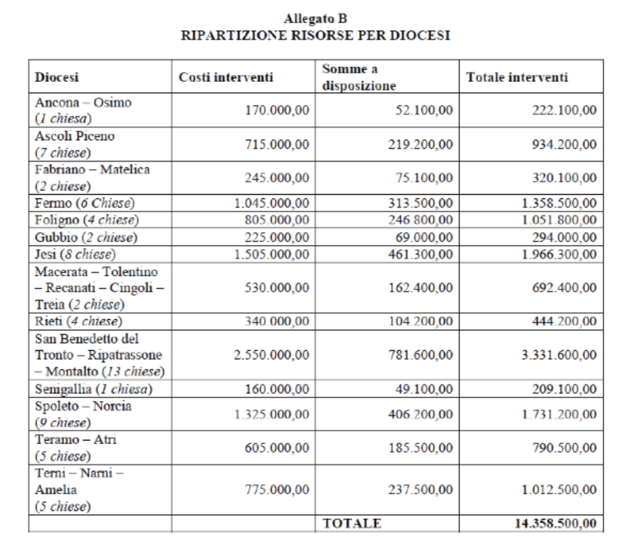

<!-- TOC -->

- [6. Ricostruzione pubblica](#6-ricostruzione-pubblica)
    - [PIANO CASA ITALIA](#piano-casa-italia)
    - [INFRASTRUTTURE VIARIE](#infrastrutture-viarie)
    - [PATRIMONIO CULTURALE](#patrimonio-culturale)
    - [ART-BONUS](#art-bonus)
    - [8x1000 IRPEF A DIRETTA GESTIONE STATALE](#8x1000-irpef-a-diretta-gestione-statale)
    - [PRIMO PIANO D'INTERVENTI SUI BENI DEL PATRIMONIO  ARTISTICO E CULTURALE](#primo-piano-dinterventi-sui-beni-del-patrimonio-artistico-e-culturale)
    - [CHIESE E LUOGHI DI CULTO](#chiese-e-luoghi-di-culto)
    - [PARTECIPAZIONE DELLA POPOLAZIONE ALLE ATTIVITÀ DI RICOSTRUZIONE](#partecipazione-della-popolazione-alle-attivit%C3%A0-di-ricostruzione)
    - [PARTENARIATO PUBBLICO-PRIVATO PER LA RICOSTRUZIONE PUBBLICA](#partenariato-pubblico-privato-per-la-ricostruzione-pubblica)
    - [INTERVENTI FINANZIATI CON DONAZIONI EFFETTUATE SUL NUMERO SOLIDALE (45500) E SUL CONTO CORRENTE DELLA PROTEZIONE CIVILE](#interventi-finanziati-con-donazioni-effettuate-sul-numero-solidale-45500-e-sul-conto-corrente-della-protezione-civile)

<!-- /TOC -->

# 6. Ricostruzione pubblica 

*A cura di [Luca Brigida](https://twitter.com/lucabrigidafdd)*

**CHE COS'È?**

**Per "ricostruzione pubblica"** s'intendono gli **interventi di ricostruzione**,
**riparazione e ripristino degli edifici pubblici e dei beni appartenenti al
patrimonio artistico e culturale**, i quali prevedono anche opere di miglioramento sismico finalizzate ad accrescere la capacità di resistenza
delle strutture, attraverso la concessione di contributi a favore di:

* **immobili adibiti ad uso scolastico o educativo e strutture edilizie universitarie**;
* **edifici municipali, caserme, immobili demaniali o di proprietà di enti ecclesiastici** civilmente riconosciuti, dichiarati d'**interesse storico-artistico**;
* **immobili di proprietà pubblica**, ripristinabili con miglioramento sismico, **da destinare alla soddisfazione delle esigenze abitative** delle popolazioni terremotate;
* **opere di difesa del suolo, delle infrastrutture e degli impianti pubblici di bonifica** per la difesa idraulica e l'irrigazione;
* **edifici privati ad uso pubblico**, comprese **strutture socio-sanitarie, archivi, musei, biblioteche e chiese**;
* **edifici privati inclusi nelle aree cimiteriali** e individuati **come cappelle private**.

**QUAL'È LA PROCEDURA?**
Al fine di programmare e attuare gli interventi di ricostruzione, con ordinanza del Commissario Straordinario si predispone e si approva:

* **un piano delle opere pubbliche**, comprensivo degli interventi     sulle urbanizzazioni dei centri oggetto degli strumenti urbanistici attuativi, che quantifichi il danno e ne preveda il finanziamento in base alle risorse disponibili;
* **dei piani per il ripristino e per il regolare svolgimento dell'anno scolastico 2017*2018** (e successivi) nei Comuni terremotati e in quelli nei quali risultino edifici scolastici distrutti o danneggiati.
Qualora la programmazione della rete scolastica o la riprogrammazione negli anni 2017 e 2018 preveda la costruzione di edifici in sedi nuove o diverse da quelle originarie, le risorse disponibili sono comunque utilizzabili.
Inoltre, per facilitare la ripresa dell'attività scolastica, i Presidenti delle Regioni colpite procedono, sulla base della ricognizione del fabbisogno abitativo dei territori interessati, all'individuazione degli edifici di proprietà pubblica che siano ripristinabili con miglioramento sismico **entro il 31 dicembre 2018**.
Ciascun Presidente comunica al Commissario Straordinario l'elenco degli immobili individuati.

* **Un piano dei beni culturali** che ne quantifichi il danno e ne preveda il finanziamento in base alle risorse disponibili;

* un piano di interventi su dissesti idrogeologici con priorità per quelli che costituiscono pericolo per centri abitati o infrastrutture;

* **un programma delle infrastrutture ambientali**, con particolare attenzione agli impianti di depurazione e di collettamento fognario, compreso il ripristino della sentieristica nelle aree protette ed il recupero ed implementazione degli itinerari ciclabili e pedonali di turismo lento nelle aree.

**Gli Uffici speciali per la ricostruzione provvedono alla diretta attuazione
degli interventi relativi agli edifici pubblici di proprietà statale, ripristinabili con miglioramento sismico entro il 31 dicembre 2018** ed inseriti negli elenchi predisposti dai Presidenti delle Regioni.

**1.** I soggetti attuatori, i Comuni, le Unioni di Comuni, le Unioni
Montane e le Province interessate inviano i progetti riguardanti tali interventi al Commissario Straordinario.

**2.** Questo, previo esame dei progetti presentati, verifica della congruità economica degli stessi ed acquisito il parere della Conferenza permanente, approva definitivamente i progetti esecutivi
e adotta il **decreto di concessione del contributo**, il quale è erogato
in via diretta. 
Per l'erogazione diretta dei contributi, il Commissario può essere autorizzato, con decreto del Ministro dell'economia e delle finanze, a stipulare mutui di durata massima di 25 anni con la
Banca europea per gli investimenti, con la Banca di sviluppo del Consiglio d'Europa, con la Cassa depositi e prestiti S.p.A. e con i soggetti autorizzati: le rate di ammortamento dei mutui sono pagati agli istituiti finanziatori direttamente dallo Stato.

**3.** In seguito, il Commissario inoltra i progetti esecutivi alla centrale unica di committenza, individuata nell'Agenzia nazionale per l'attrazione degli investimenti e lo sviluppo d'impresa S.p.A.,
ed i cui rapporti con il Commissario sono regolati da un'apposita convenzione: la centrale unica provvede ad espletare le procedure di gara per la selezione degli operatori economici che
realizzano gli interventi.

**4.** Sono previste diverse modalità settoriali e procedurali a seconda del tipo di intervento.

Riguardo alla fase di programmazione e ricostruzione dei beni culturali e delle opere pubbliche, è stato promosso un Protocollo d'Intesa tra il Commissario Straordinario, il Ministro dei beni e delle attività culturali e del turismo e il rappresentante delle Diocesi coinvolte, proprietarie di
beni ecclesiastici, al fine di concordare priorità, modalità e termini per
il recupero dei beni danneggiati.

**QUALI SONO I SOGGETTI ATTUATORI?**

Per la riparazione, ripristino con miglioramento sismico o ricostruzione delle opere pubbliche e dei beni culturali, i soggetti attuatori degli
interventi sono:

* **le Regioni**, attraverso gli Uffici Speciali per la ricostruzione;
* le **Diocesi**: queste sono soggetti attuatori quando gli interventi siano completamente finanziati con risorse proprie, altrimenti, **se vi è l'uso di fondi pubblici, la funzione di soggetto attuatore è svolta dal Ministero dei beni e delle attività culturali e del turismo**;
* **il Ministero dei beni e delle attività culturali e del turismo**;
* **il Ministero delle infrastrutture e dei trasporti**.

**QUALI SONO LE RISORSE DISPONIBILI?**

Al Commissario Straordinario è intestata apposita contabilità speciale
aperta presso la tesoreria statale su cui sono assegnate le risorse destinate agli interventi di ricostruzione pubblica, e sulla quale confluiscono
anche le erogazioni liberali, le risorse finanziarie derivanti dal Fondo di
solidarietà dell'Unione Europea, le donazioni raccolte mediante il numero solidale 45500 e i versamenti sul conto corrente bancario attivato
dal Dipartimento di Protezione Civile.

Successivamente, ai Presidenti delle Regioni interessate sono intestate apposite contabilità speciali per la gestione delle risorse trasferite dal Commissario Straordinario per l'attuazione degli interventi loro delegati.

**Al fondo per la ricostruzione delle aree terremotate è assegnata quindi:**

* **una dotazione iniziale di** 200 milioni di euro per il 2016;
* finanziamento di **1 miliardo per ciascuno degli anni 2017,2018,2019**. E' istituito un fondo presso il Ministero dell'Economia e delle Finanze da ripartire con una dotazione di 491,5 milioni per il 2017, 713,3 milioni per il 2018 e 699,7 milioni per il 2019, dedicato alle verifiche di vulnerabilità degli edifici scolastici (delle aree terremotate e delle aree a rischio sismico 1) e pubblici con i conseguenti progetti di ripristino ed adeguamento antisismico degli stessi, e agli interventi di ricostruzione privata.
Un fondo di 25 milioni di euro è riservato al finanziamento dei 10 cantieri pilota del Piano "Casa Italia".
* Un incremento del fondo di **63 milioni per il 2017, 132 milioni per il 2018 e 132 milioni per il 2019**;
* **le erogazioni liberali di privati, i contributi dal Fondo di solidarietà dell'Unione Europea, le donazioni** raccolte mediante **il numero solidale 45500 e i versamenti sul conto** corrente bancario **attivato dal Dipartimento di Protezione Civile**;
* per l'impiego degli avanzi di amministrazione per i Comuni terremotati, è possibile l'apertura di spazi finanziari nell'ambito dei patti di solidarietà nazionali per i Comuni colpiti dal sisma per gli anni 2017,2018 e 2019, in misura pari alle spese per gli investimenti sostenuti.
 
## PIANO CASA ITALIA 

**CHE COS'È?**

**Il Piano "Casa Italia"** è un progetto che nasce all'indomani del terremoto del 24 agosto 2016, prima come struttura di missione governativa, poi come autonomo e permanente Dipartimento del Consiglio dei Ministri, il quale si propone di progettare ed attuare politiche di prevenzione delle emergenze e degli eventuali danni derivanti da catastrofi naturali. 
Esso si pone più obiettivi:

* definire una politica generale di **messa in sicurezza del Paese**;
* assicurare il costante **monitoraggio** e l'analisi delle informazioni riguardanti la **sicurezza, la qualità dell'abitare e dei servizi infrastrutturali del Paese**;
* indicare linee guida relative agli interventi preventivi da realizzare
per la riduzione del rischio potenziale e del rischio reale;
* **promuovere un più efficiente utilizzo delle risorse disponibili** al fine di
ottimizzarle e di conseguire la massima semplificazione delle iniziative da attuare;
* **promuovere**, in collaborazione con la Scuola Nazionale dell'Amministrazione, **un programma di formazione di tecnici, professionisti ed amministratori pubblici**.

**COME OPERA?**

Presso il Ministero dell'economia e delle finanze è stato istituito un
Fondo (491,5 milioni di euro per l'anno 2017, 713,3 milioni per il 2018
e 699,7 milioni per il 2019) il cui utilizzo viene disposto con decreti del
Ministro su proposta del Commissario Straordinario o del Dipartimento "Casa Italia". Attraverso tali decreti si provvede alle seguenti finalità
ed attività.

**A.** **Finanziamento delle verifiche di vulnerabilità degli edifici scolastici** per la conseguente realizzazione di progetti di ripristino dei danni, adeguamento antisismico e/o ricostruzione degli edifici.

**B.** **Finanziamento delle verifiche di vulnerabilità degli edifici pubblici strategici** per la conseguente realizzazione di progetti di ripristino e adeguamento antisismico e per il finanziamento degli interventi di ricostruzione privata.

**C.** **Interventi nei Comuni delle zone a rischio sismico 1 per il finanziamento delle verifiche di vulnerabilità degli edifici scolastici** situati nei Comuni diversi da quelli del cratere sismico, e per i relativi progetti di adeguamento, previa intesa con il Ministero dell'istruzione per il
coordinamento dei suddetti interventi.

**D.** **Finanziamento delle verifiche di vulnerabilità degli edifici privati delle zone a rischio sismico 1**.

**E.** **Incentivare piani sperimentali per la difesa sismica degli edifici pubblici attraverso il finanziamento di 10 cantieri pilota** (Catania, Reggio Calabria, Isernia, Piedimonte Matese, Sulmona, Sora, Foligno, Potenza, Feltre, Gorizia) per un importo di 25 milioni di euro per il 2017, suddivisi per 2,5 milioni a cantiere.

Per quanto riguarda quest'ultimo punto, l'avvio dei cantieri si pone il fine di ridurre la vulnerabilità degli edifici residenziali di proprietà pubblica, migliorandone la qualità dell'abitare: il progetto, il quale coinvolge il G124, coordinato dal Senatore Renzo Piano, intende sperimentare sul territorio metodi diagnostici e soluzioni progettuali innovative, privilegiando interventi non invasivi che consentano alle persone di poter continuare a vivere nel proprio contesto di vita quotidiana.
**I Comuni sono stati scelti in base ai seguenti criteri**:

* **molteplicità delle fonti di pericolo**: comuni che uniscano al rischio sismico anche quello
idrogeologico e, in almeno uno dei casi, fenomeni di tipo vulcanico e/o di maremoto;
* **pericolosità sismica**: comuni localizzati nelle aree a più alta pericolosità sismica, escludendo quelli che appartengono ad "aree di cratere" interessate dai terremoti degli ultimi anni (L'Aquila, Emilia Romagna, Centro Italia);
* **dispersione territoriale**: cantieri non più di uno per Regione;
* **caratteristiche sociali e demografiche**: attuare la sperimentazione in aree che uniscano
alle problematiche ambientali anche alcuni aspetti significativi di vulnerabilità sociale e di
esposizione demografica.

## INFRASTRUTTURE VIARIE

**COSA SONO?**

Le **infrastrutture viarie** sono opere fruibili dalla collettività che comprendono **tratte autostradali, strade di grande comunicazione e viabilità regionale, provinciale e comunale**.

**QUALI INTERVENTI SONO PREVISTI?**

**ANAS S.p.A.**

Per gli interventi di messa in sicurezza e ripristino della viabilità delle **infrastrutture stradali d'interesse nazionale, interessate dagli eventi sismici e rientranti nella competenza di ANAS S.p.A.**, quest'ultima provvede immediatamente ad approvare progetti operativi in qualità di soggetto attuatore della Protezione Civile con la possibilità di agire in deroga a numerose previsioni sugli appalti pubblici contenute nel d.lgs. n°50/2016, detto "Codice degli appalti pubblici".
La società ANAS S.p.A. opera in via di anticipazione sulle risorse di un fondo costituito appositamente all'interno del bilancio dello Stato, nel quale confluiscono le risorse a qualunque titolo destinate all' ANAS S.p.A.

**In caso di emergenze**, questa provvede immediatamente a svolgere le opportune verifiche e le relative opere di messa in sicurezza delle tratte stradali: la società dà preventiva comunicazione al Ministero delle infrastrutture e dei trasporti che rilascia l'autorizzazione ad intervenire nei successivi 30 giorni, decorrenti dalla data di ricezione della comunicazione.
Decorso infruttuosamente tale termine, l'ANAS S.p.A. può comunque procedere, dandone tempestiva comunicazione al predetto Ministero.
Le variazioni rispetto all'ordinaria manutenzione delle infrastrutture stradali confluiscono nell'aggiornamento annuale del piano pluriennale di opere.

**Nei territori per i quali é stato dichiarato lo stato di emergenza ed é stata completata la procedura di ricognizione dei danni** prodotti dalle calamità naturali, l'ANAS Spa e' autorizzata, mediante apposita delibera del Consiglio dei ministri, adottata su proposta del Ministero dell'economia e delle finanze e del Ministero delle infrastrutture e dei trasporti, sentita la Protezione civile, ad effettuare interventi di manutenzione straordinaria sulle strade provinciali e comunali, normalmente non di sua competenza.

**STRADA DEI PARCHI S.p.A (A24 e A25)**

**Per consentire l'immediata esecuzione degli interventi di ripristino e messa in sicurezza sulla tratta autostradale A24 e A25**, interessata dagli eventi sismici del 2009, 2016 e 2017, è stato concesso un contributo di **50 milioni di euro** in favore della società concessionaria "Strada dei Parchi S.p.A." **per ciascuno degli anni dal 2021 al 2025**: il valore degli interventi di ripristino e messa in sicurezza, autorizzati dal Ministero delle infrastrutture e dei trasporti, ed i valori dei contributi di cui sopra, vengono riportati nell'aggiornamento del piano economico-finanziario della società concessionaria "Strada dei Parchi S.p.A."

## PATRIMONIO CULTURALE

**COSA S'INTENDE?**

Secondo la nozione data dal Codice dei beni culturali e del paesaggio (d.lgs. 42/2004), il **patrimonio culturale** è costituito da:

* **beni culturali**: cose immobili e mobili che presentano un particolare interesse artistico, storico, archeologico, etno-antropologico, archivistico e bibliografico ed altri beni individuati dalla legge come testimonianze aventi valore di civiltà;
* **beni paesaggistici**: immobili e aree espressione dei valori storici, culturali, naturali, morfologici ed estetici del territorio e gli altri beni individuati come tali dalla legge.

**INTERVENTI IMMEDIATI**

Al fine di avviare in maniera tempestiva gli interventi di tutela e ricostruzione del patrimonio culturale danneggiato in conseguenza degli eventi sismici, per **i lavori, i servizi e le forniture urgenti** si applicano alcune disposizioni speciali contenute nel Codice degli appalti pubblici (**d.lgs.50/2016**): **l'esecuzione dei lavori immediati è consentita nei casi di massima urgenza**, nei quali ogni ritardo possa essere pregiudizievole alla pubblica incolumità o alla tutela del bene.

**Il responsabile del procedimento o il tecnico dell'amministrazione** competente che si reca per primo sul luogo, può disporre, contemporaneamente alla redazione del verbale (in cui sono indicati i motivi dello stato di urgenza, le cause che l'hanno provocato e i lavori necessari per rimuoverlo), la **immediata esecuzione dei lavori entro il limite di 200.000 euro o di quanto indispensabile per rimuovere lo stato di pregiudizio alla pubblica incolumità**.

**L'esecuzione dei lavori** può essere affidata in forma diretta a uno o più operatori economici individuati dal responsabile del procedimento o dal tecnico dell'amministrazione competente: questi ultimi, **entro 10 giorni** dall'ordine di esecuzione dei lavori, compilano una **perizia giustificativa** degli stessi e la trasmettono, unitamente al verbale riguardante l'urgenza dell'intervento, alla stazione appaltante che provvede alla copertura della spesa e alla approvazione dei lavori. Qualora un'opera urgente non riporti l'approvazione del competente organo dell'amministrazione, la relativa realizzazione viene sospesa immediatamente e si procede, previa messa in sicurezza del cantiere, alla sospensione dei lavori e alla liquidazione dei corrispettivi dovuti per la parte realizzata.

**Nel caso in cui si adottino le procedure di affidamento in condizioni di massima urgenza** e vi sia l'esigenza di assicurare la tempestiva esecuzione del contratto, gli **affidatari dichiarano**, mediante **autocertificazione**, **il possesso dei requisiti di partecipazione** previsti per l'affidamento di contratti di uguale importo mediante procedura ordinaria, che l'amministrazione aggiudicatrice controlla entro un termine non superiore a 60 giorni dall'affidamento: quest'ultima dà conto, con adeguata motivazione, della sussistenza dei requisiti di massima urgenza.
**In assenza di un parere favorevole relativo a tali verifiche, non è possibile procedere al pagamento dell'opera realizzata** e, qualora venga accertato l'affidamento ad un operatore privo dei requisiti richiesti, le **amministrazioni aggiudicatrici recedono dal contratto**, fatto salvo il pagamento del valore delle opere già eseguite ed il rimborso delle spese eventualmente già sostenute per l'esecuzione della parte rimanente e procedono alla segnalazione presso le autorità competenti.

In via eccezionale, l'**affidamento diretto** può essere autorizzato anche **oltre** il limite di 200.000 euro, per un arco temporale non superiore a 30 giorni e solo per specifiche fattispecie previste con ordinanza del Capo del Dipartimento di Protezione Civile, salvo il caso in cui il decreto, con il quale sia stato emanato lo stato di emergenza, non preveda diversamente. L'affidamento diretto non è comunque ammesso per appalti di valore pari o superiore alle soglie europee indicate all'art.35 d.lgs.50/2016.

Limitatamente **agli appalti pubblici di forniture e servizi di lavori di somma urgenza, d'importo pari o superiore a 40.000 euro**, per i quali non siano disponibili elenchi di prezzi definiti mediante l'utilizzo di prezzari ufficiali di riferimento, **gli affidatari si impegnano a fornire i servizi e le forniture richiesti ad un prezzo provvisorio stabilito consensualmente tra le parti** e ad accettare la determinazione definitiva del prezzo a seguito di apposita valutazione di congruità: il responsabile del procedimento comunica il prezzo provvisorio, unitamente ai documenti esplicativi dell'affidamento, all'Autorità Nazionale Anti Corruzione (ANAC), la quale, entro 60 giorni, rende il proprio parere sulla congruità del prezzo, e, in caso di parere favorevole, si procede immediatamente al pagamento del 50% del prezzo dell'opera. Sul profilo del committente sono pubblicati gli atti relativi agli interventi urgenti, nei quali sono contenute le informazioni riguardanti l'affidatario, le modalità di scelta dell'operatore e le motivazioni che non hanno consentito il ricorso alle procedure ordinarie.

**Per i servizi di progettazione inerenti la messa in sicurezza dei beni culturali immobili, le amministrazioni** competenti possono procedere, **per affidamenti inferiori ai 40.000 euro**, al procedimento **dell'affidamento diretto** a professionisti risultati idonei ed iscritti nell'elenco speciale, senza la necessità di ulteriori formalità.

I **Comuni** interessati possono **effettuare gli interventi ritenuti indispensabili**, inclusi quelli di messa in sicurezza degli edifici (anche quelli di proprietari, possessori o detentori di beni culturali e paesaggistici), per evitare ulteriori danni al patrimonio culturale presente nei propri territori, dandone immediata comunicazione al Ministero dei beni e delle attività culturali e del turismo: in generale, ma soprattutto nel caso in cui siano necessari interventi di demolizione di beni culturali, beni immobili ed aree di notevole interesse pubblico, si richiede l'autorizzazione del rappresentante del Ministero dei beni e delle attività culturali e del turismo che partecipa alle operazioni. Ai fini delle necessarie autorizzazioni, i progetti dei successivi interventi sono trasmessi al Ministero, il quale trasmette le comunicazioni ed i progetti ricevuti alle altre eventuali amministrazioni competenti.

## ART-BONUS

**CHE COS'È?**

**L'Art-Bonus** è uno strumento utilizzato da un nucleo di benefattori, detti "**mecenati**", i quali effettuano **erogazioni liberali per la conservazione ed il restauro del patrimonio culturale italiano, in cambio di benefici fiscali corrispondenti al riconoscimento a loro carico di un credito d'imposta**: quest'ultimo è ogni genere di credito di cui sia titolare il contribuente nei confronti dell'erario dello Stato e può essere destinato a compensare i debiti, a diminuire le imposte dovute o, quando ammesso, se ne può richiedere il rimborso.

Questo strumento è stato **esteso anche alle donazioni a favore del Ministero dei beni e delle attività culturali e del turismo per interventi di manutenzione, protezione e restauro di beni culturali**, anche d'interesse religioso (di enti e istituzioni della Chiesa cattolica o di altre confessioni) **presenti nei Comuni colpiti dagli eventi sismici**.
La raccolta fondi è rivolta ai beni di elevato valore culturale individuati dal MiBACT e a quelli ritenuti prioritari dagli Enti religiosi anche per esigenze di culto: tale credito d'imposta spetta anche per le erogazioni liberali effettuate per il sostegno dell'Istituto superiore per la conservazione e il restauro, dell'Opificio delle pietre dure e dell'Istituto centrale per il restauro e la conservazione del patrimonio archivistico e librario.

**SOGGETTI BENEFICIARI DEL CREDITO D'IMPOSTA**

**Il credito d'imposta è riconosciuto a tutti i soggetti che effettuano le erogazioni liberali a sostegno della cultura e dello spettacolo, indipendentemente dalla natura e dalla forma giuridica.**

**AMMONTARE DEL CREDITO**

**Il credito d'imposta spetta nella misura del 65% delle erogazioni liberali effettuate**.
In relazione alla qualifica del soggetto che effettua le erogazioni liberali sono previsti **limiti massimi differenziati di spettanza del credito d'imposta**:

* Per le **persone fisiche ed enti che non svolgono attività commerciale** (dipendenti, pensionati, professionisti), il credito d'imposta è riconosciuto nel limite del **15% del reddito imponibile**.

* Per i **soggetti titolari di reddito d'impresa** (società e ditte individuali) ed **enti non commerciali che esercitano anche attività commerciale**, il credito d'imposta è riconosciuto nel limite del **5 per mille dei ricavi annui**.

**ADEMPIMENTI RICHIESTI AI BENEFICIARI DELLE EROGAZIONI LIBERALI**

**I soggetti beneficiari delle erogazioni liberali** sono tenuti a **comunicare mensilmente**, tramite il sito [www.artbonus.gov.it](http://www.artbonus.gov.it) e il proprio sito web istituzionale (in una pagina dedicata), l'**ammontare delle erogazioni ricevute, la destinazione e l'utilizzo** delle erogazioni stesse.

Nel portale [www.artbonus.gov.it,](http://www.artbonus.gov.it,) ai soggetti destinatari delle erogazioni liberali sono associate tutte le informazioni relative allo **stato di conservazione del bene**, gli **interventi di ristrutturazione o riqualificazione** eventualmente in **atto, i fondi pubblici assegnati** per l'anno in corso, l'ente **responsabile del bene** e le **informazioni** relative alla **fruizione del bene**.

**OGGETTO DELLE EROGAZIONI LIBERALI**

L'art bonus può essere **applicato così**:

* se l'oggetto dell'erogazione liberale è un **bene culturale pubblico**, esso si applica esclusivamente per interventi di restauro, protezione e manutenzione;
* se l'erogazione liberale è destinata a **Istituti e Luoghi della cultura di appartenenza pubblica**, alle Fondazioni lirico-sinfoniche e ai Teatri di tradizione, esso si applica solo per interventi di sostegno;
* se l'erogazione liberale è destinata a **enti o istituzioni pubbliche che, senza scopo di lucro**, svolgono esclusivamente **attività nello spettacolo**, esso si applica solo per la realizzazione di nuove strutture e il restauro e/o potenziamento di quelle già esistenti;
* se l'erogazione liberale è destinata ai **soggetti concessionari o affidatari di beni culturali pubblici**, esso si applica solo per interventi di manutenzione, protezione e restauro di un bene pubblico.

## 8x1000 IRPEF A DIRETTA GESTIONE STATALE

Le risorse della quota dell'8x1000 dell'imposta sul reddito delle persone fisiche a diretta gestione statale, derivanti dalle dichiarazioni dei redditi, relative agli anni 2016-2025 e riferite alla conservazione dei beni culturali, sono destinate agli interventi di ricostruzione e/o restauro dei beni culturali danneggiati o distrutti in seguito agli eventi sismici del 2016/2017.

## PRIMO PIANO D'INTERVENTI SUI BENI DEL PATRIMONIO  ARTISTICO E CULTURALE

Il **costo** dei primi interventi è stimato in **170,60 milioni di euro**, di cui 137,60 milioni di euro sono ripartiti tra le Regioni, ed ulteriori **33 milioni di euro** sono destinati al finanziamento delle seguenti opere.

* **Chiesa di San Benedetto, Norcia (PG)**. L'intervento, dall'importo complessivo di 10 milioni di euro, è finanziato con 6 milioni di euro provenienti dall'Unione europea, e con 4 milioni di euro gravanti sulle risorse del fondo appositamente costituito.
* **Castello Pallotta,  Caldarola (MC)**.
* **Complesso Don Minozzi** (ad  esclusione della Chiesa di Santa  Maria Assunta), **Amatrice (RT)**. 
* **Cattedrale di Santa Maria  Assunta, Teramo (TE)**.

**PROCEDURA DI PRESENTAZIONE, APPROVAZIONE ED ESECUZIONE DEI PROGETTI**

**1.** Entro il 6 gennaio 2018, il **Ministero dei beni e delle attività culturali e del turismo**, in qualità di soggetto attuatore, deve aver **presentato al Commissario Straordinario**, per la loro approvazione, i progetti esecutivi relativi agli interventi indicati.

**2.** **Il Commissario Straordinario**, previa verifica della congruità economica del progetto esecutivo, ed acquisito il parere della Conferenza permanente, **approva definitivamente il progetto ed adotta il decreto di concessione del contributo**.

**3.** Entro 7 giorni dall'adozione del provvedimento, si provvede al **trasferimento** in favore della contabilità speciale, intestata all'Ufficio del Soprintendente Speciale per le aree colpite dal sisma del Ministero dei beni e delle attività culturali e del Turismo, delle **somme corrispondenti pari al 50% del contributo riconosciuto**, al netto delle somme già corrisposte.

**4.** Entro 7 giorni dal ricevimento della comunicazione dell'Ufficio del Soprintendente Speciale, relativa all'avvenuta stipulazione del contratto d'appalto, si provvede al **trasferimento dell'importo residuo** del contributo riconosciuto.

**5.** A seguito del rilascio del provvedimento di concessione del contributo, il Commissario Straordinario inoltra i progetti esecutivi alla centrale unica di committenza, che provvede ad espletare le procedure di gara per la selezione degli operatori economici che realizzeranno gli interventi, secondo le modalità e nei termini previsti dal modello relativo di convenzione. Restano ferme le previsioni dell'Accordo per l'esercizio dei compiti di alta sorveglianza e di garanzia della correttezza e della trasparenza delle procedure connesse alla ricostruzione pubblica, sottoscritto tra il Commissario Straordinario, l'A.N.A.C. e l'Agenzia nazionale per l'attrazione degli investimenti e lo sviluppo d'impresa S.p.A.-Invitalia.

**6.** Con **cadenza trimestrale, l'Ufficio del Soprintendente Speciale** provvede a **comunicare al Commissario Straordinario**, relativamente ai progetti ammessi a contributo, gli **appalti già aggiudicati e quelli in corso di aggiudicazione**, nonché a fornire l'**aggiornamento dello stato di attuazione degli interventi**, per i territori di rispettiva competenza.

## CHIESE E LUOGHI DI CULTO

**A CHI SI RIVOLGE: CHI È CONFIGURABILE COME SOGGETTO ATTUATORE**

Per assicurare la continuità del culto, i **proprietari, i possessori, i detentori e le relative Diocesi, delle chiese site nei comuni terremotati**, contestualmente agli **interventi di messa in sicurezza** per la salvaguardia del bene, possono effettuare, secondo le modalità stabilite nelle ordinanze commissariali, **ulteriori interventi che ne possano garantire la più celere riapertura al pubblico**.
Conclusa la procedura per il rilevamento dei danni contenuta nella "**Scheda per il rilievo del danno ai beni culturali-chiese**" (direttiva del Ministro dei beni e delle attività culturali e del turismo, 23 aprile 2015), è **individuato dal Commissario straordinario**, tramite ordinanza, **l'elenco delle chiese classificate inagibili sulle quali sono autorizzati tali interventi immediati**.

**QUAL È LA PROCEDURA DA SEGUIRE?**

**I soggetti attuatori** degli interventi, cioè coloro interessati alla realizzazione dell'opera, i quali molto spesso coincidono con i beneficiari, devono aver **presentato i progetti riguardanti la realizzazione degli interventi di messa in sicurezza e degli eventuali interventi definitivi finalizzati a consentire la riapertura delle chiese** presso i competenti Uffici speciali per la ricostruzione, entro il 4 luglio 2017.

Il **progetto** depositato all'Ufficio speciale deve **contenere**:

* **la descrizione dei danni rilevati e degli interventi necessari sia per la messa in sicurezza che per rimuovere lo stato d'inagibilità** certificato dall'ordinanza comunale;
* **l'indicazione degli interventi edilizi da eseguire**, corredata da adeguati elaborati;
* **l'indicazione degli interventi strutturali da eseguire**, sviluppata con adeguati elaborati.
* **Computo metrico estimativo dei lavori redatto sulla base del prezzario unico e integrato con le spese tecniche**, distinte per ciascuna prestazione professionale;
* esauriente **documentazione fotografica dei danni** subiti dall'edificio.

Ove necessario, l'Ufficio speciale trasmette immediatamente copia del progetto e della documentazione necessaria al Comune territorialmente competente per il rilascio del titolo abilitativo.
Unitamente al progetto, **il soggetto attuatore** deve presentare una **dichiarazione** dalla quale risultino:

**1.** **gli estremi e la categoria catastale dell'edificio**;

**2.** la sua **superficie complessiva**;

**3.** **il numero e la data dell'ordinanza comunale d'inagibilità**;

**4.** **il nominativo dei tecnici incaricati della progettazione e della direzione dei lavori e del coordinamento della sicurezza**;

**5.** **l'impresa incaricata di eseguire i lavori**, che deve essere stata scelta tra almeno 5 ditte, individuate nel rispetto dei principi di trasparenza, concorrenza e rotazione, mediante apposita procedura concorrenziale intesa all'affidamento dei lavori alla migliore offerta.

**6.** **gli estremi di un conto corrente bancario** su cui far confluire le somme erogate a titolo di contributo.

I lavori sono obbligatoriamente **affidati a imprese iscritte all'Anagrafe antimafia**, che non abbiano commesso violazioni agli obblighi contributivi e previdenziali, come attestato dal documento unico di regolarità contributiva (DURC), e, **per lavori di importo superiore ai 150.000 euro, che siano in possesso della qualificazione di "esecutori di lavori pubblici"**, ai sensi dell'art. 84 del Codice dei contratti pubblici (d.lgs. 50/2016).

Al **progetto** devono essere **allegati**:

**1.** **Perizia asseverata del tecnico incaricato della progettazione**, completa di adeguata relazione che attesti il nesso di causalità tra i danni rilevati e l'evento sismico che li ha generati, con espresso riferimento alla scheda per il rilievo del danno ai beni culturali-chiese (direttiva del Ministro dei beni e delle attività culturali e del turismo, 23 aprile 2015).

**2.** **Documentazione della procedura selettiva seguita per l'individuazione dell'impresa esecutrice**, compreso apposito verbale dal quale risultino i criteri adottati e le modalità seguite per la scelta.

**3.** **Documentazione** attestante **l'iscrizione all'Anagrafe Antimafia**.

**4.** **Documentazione** attestante **l'iscrizione dei professionisti** incaricati della
progettazione e della direzione dei lavori **nell'elenco speciale**.

**5.** Eventuale **polizza assicurativa stipulata prima della data del sisma per il risarcimento dei danni conseguenti all'evento sismico**, dalla quale risulti l'importo assicurativo riconosciuto.

**L'Ufficio speciale** cura **l'istruttoria sul progetto** presentato, verifica la congruità dei costi previsti, anche ai fini dell'autorizzazione all'effettuazione d'interventi di natura definitiva, e **provvede a determinare l'importo** massimo ammissibile a contributo **entro il termine di 30 giorni dal deposito del progetto e della documentazione allegata**: tale termine può essere interrotto per una sola volta, al fine di richiedere al soggetto attuatore chiarimenti o integrazioni documentali, che devono essere rese entro 15 giorni dalla richiesta.

Qualora **l'edificio** di culto sia **sottoposto alla tutela del Codice dei beni culturali e del turismo**, il progetto è sottoposto al **parere della Conferenza regionale** per l'acquisizione delle necessarie autorizzazioni.

**L'importo dei lavori non può superare i 300 mila euro**.
Esaurita l'istruttoria, il **Presidente di Regione**, con proprio provvedimento, rilascia l'autorizzazione all'effettuazione dell'intervento e **adotta il decreto di concessione del contributo**, dandone notizia al Comune territorialmente competente.

L'adozione del provvedimento, se necessario, è preceduta dal rilascio del titolo abilitativo da parte del Comune, il quale adotta le proprie determinazioni entro 20 giorni dal ricevimento della documentazione trasmessa dall'Ufficio speciale.

**Il contributo è erogato in via diretta a favore del soggetto attuatore**.
La liquidazione è effettuata dall'Ufficio speciale territorialmente competente, mediante accredito sul conto corrente bancario, a valere sulle risorse disponibili trasferite dal Commissario straordinario nelle contabilità speciali istituite.

* **Per gli interventi d'importo inferiore o pari a 40.000 euro**, la somma
spettante è liquidata ed erogata a seguito del deposito presso l'Ufficio speciale dei documenti comprovanti l'effettiva realizzazione dell'intervento, previo esperimento dei necessari controlli.
* **Per gli interventi d'importo superiore ai 40.000 euro**, su richiesta del soggetto interessato formulata in sede di presentazione del progetto, può essere erogato a titolo di anticipazione il 10% del contributo, approvato all'atto di adozione dei provvedimenti. Su richiesta del soggetto attuatore, da formulare negli stessi termini, può essere riconosciuta un'ulteriore anticipazione fino al 50% del valore totale del contributo, da corrispondere a seguito della consegna dei lavori e dell'attivazione del cantiere, ed ulteriori pagamenti per stati di avanzamento lavori fino al 90% del contributo concesso. In tali ipotesi il saldo finale è erogato alla presentazione dei documenti che comprovano l'effettiva realizzazione dell'opera ed esperiti i necessari controlli.

**CHIESE DI PROPRIETÀ PUBBLICA**

* **L'ente pubblico proprietario della chiesa** o, in riferimento alle chiese del Fondo Edifici di Culto, **il Ministero dei Beni e delle Attività Culturali e del Turismo hanno** predisposto ed **inviato al Commissario Straordinario** del Governo, entro il 21 luglio 2017, i **progetti** riguardanti la realizzazione degli interventi di messa in sicurezza e degli eventuali interventi definitivi finalizzati a consentire la riapertura delle chiese individuate dall'ordinanza.
* Entro 30 giorni dal deposito del progetto e della documentazione allegata, il **Commissario straordinario** provvede all'istruttoria sul progetto presentato, verificando la congruità dei costi previsti anche ai fini dell'autorizzazione all'effettuazione di interventi di natura definitiva e provvedendo a determinare l'importo massimo ammissibile a contributo. Il termine può essere interrotto per una sola volta per richiedere al soggetto attuatore chiarimenti o integrazioni documentali, che devono essere resi entro 15 giorni dalla richiesta.
* Esaurita l'istruttoria e acquisito il parere della Conferenza, il **Commissario straordinario** con proprio provvedimento **rilascia l'autorizzazione** all'effettuazione dell'intervento e **adotta il decreto di concessione del contributo**.

**L'importo dei lavori ammissibili** a contributo **non può in ogni caso superare i 300 mila euro**.
**Il soggetto attuatore provvede all'individuazione dell'impresa esecutrice dei lavori, mediante procedura negoziata** senza previa pubblicazione di un bando di gara.
L'individuazione degli operatori economici, invitati a partecipare alla procedura negoziata, avviene secondo modalità, anche informatiche, che assicurino la trasparenza, la parità di trattamento, la concorrenza e la rotazione, e viene effettuata tra tutti gli iscritti nell'Anagrafe antimafia degli esecutori, che abbiano i necessari requisiti di qualificazione o che abbiano presentato domanda di iscrizione nella predetta Anagrafe: se al momento dell'aggiudicazione, l'operatore economico non risulta ancora iscritto all'Anagrafe antimafia degli esecutori, il soggetto attuatore provvede a comunicare, tempestivamente, al Commissario straordinario la graduatoria dei concorrenti, affinché, vengano attivate le verifiche finalizzate al rilascio dell'informazione antimafia, con priorità rispetto alle richieste di iscrizione pervenute.

In questo caso la **liquidazione del contributo** concesso avviene secondo la tempistica e nei limiti indicati.

* Una somma pari al **50% del contributo concesso**, entro 15 giorni dalla ricezione della comunicazione della stazione appaltante relativa all'avvenuta aggiudicazione dell'appalto.
* Una somma pari al **45% del contributo** concesso, entro 15 giorni dalla ricezione della comunicazione della stazione appaltante relativa all'avvenuta presentazione dell'avanzamento lavori non inferiore al 50% dei lavori da eseguire;
*  Una somma pari al 5% del contributo concesso, entro 7 giorni dalla ricezione della comunicazione della stazione appaltante relativa dall'emissione del certificato di collaudo, del certificato di verifica di conformità o del certificato di regolare esecuzione.
* Il Commissario straordinario procede all'erogazione del contributo mediante accredito sulla contabilità della stazione appaltante. La stazione appaltante provvede a rendicontare al Commissario straordinario i pagamenti effettuati mediante le risorse trasferite, trasmettendo, entro 7 giorni dall'effettuazione del pagamento, tutta la documentazione ad esso relativa.

**PRIMO PROGRAMMA D'INTERVENTI**

Il costo complessivo del primo programma d'interventi immediati è pari ad **euro 14.358.500,00**, ripartiti tra le Diocesi interessate.

**SECONDO PROGRAMMA D'INTERVENTI**

Il costo complessivo del secondo programma d'interventi immediati, finalizzati a consentire la continuità delle attività di culto, è pari ad euro 29.152.500,00. Detta somma sarà ripartita:

* per gli interventi attuati dagli **enti ecclesiastici civilmente riconosciuti**, fra le diocesi interessate i cui importi sono da intendersi come limite massimo delle risorse utilizzabili da ciascuna diocesi;
* per gli interventi attuati dagli enti pubblici proprietari o dal Ministero dei Beni e delle Attività Culturali e del Turismo, per le chiese di proprietà del Fondo Edifici di culto, fra i soggetti attuatori, i cui importi sono da intendersi come limite massimo delle risorse utilizzabili da ciascun soggetto attuatore.

## PARTECIPAZIONE DELLA POPOLAZIONE ALLE ATTIVITÀ DI RICOSTRUZIONE

**COSA S'INTENDE PER PARTECIPAZIONE DELLA POPOLAZIONE**

Per partecipazione della popolazione alle attività di ricostruzione s'intende la possibilità per i cittadini residenti e non nei Comuni terremotati di presentare osservazioni e/o reclami relativi ad un progetto per l'esecuzione di strumenti urbanistici attuativi all'interno delle aree perimetrate dal Comune per la loro messa in sicurezza e/o ricostruzione.

Il Comitato istituzionale di ogni Regione, l'organo che conta tra i suoi membri anche il Commissario straordinario e il Presidente regionale, è tenuto a disciplinare le modalità di partecipazione ed i criteri di rappresentatività delle popolazioni ai processi di ricostruzione nel territorio di propria competenza (altrimenti deve provvedervi il Presidente della Regione entro 45 giorni dal decorso infruttuoso di tale termine) in tali ambiti:

* **superamento dell'emergenza e avvio degli interventi immediati di ricostruzione**;
* **Interventi su opere pubbliche e beni culturali di competenza regionale**;
* **funzioni delegate alle Regioni per le quali è prevista la partecipazione popolare**.

I provvedimenti adottati per la disciplina della partecipazione popolare alle attività di ricostruzione sono comunicati al Commissario straordinario e sono pubblicati sul sito istituzionale della Regione. Le disposizioni qui spiegate si riferiscono a delle precise previsioni normative: in realtà però, in alcuni luoghi del cratere sismico, si è assistito a delle forme non disciplinate di consultazione pubblica operate da alcuni sindaci per prendere decisioni condivise diffusamente tra la popolazione in merito alla ricostruzione dei borghi del Centro Italia. Incoraggiamo gli amministratori locali a coinvolgere sempre più la popolazione nelle scelte relative alla vita pubblica, sia nelle forme istituzionalmente disciplinate, sia nelle forme più spontanee.

**CHI PUÒ PARTECIPARE?**

Tutti **coloro i quali abbiano un interesse personale e concreto, le associazioni e gli organismi di partecipazione popolare comunque denominati e costituiti** per la tutela d'interessi collettivi e diffusi.

**La popolazione può formulare osservazioni sugli strumenti urbanistici attuativi adottati dai Comuni entro 10 giorni dalla pubblicazione nell'albo pretorio**, termine che attesta l'invio al Commissario straordinario della documentazione.

La popolazione può effettuare osservazioni in relazione a:

* questioni oggetto di pareri ambientali, paesaggistici, di **tutela dei beni culturali o delle aree dei parchi nazionali o regionali**, riguardo ad interventi operati da privati, dalle Regioni o dalle diocesi;
* questioni oggetto di **parere obbligatorio previsto per tutti i progetti di fattibilità relativi ai beni culturali**, e, limitatamente alle opere pubbliche, per il **parere relativo agli interventi sottoposti al vincolo** ambientale o ricompresi nelle **aree dei parchi nazionali o regionali**.

**Le osservazioni devono pervenire entro un termine congruo e comunque non superiore a 7 giorni dalla data delle riunioni delle Conferenze permanenti**: quest'ultime assicurano il tempestivo ed adeguato esame delle osservazioni e delle opposizioni dei cittadini trasmesse dai Comuni.

**COME SI PUÒ PARTECIPARE?**

**I Comuni, entro 150 giorni dalla perimetrazione** delle aree interessate, le quali necessitano di strumenti urbanistici attuativi, curano la pianificazione urbanistica oltre al relativo piano finanziario, **assicurando l'informazione ed il coinvolgimento delle popolazioni interessate**.

Tutti coloro che ne hanno interesse possono **formulare proposte entro 45 giorni da tale perimetrazione**: le proposte devono essere **necessariamente inviate tramite modalità telematiche**, fatte salve le diverse modalità di consultazione previste dagli Statuti dei singoli Comuni.
I Comuni assicurano il tempestivo e adeguato esame delle proposte e indicano le motivazioni in ordine all'accoglimento o al rigetto di tali proposte nei provvedimenti adottati.

I Comuni adottano con atto consiliare gli **strumenti urbanistici attuativi**, i quali vengono **pubblicati nell'albo pretorio per la durata di 15 giorni dalla loro adozione**: si possono presentare **osservazioni ed opposizioni entro 30 giorni dalla data di pubblicazione**, poi il Comune li trasmette, unitariamente alle osservazioni e opposizioni ricevute, al Commissario straordinario per l'acquisizione del parere espresso dalla Conferenza permanente.

Il Comune, entro 2 giorni dall'invio della documentazione al Commissario straordinario, provvede a dar notizia dell'avvenuta trasmissione mediante avviso pubblicato sull'albo pretorio.

## PARTENARIATO PUBBLICO-PRIVATO PER LA RICOSTRUZIONE PUBBLICA

**Il partenariato pubblico-privato** (PPP) è una forma di cooperazione tra la pubblica amministrazione e i privati, con l'obiettivo di finanziare, costruire e gestire infrastrutture o di fornire servizi d'interesse pubblico: tale cooperazione consente alle amministrazioni di attrarre maggiori risorse d'investimento e competenze non disponibili al suo interno.
E' generalmente disciplinata agli articoli 180-183 del Codice dei Contratti pubblici (d.lgs. 50/2016), cui si rinvia per lo studio della disciplina generale.

Tale forma di cooperazione è stata prevista anche nell'ambito delle attività di ricostruzione del patrimonio pubblico distrutto dal sisma, in maniera tale da poterlo riparare o ricostruire per ripristinare in questo modo la funzionalità dei servizi pubblici svolti all'interno di essi.

Tali procedure sono applicabili solo a **edifici scolastici** (esclusi i paritari), **educativi per la prima infanzia, universitari, municipali, caserme, immobili demaniali, strutture sanitarie pubbliche, chiese e edifici di culto d'interesse storico-artistico** i cui proprietari siano enti ecclesiastici riconosciuti.
**Questi devono essere stati inclusi già nei programmi e piani di recupero e/o ricostruzione degli immobili pubblici**, disciplinati con ordinanza commissariale.

**COME SI OPERA?**

Le **proposte** (corredate da un relativo piano economico-finanziario) formulate dagli operatori economici **devono essere presentate agli enti proprietari degli edifici** interessati, i quali entro un mese da tale presentazione **provvedono alla valutazione di fattibilità della proposta**: nel caso di valutazione favorevole, gli enti informano gli Uffici Speciali per la ricostruzione territorialmente competenti.

Prima dell'avvio della procedura di affidamento dei lavori, **il progetto è trasmesso al Commissario straordinario per l'approvazione e la quantificazione del contributo** a carico dell'Ufficio commissariale: egli determina la sua quota valutandola in relazione al totale del costo economico dell'intervento.

**Alle procedure di affidamento dei lavori provvedono le Centrali Uniche di committenza**: il progetto esecutivo predisposto dall'aggiudicatario viene trasmesso al Commissario straordinario per rivalutare la congruità del contributo economico commissariale. Nel caso in cui questo venga rideterminato, il Commissario adotta un nuovo decreto in sostituzione del precedente, comunicando la sua decisione all'ente aggiudicatore.

L'Autorità Nazionale Anti Corruzione (A.N.A.C.) vigila sulla correttezza dello svolgimento di tali procedure: tali accordi di partenariato, stipulati sulla base dei piani pubblici relativi, devono essere integrati o modificati entro l'11 marzo 2018.

## INTERVENTI FINANZIATI CON DONAZIONI EFFETTUATE SUL NUMERO SOLIDALE (45500) E SUL CONTO CORRENTE DELLA PROTEZIONE CIVILE

Per avviare il più velocemente possibile gli interventi, definiti "essenziali" dal Commissario straordinario, già approvati dal Comitato dei Garanti in relazione all'utilizzo dei fondi (26 milioni circa di euro) raccolti tramite le donazioni effettuate sul numero solidale 45500 e sul conto corrente della Protezione Civile, gli enti proprietari degli immobili o le quattro Regioni interessate provvedono all'elaborazione e all'approvazione dei relativi progetti.

**QUAL'È LA PROCEDURA?**

Entro il **10 maggio 2018**, gli **enti proprietari degli immobili o le quattro Regioni trasmettono al Commissario straordinario i progetti esecutivi: egli**, previa verifica della congruità economica degli stessi ed acquisito il parere favorevole della Conferenza permanente, entro 30 giorni dalla ricezione del progetto da parte dell'Ufficio Speciale, **approva lo stesso e adotta il decreto di concessione del contributo**, il cui importo massimo di ogni singolo intervento è già stato stabilito dal Comitato dei garanti.

Il Commissario inoltra i progetti esecutivi alla **Centrale unica di committenza**, la quale **provvede ad espletare le procedure di gara per la selezione degli operatori economici che realizzeranno i predetti interventi**.

**Ogni tre mesi**, gli **Uffici Speciali** per la ricostruzione **inoltrano al Commissario straordinario una relazione sullo stato di avanzamento dei lavori**, comprensivo di una dettagliata rendicontazione dell'utilizzo delle risorse assegnate, mentre il **Commissario straordinario informa con la stessa cadenza trimestrale il Comitato dei garanti sulla situazione dell'avanzamento dei lavori**.

Nel caso di **gravi irregolarità nell'uso del contributo o ritardi nell'avvio del progetto**, il Commissario, su segnalazione dei Presidenti regionali, può proporre al Comitato dei garanti l'adozione di alcuni provvedimenti **urgenti, tra i quali la revoca del contributo**.