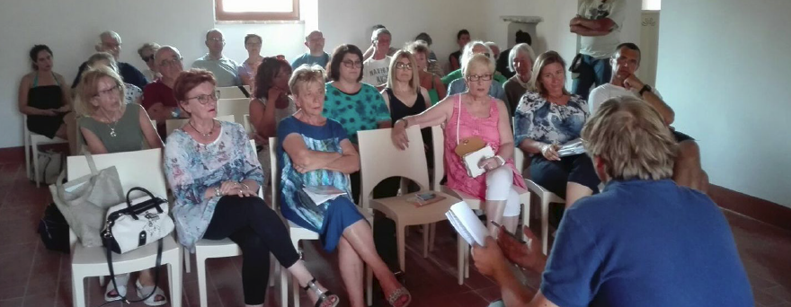
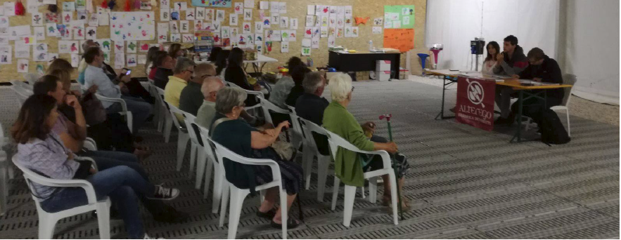
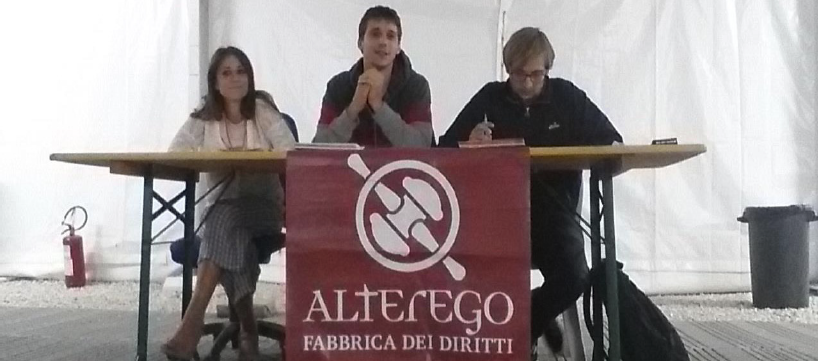
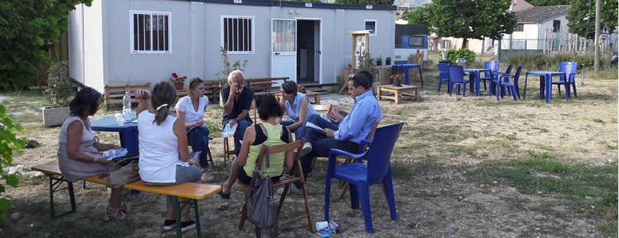
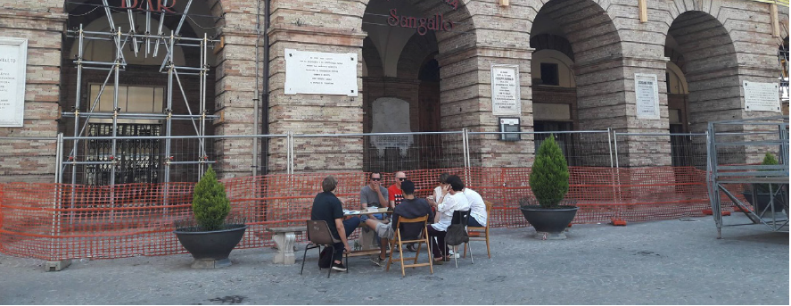

# oissa2webbook

A quasi un anno dall'uscita della prima edizione del nostro Vademecum
Legale – [OISSA](http://www.fabbricadeidiritti.it/2017/11/17/il-vademecum-legale-oissa-tutto-quello-che-ce-da-sapere-sulla-disciplina-post-sisma/) molte cose sono cambiate.

**Il generale sentimento di speranza, condiviso da tutta la popolazione** nei mesi successivi ai tragici eventi del 24 Agosto 2016 e delle successive devastanti scosse succedutesi il 30 Ottobre 2016 e nel mese di Gennaio 2017, **è mutato in un sentimento di attesa e, a volte, di rabbia**.

Una parola continua a risuonare di bocca in bocca, sollecitata dai comitati formatisi sul cratere e da una parte dei media: **ritardo**.
**Ritardi nella gestione dell'emergenza**, i villaggi **SAE** al momento in cui scriviamo, tardano ancora ad essere realizzati, **ritardi nelle pratiche amministrative** finalizzate a portare avanti i processi di ricostruzione sia pesante che leggera, ritardi nel pagamento dei CAS, che in assenza di controllo preventivo (l'autodichiarazione del cittadino era finalizzata a sveltire il riconoscimento del diritto) hanno comportato un rallentamento generale delle liquidazioni del contributo in favore di rigorosissimi schemi di controllo.
**Ritardi insomma, troppo spesso "narrati" da un punto di vista della responsabilità politica, ahinoi raramente da un punto di vista giuridico**. Sì, perché giuridicamente una Pubblica Amministrazione che ritarda è una Pubblica Amministrazione che genera un danno al cittadino che lo subisce. E il cittadino danneggiato ha numerosi strumenti giudiziari per attivare un procedimento finalizzato a essere ristorato.

Il nostro lavoro sul territorio ci ha permesso di entrare in contatto con numerosissime realtà e storie diverse. Da tali incontri e da un determinante lavoro che proprio OISSA ci ha permesso di fare per informare e formare sul diritto moltissimi cittadini, abbiamo iniziato a "smascherare" irregolarità e contraddizioni che avvenivano su tutto il territorio.
**Il nostro intento, con questa opera** che distribuiremo gratuitamente da qui in avanti, è proprio quello di **continuare il lavoro di "soccorso legale" che abbiamo iniziato a Settembre del 2016**.

Tale convinzione si consolida nella nostra mente anche grazie ai numeri:

* **Più di 250 cittadini incontrati e informati singolarmente**;
* **Oltre 70 incontri pubblici tra assemblee e sportelli informativi**;
* **3000 copie circa di OISSA distribuite gratuitamente su tutto il cratere**;
* **13 questioni e criticità da noi denunciate rilanciate dai media**.

Inoltre, legami, rapporti, amicizie e relazioni sviluppate su tutto il "Cratere", che ci hanno resi più forti e maggiormente consapevoli che la nostra idea di supporto legale in emergenza è uno strumento in cui credere e per cui vale la pena continuare a lottare. **Sì perché il diritto puo' rappresentare un fondamentale strumento di lotta e resistenza, di denuncia e di interpretazione dei processi "celati" dietro le "meravigliose" sfilate istituzionali**.

**Un impegno che ci ha portato a riflettere sulla necessità di intervenire pesantemente sulle regole che il nostro Stato si è dato per la gestione di tutte le emergenze**.

Viviamo in un territorio sismico, gran parte del nostro paese è soggetto al rischio sismico e le tecniche di studio di tale problema si fanno via via più precise.
Continui monitoraggi, analisi geologiche sempre più approfondite (si pensi alla microzonazione di terzo livello) contribuiscono a rendere più semplice oggi stabilire piani di prevenzione sismica che comportino anche la nascita di una "cultura del terremoto".
Ebbene "emergenza": una circostanza imprevista, che emerge all'improvviso e determina una situazione di grave pericolo.

**E' il terremoto una circostanza imprevista?**

Il termine emergenza è corretto se rapportato a un evento che sappiamo che accadrà ma non possiamo predirne il momento? In ogni "emergenza" lo strumento di regolamentazione è sempre stato la "decretazione d'urgenza".
**Ogni Governo ha gestito i terremoti in modo differente, quasi mai uniformandosi alla gestione precedente**.
Gli effetti di tale scelta sono oggi sotto gli occhi di tutti.
Processi spezzettati, ordinanze e decreti legge che si susseguono in tempi rapidissimi e mutano orientamento a seconda dei ritardi e delle esigenze, impossibilità per gli operatori attivi sul territorio di avere una conoscenza delle leggi tale da poter dare risposte sicure. Insomma, un "guazzabuglio" di norme tale da rendere spesso il cittadino impossibilitato ad entrare in contatto con le Istituzioni e di farsi una coscienza propria sui problemi.

**Da qui, la necessità di una Legge Unica sulle Emergenze**. Una disciplina votata dalle Camere, modello da seguire e aggiornare nel tempo, immediatamente recepibile e comprensibile da tutti gli operatori pubblici e da tutti i cittadini. **Una legge che preveda oltre alle regole di intervento e agli strumenti di sostegno alle popolazioni colpite da eventi calamitosi**, anche una chiara disciplina sulle responsabilità e degli obblighi diretti e inalienabili della Pubblica Amministrazione in riferimento alla prevenzione e informazione della popolazione esposta a tali rischi. **L'Italia è un paese che deve essere messo in sicurezza, si dice spesso, ma è anche un paese che deve prima conoscere i pericoli che corre quotidianamente**.

**Noi, dal canto nostro, continueremo a parlare con tutti, insieme ai nostri compagni di viaggio, senza arretrare di un solo passo**.

La storia di ogni individuo è la storia di tutti noi.

Ed è dalla parte di ogni individuo che potrete trovarci.

**NOI DA QUI NON CE NE ANDIAMO!**

**SOSTIENI IL NOSTRO LAVORO CON UNA DONAZIONE**
IBAN IT 18M0103003278000001586995

**CONTATTACI**
Se desideri organizzare un'assemblea, uno sportello legale nel tuo comune,
nella tua frazione contattaci:
* Inviando una mail a info@fabbricadeidiritti.it
* Chiamando allo 06-8845197

**QUESTO VADEMECUM È IN CONTINUO AGGIORNAMENTO**:
* Sul sito: [www.fabbricadeidiritti.it](www.fabbricadeidiritti.it) e [www.oissa.info](www.oissa.info)
* Sulla nostra pagina Facebook: Alterego-Fabbrica dei diritti.

